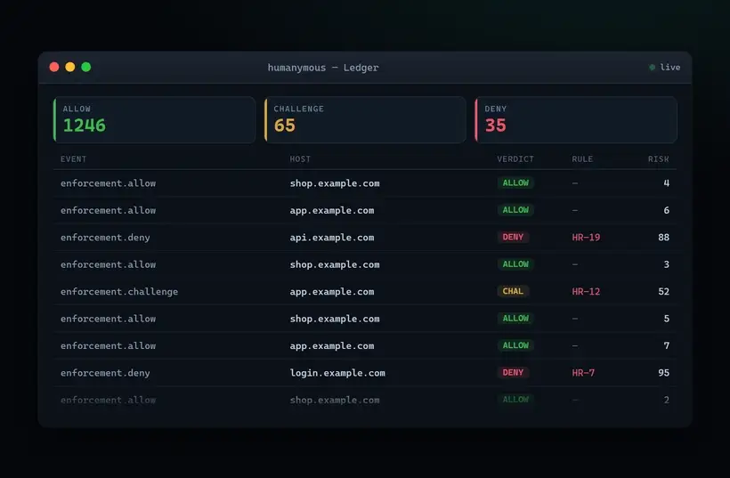
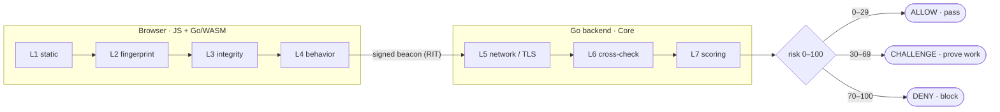
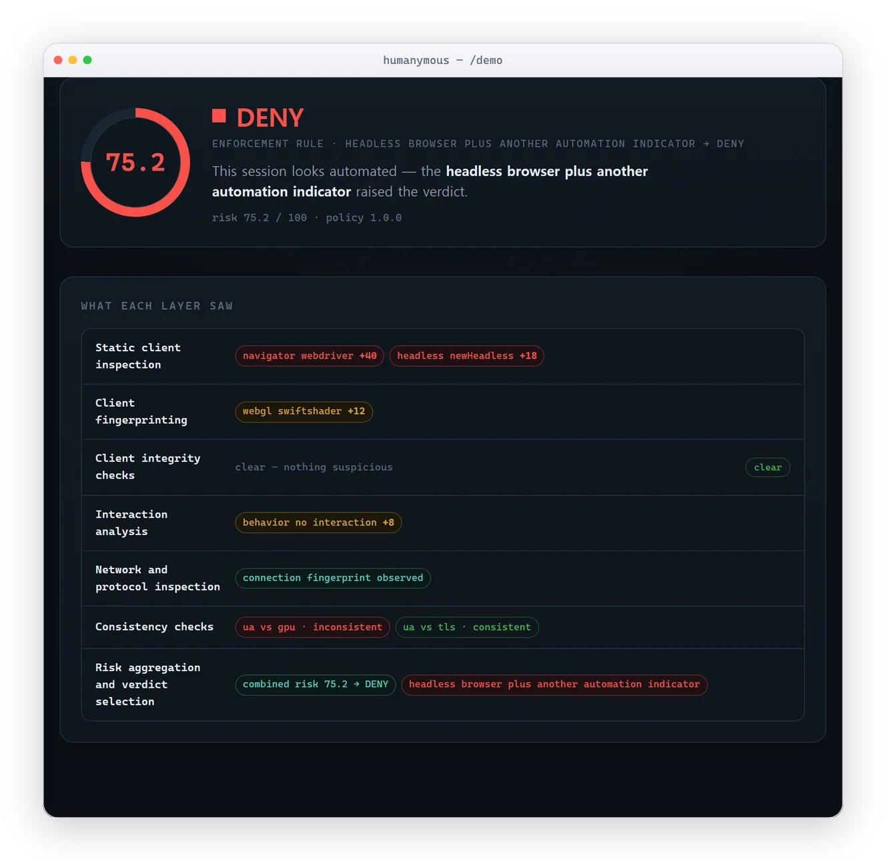

<p align="center">
  
</p>
<p align="center"><em>Raise the cost of automation.</em></p>
<p align="center"><sub>seven layers · one verdict · a signed record</sub></p>

<p align="center">
  <a href="LICENSE"></a>
  <a href="https://github.com/modootoday/humanymous/releases"></a>
  <a href="https://github.com/modootoday/humanymous/actions/workflows/ci.yml"></a>
  <a href="https://goreportcard.com/report/github.com/modootoday/humanymous"></a>
  <a href="https://github.com/modootoday/humanymous/pkgs/container/humanymous-gate"></a>
</p>

# humanymous — Browser Automation Detection Sample (Go/WASM + JS)

<p align="center">
  
</p>
<p align="center"><sub>The <strong>Ledger</strong> — every edge decision, scored across seven layers and sealed into a tamper-evident audit chain.</sub></p>

> **A defensive anti-bot detection reference project (educational / commercial).**
> A multi-layer detection engine sample built with Go (WASM) + JavaScript + a Go
> backend that strictly separates a browser-automation environment from a real
> human environment.

## Overview

To distinguish `humanymous` (human-like) from `automationymous` (automation-like),
the engine collects, cross-checks, and scores signals across the layers below.

| Layer | Location | Representative signals |
|------|------|-------------|
| L1 static client | JS + Go/WASM | `navigator.webdriver`, headless tells, plugins/mimeTypes, permission inconsistencies |
| L2 client fingerprint | JS + Go/WASM | Canvas / WebGL / AudioContext, font, screen metrics, HW concurrency, deviceMemory |
| L3 client integrity | Go/WASM | `toString` native-code check, proxy/monkeypatch detection, WASM-sealed logic |
| L4 behavioral biometrics | JS collect → WASM/server score | mouse curvature/velocity, keystroke dwell/flight, scroll, `isTrusted` |
| L5 network/protocol | Go backend | JA3/JA4 TLS, HTTP/2 fingerprint, header order/casing |
| L6 consistency cross-check | Go backend | UA ↔ UA-CH ↔ JS navigator ↔ TLS/H2 cross-consistency |
| L7 scoring/decision | Go backend | weighted risk score → allow / challenge / deny |

The client layers (L1–L4) are collected in the browser and beaconed under a rotating integrity token; the server layers (L5–L7) are read from the connection itself and cannot be spoofed by client JavaScript. The cross-check layer (L6) treats *disagreement between layers* as stronger evidence than any single value.



### See it decide

The public `/demo` page scores *your* browser live. Below, a headless automation
(the same kind used in the self-test catalog) is scored on `/demo` — a hard rule
(HR-7) overrides the score to DENY:

<p align="center">
  <picture>
    <source media="(prefers-color-scheme: dark)" srcset="docs/assets/screenshots/framed/verdict-detail-dark.webp" />
    
  </picture>
</p>

A real browser on real hardware clears with a low score (ALLOW). No detector is
perfect — the goal is to *raise the cost of automation*, not to claim a perfect wall.

## What this is — and is not

Read this before you evaluate or deploy. This is an **Apache-2.0 reference/sample** anti-bot
detection engine that **raises the cost of automation against the commodity bot long tail**.
It is not a turnkey production bot defense and not a silver bullet.

**It reliably handles** off-the-shelf automation (Selenium, Puppeteer, Playwright,
undetected-chromedriver, nodriver), headless tells, `curl_cffi`/uTLS TLS parrots, and naive
proxy farms. **It does not** stop a determined, well-resourced adversary running a *genuine*
browser engine (a patched Camoufox/Chromium) behind residential proxies with human-paced
input — that is the nature of browser fingerprinting, an arms race, not a bug. It is also not
a WAF (no payload/exploit filtering), not a CDN (no volumetric-DDoS absorption), and not a
CAPTCHA (its CHALLENGE is an accessible proof-of-work, not a puzzle). See the honest
threat-tier (T0–T4) breakdown in [Where Gate fits](docs/explanation/where-gate-fits.md).

## Supported topologies (read before deploying)

**The detection layers are not all active in every topology.** The network plane — JA3/JA4
TLS fingerprinting, the HTTP/2 fingerprint, and the UA-vs-TLS/H2 cross-checks (hard rules
HR-2/HR-5/HR-11/HR-14) — is read from the **raw TLS connection** and exists **only** in a
process that terminates raw TLS on its own accept loop. Two consequences that most surprise
adopters:

- **Behind a CDN, WAF appliance, or L7 load balancer that re-terminates TLS, the entire
  network plane is inert** — silently. Detection collapses to the client JS/WASM plane
  (the most spoofable layer) plus header and IP-intel heuristics. This is the dominant
  production topology, so plan for it.
- **The shipped `cmd/gate` reverse proxy does not capture the ClientHello at all** — JA3/JA4/H2
  do not fire at the gate. For TLS fingerprinting, deploy the `cmd/server` Core engine as the
  raw-TLS terminator (direct-facing or behind an **L4 / TCP-passthrough** LB), with no
  re-terminating CDN in front.

It is also **single-node by default**: only bans, sticky verdicts, and the rate limiter have a
shared-state (Redis) seam; correlation, recon-sweep, nonce anti-replay, and the RIT/PoW state
are per-node in memory. **The full topology matrix — what fires where, plus the scale and
clock-sync requirements — is in [Supported topologies](docs/reference/supported-topologies.md).**

## Why Go/WASM

- The core detection logic is **sealed in a WASM binary**, making it harder to tamper with or hook than plain JS.
- Browser APIs are read via JS↔WASM interop (`syscall/js`), but the verdict and integrity checks run inside WASM.
- The same Go codebase is reused on **both the client (WASM) and the server (backend)**, so signal definitions stay single-sourced.

## Directory layout

Following golang-standards/project-layout.

```
cmd/            # executables: server, gate, redteam, tlsparrot, report, wasm
internal/       # internal packages (16): signals, network, scoring, gate, collector, …
api/            # HTTP API contract (http-contract.md)
web/            # client assets: index.html, /demo, JS injector, detector.wasm
build/          # Dockerfiles: engine / gate / bots (+ per-file .dockerignore)
deployments/    # modular docker compose (include:) + origin + bots scripts + artifacts
configs/        # deployment config (dev.env, …)
test/           # redteam/ attack catalog, e2e/ runner, gate/ conformance
docs/           # GitHub Pages documentation
scripts/        # local dev helpers (e2e.sh)
sots/  plan/    # development source-of-truth / design (excluded from release & publish)
```

## Quick start (Docker — cross-platform, recommended)

The only prerequisite is **Docker** (Desktop or Engine). No `make`, Go, or Node is
required on the host — everything builds inside containers, so the exact commands
below work the same on **Linux, macOS, and Windows**.

<p align="center">
  
</p>

```bash
cd deployments

# 1. Start the detection stack (builds the images on the first run; long-running)
docker compose up -d --build core origin gate
```

Then open (accept the self-signed certificate):

- **Engine demo** — <https://localhost:8443/demo> — score your own browser across L1–L7.
- **Gate edge** — <https://localhost:8444/> — a demo origin app with the detection bundle injected.
- **Ledger** — <https://localhost:8445/__hmn/admin/console> — dev token `operator:e2e-operator-token`.

```bash
# 2. Run the bots (automation catalog, 47 profiles across a T0–T4 cost ladder) against the engine
docker compose run --rm bots

# 3. Gate proxy-layer conformance (34 checks)
docker compose run --rm gate-e2e

# 4. Multi-subnet correlation swarm — one fingerprint across 3 real subnets
docker compose --profile swarm up --abort-on-container-exit bot-swarm-a bot-swarm-b bot-swarm-c

# Tear everything down
docker compose down -v
```

Expected result (a single reference run on the maintainers' hardware, n=1 per
profile): all **45 bot profiles blocked** (DENY/CHALLENGE) and the **1 baseline
session not denied**; Gate conformance **34/34**. These are reference-measured
observations, **not a guarantee** — the baseline is a Playwright/CDP-driven session,
not a physical human (see *Verification results* below). The bots containers attach to an `internal` network only, so
they can physically reach nothing but the detector. Full topology and safety model:
`deployments/README.md`.

> **Windows note:** if `docker build` reports `docker-credential-desktop … not
> found`, add `C:\Program Files\Docker\Docker\resources\bin` to your `PATH`.

### Deploy in front of your own app (published images — no build)

The lab above builds from source. To run **Gate** in front of your own origin, pull the
published multi-arch images from `ghcr.io` instead — no source tree, no Go/Node toolchain:

```bash
# fastest: one container in front of your app (self-signed dev TLS, monitor-first)
docker run -d -p 8444:8444 -p 127.0.0.1:8445:8445 \
  ghcr.io/modootoday/humanymous-gate:latest \
  -addr :8444 -admin-addr :8445 -upstream http://YOUR-ORIGIN:PORT -monitor
```

With a **real Let's Encrypt certificate** (automatic issue + renew via TLS-ALPN-01; needs a
public domain, inbound `:443`, and a persistent cache volume — full walkthrough in
[HTTPS / TLS certificates](docs/how-to/https-tls-certificates.md)):

```bash
docker run -d -p 443:8444 -p 127.0.0.1:8445:8445 \
  -v hmn-acme:/acme-cache \
  ghcr.io/modootoday/humanymous-gate:latest \
  -addr :8444 -admin-addr :8445 -upstream http://YOUR-ORIGIN:PORT \
  -acme-domain your.domain -acme-cache /acme-cache -acme-email you@your.domain -monitor
```

For a real deployment (ACME TLS, sealed keystore, durable audit, hardened read-only
container), use the pull-only compose — it references the published images directly:

```bash
cd deployments
cp .env.example .env            # set HMN_UPSTREAM, HMN_DOMAIN, HMN_UNSEAL, HMN_ADMIN_TOKENS
cp routes.conf.example routes.conf
docker compose -f compose.release.yaml up -d
```

Published images (Apache-2.0, `linux/amd64` + `linux/arm64`, cosign-signed):

- `ghcr.io/modootoday/humanymous-gate:latest` — the reverse-proxy enforcement layer (the product you deploy).
- `ghcr.io/modootoday/humanymous-core:latest` — the standalone detection engine (demo / self-testing).

`:latest` tracks the newest release. Start with `-monitor` (score + log, enforce
nothing), watch the Ledger, then drop it to enforce — see
[Will this break my app?](docs/explanation/will-this-break-my-app.md).

## Without Docker (local build)

With the Go toolchain installed you can build and run directly. A `Makefile`
provides shortcuts (`make wasm`, `make run`, `make attack`, `make gate-e2e`, …)
**where `make` is available** — note that Windows typically has no `make`, so the
Docker path above is the reliable cross-platform option. The raw equivalents:

```bash
# Unit tests (Go only)
go test ./...

# Build the WASM detector, then run the engine (self-signed TLS on :8443)
GOOS=js GOARCH=wasm go build -o web/detector.wasm ./cmd/wasm/
go run ./cmd/server -addr :8443 -web web        # open https://localhost:8443/demo
```

> The engine serves `web/js/wasm_exec.js` (Go's WASM loader) from `web/`. If the
> demo fails to load the detector, refresh it from your Go install:
> `cp "$(go env GOROOT)/lib/wasm/wasm_exec.js" web/js/wasm_exec.js` (or `make wasmexec`).

## Ethical & legal notice

This project is for **defensive bot-detection research, education, and protecting
commercial services**. The included red-team simulations (Selenium/Puppeteer/
Playwright, etc.) exist to **validate your own detector** and must not be used for
unauthorized access to, evasion of, or abuse of third-party systems. The collected
signals may be personally identifiable, so a real deployment must comply with
GDPR / privacy-law notice, consent, and retention obligations. See the
[data-processing inventory](docs/reference/data-processing-inventory.md) and the
[transparency report](docs/explanation/transparency-report.md) for the privacy model,
and [red-team rules of engagement](docs/reference/red-team-rules-of-engagement.md) for
the testing boundaries.

## Verification results (bots vs the detector)

Reference-measured results of running the **SoT-04 automation catalog** in
`test/redteam/` against the local detector engine. Chromium-family profiles use the
installed Edge, Firefox-family use Playwright Firefox, and tls-parrot runs a real
uTLS (Go) client:

> **How to read these numbers.** This is a **single run (n=1 per profile) on the
> maintainers' hardware** against a 47-profile local catalog (**45 bot profiles + 1 detection-ceiling + 1
> baseline**). The "baseline" is a **Playwright/CDP-driven session, not a physical
> human**, so a real-human false-positive rate is *not* measured here. "FPR" below is a
> **DENY-only** metric — it cannot count a human who was sent to a CHALLENGE, so it
> under-reports human friction. Treat every figure as **reference-measured, not a
> guarantee**.

| Profile | Verdict | Detection basis |
|----------|------|-----------|
| baseline (Playwright/CDP session — not a physical human) | **ALLOW** or CHALLENGE | not denied in the reference run |
| bot:http-client | CHALLENGE | UA↔TLS/header inconsistency (L6) |
| bot:tls-parrot (uTLS Chrome parrot) | DENY | JA4=chrome but sec-ch-ua/sec-fetch absent + no JS |
| bot:selenium | DENY | `cdc_` artifacts (HR-1) |
| bot:puppeteer / playwright / direct-cdp | DENY | headless + webdriver (HR-7) |
| bot:puppeteer-stealth / playwright-stealth | DENY | patched native getter / L3 (HR-8) |
| bot:undetected-chromedriver | DENY | headless + chromeless (HR-7) |
| bot:patchright | DENY | Console API disabled (HR-9) |
| bot:nodriver / xvfb-headful / anti-detect | CHALLENGE | no interaction (HR-12) |
| bot:camoufox (Playwright Firefox) | CHALLENGE | no interaction (HR-12) |

→ In this reference run all 45 bot profiles were blocked (DENY/CHALLENGE) and the
baseline was not denied. **Reference-measured on the maintainers' hardware, n=1 — not
a guarantee**; the baseline is a Playwright/CDP session, and the DENY-only "FPR"
under-reports human friction. A full per-profile report is generated locally at
`docs/report.html` (via `make report-html`, or by re-running the catalog). Honest
capabilities, limits, and the known detection floor are published in the
[transparency report](docs/explanation/transparency-report.md) and the
[security audit](docs/reference/security-audit.md).

## Anti-bypass layers (implemented & wired)

| Layer | Source of truth | Status | Verification |
|------|------|------|------|
| RIT rotating-hash anti-tamper | SoT-07 | ✅ live | detects header/body tampering + replay, browser Web Crypto HMAC |
| Forensic watermarking of all resources | SoT-08 | ✅ live | `/res/*`→`/api/trace` leak-session trace-back + forgery detection, measured |
| Adaptive resource gating (video/embed) | SoT-10 | ✅ live | verdict×tier → serve/downgrade/deny, `X-HM-Gate` |
| Ad/tracking-block verification | SoT-09 | ✅ live | mitigates false positives for privacy users |
| Script-injection/eval/new Function guard | SoT-11 | ✅ live | injector runtime hardening + patchright detection (HR-9); CSP ships **report-only** (violation telemetry, not an enforced block — see the security audit) |
| Traffic (TCP/TLS/HTTP) logging + consistency guard | SoT-12 | ✅ live | detects intra-session JA4/UA/IP/header rotation (HR-14/15) |
| **Raw HTTP/2 frame capture (Akamai fp)** | SoT-02 | ✅ live | captures real SETTINGS/pseudo-order (fingerproxy approach) |
| **Image LSB steganography (watermark robustness)** | SoT-08 | ✅ live | survives meta-strip + PNG re-encode, retains leak tracing |

## Aggressive escalation (harder bots) (measured against the bot catalog)

Even an attacker that **forges browser headers** (curl_cffi-class) is blocked by
the anti-bypass layers:

| Attack profile | Verdict | Basis |
|---------------|------|------|
| bot:tls-rotate (Chrome→Firefox TLS within a session) | DENY | HR-14 (traffic.engine_rotation) |
| bot:ua-rotate (UA change within a session) | DENY | HR-18 (traffic.ua_rotation) |
| bot:rit-replay (RIT token replay) | CHALLENGE | HR-17 (rit.stale_replay) |
| bot:rit-tamper (body altered after RIT signing) | DENY | HR-16 (rit.header_tampered) |
| bot:video-scrape (video Range storm) | DENY | media.range_storm + gate (HR-14) |
| bot:watermark-strip (leak + meta strip) | DENY | LSB residue → session identified via /api/trace |

→ In this reference run every profile above was blocked and the baseline was not
denied (reference-measured, n=1 — not a guarantee). RIT is validated on a real
browser (`l5.rit.ok`); replay and tampering are blocked.

### Round 2 — web-research-driven deeper escalation (2025–2026 techniques)

| New detection (SoT-13/14) | Effect |
|----------------------------|------|
| **post-2025-05 CDP probe** (prototype-Proxy `console.groupEnd` leak) | after the Error.stack probe died, catches current CDP automation → raises nodriver/xvfb/anti-detect toward DENY |
| **advanced fingerprints** `l2.adv.*` (WebRTC/voices/WebGPU/Widevine/audio 24k/rtt 0) | cross-surface contradictions + headless residual tells |
| **coalesced events** (`getCoalescedEvents`) | catches CDP/OS-injected input that `isTrusted` misses |
| **browser_no_js** (HR-18) | a browser UA with zero JS-execution evidence = a header-forging HTTP parrot (curl_cffi-class) → DENY |
| **PoW active defense** (SoT-13, hashcash) | imposes a CPU cost on CHALLENGE sessions → breaks the economics of mass automation |

New bots: `tls-static` (static parrot), `tls-rotate`, `ua-rotate`, `rit-replay`, `rit-tamper`, etc.

### Round 3 — 2025–2026 frontier threats (AI agents · distributed proxies)

| New detection (SoT-15/16) | Effect |
|----------------------------|------|
| **AI-agent behavior** (SoT-16, FP-Agent): mouse only at click-time (no trajectory), machine typing, LLM inference-loop cadence | Operator/browser-use/Claude computer-use-class **AI agents DENY (HR-20)** |
| **cross-session correlation** (SoT-15): keyed on fingerprintId+JA4, one fingerprint across many subnets | **residential-proxy rotation DENY (HR-19)** |
| **PoW solve-time**: solved faster than the browser-JS lower bound | native/GPU solver detection (`l7.pow.too_fast`) |

**Honest limitation**: the automation-e2e "human" is Playwright (CDP), so CDP signals
fire but it resolves to ALLOW once it interacts; a physical human has no CDP signal
at all. AI-agent burst_silence needs a long-enough observation window to catch
(loader 6s). Not-yet-implemented extensions: memory-hard PoW (Argon2), web-bot-auth
(allow declared agents), Sec-Fetch combination checks.

### Round 4 — destructive attack classes (deep-research verified, SoT-17)

Deep web research (WebSearch fan-out + adversarial verification) surveyed the most
destructive automation attacks of 2025–2026 and implemented server-side detection +
mitigation. Key finding: **after MadeYouReset (CVE-2025-8671), a defense that only
counts client RST_STREAMs can be bypassed → the decisive mitigation is a per-connection
rate limit on the protocol-error rate and server-emitted resets.**

| New detection (SoT-17) | Effect |
|-------------------------|------|
| **passive HTTP/2 frame monitor** (`cmd/server/h2monitor.go`): parses only the 9-byte frame header of the decrypted h2 stream (no HPACK access → no serving interference), per-conn RST/CONTINUATION/protoErr counts | **Rapid Reset (CVE-2023-44487) · CONTINUATION Flood · MadeYouReset** → `l5.h2dos.*` → DENY (HR-21) |
| **fingerprint-keyed sliding-window limiter** (`internal/abuse`): key = JA4+subnet (not IP → defeats proxy rotation) | request flood + credential-stuffing rate → `l5.abuse.flood` → score-based CHALLENGE + escalating ban ladder (not a categorical DENY, so a shared CGNAT subnet is not locked out) |
| **connection resource caps**: `ReadHeaderTimeout` (slowloris), `ReadTimeout` (slow-POST), `MaxConcurrentStreams`, `MaxReadFrameSize` | mitigates slowloris/slow-POST/connection-exhaustion |

New bots: `flood` (90 rapid requests from one fingerprint), `rapid_reset` (open + immediate
CANCEL flood on one connection; scored even when Go stdlib mitigation closes the
connection). **Result** (reference run, n=1): all bot profiles blocked (DENY/CHALLENGE)
and the baseline not denied — reference-measured, not a guarantee. The
frame monitor showed no regression for normal h2 browser serving in this run.

### Round 5 — deployment-suitability hardening (signal provenance · privacy-evasion)

Five deep deployment-suitability reviews (see the [GitHub Releases notes](https://github.com/modootoday/humanymous/releases)) surfaced two
evasions that are now **permanent regression wargame cases** in the catalog (retained as
code — `cmd/redteam` + `test/redteam/*.mjs`), so a future change that reopens either fails
the run:

| New wargame profile | Attack | Verdict | Basis |
|---------------------|--------|---------|-------|
| `bot:signal-forgery` | a borderline (score-CHALLENGE) client FORGES the server-only trust-upgrades `l7.pass.solved`/`l7.pow.solved` in its own report to launder itself to ALLOW | **CHALLENGE** | client-supplied L5/L6/L7 signals are stripped at ingest; a trust-upgrade is honored ONLY from a server-minted signal, so the forgery is inert |
| `bot:privacy-evasion` | a residential-proxy-rotation scraper ALSO claims `adBlock`/GPC to try to disarm the correlation hard rule | **DENY** | a client-reported privacy flag does NOT exempt the server-authoritative `l5.correlation.proxy_rotation` rule → **HR-19** |

→ **Result** (reference run, n=1): all **45 bot profiles blocked** (DENY/CHALLENGE), the
baseline not denied, Gate conformance **34/34** — reference-measured, not a guarantee.

### Round 6 — web-research-designed cost-escalation ladder (T0→T4)

A 10-surface web-research survey of 2025–2026 anti-bot evasion (TLS/JA4 mimicry, HTTP/2 &
smuggling, stealth frameworks, anti-detect browsers, fingerprint spoofing, behavioral evasion,
AI agents, proxy/token/credential abuse) produced a **70-scenario taxonomy**; its implementable
gradations were realized as code, growing the catalog to **45 bot profiles + a detection-ceiling
+ a human baseline**, organized as a staged **attacker-cost ladder** (`test/e2e/tiers.mjs`,
parity-enforced). The wargame now runs and reports cheap→expensive:

| Tier | Cost | Example scenarios | Blue |
|------|------|-------------------|------|
| **T0** | trivial · $0 script | non-browser UA, `sec-ch-ua`/`sec-fetch` absent, RIT-absent, untrusted events, no-interaction | **100% blocked** |
| **T1** | low · off-the-shelf | Selenium/Puppeteer/Playwright, TLS/engine churn, `ja4-churn`, grease-absent, flood, Rapid Reset | **100% blocked** |
| **T2** | moderate · stealth | puppeteer/playwright-stealth, patchright, multi-axis rotation, WebGPU-vs-WebGL mismatch, machine-keystroke, Bézier-mouse, LLM burst-silence | **100% blocked** |
| **T3** | high · real engine + AI/proxy | nodriver/xvfb/anti-detect/camoufox, full AI-agent cadence (HR-20), residential-proxy correlation (HR-19) | **100% blocked** |
| **T4** | very high · coherent spoof / real human | a fully coherent Chrome-TLS engine-level spoof | **ALLOW — the honest detection ceiling** (mitigated by rate/reputation only) |

The ladder is the honest map of where detection holds and where it stops: reliable through T2,
degrading-but-scoring at T3, and — by construction — not solved at T4.

## Production promotion — reverse-proxy security layer (SoT-18–28)

The verified L1–L7 engine was promoted into a **drop-in reverse proxy**:
`(browser) → (humanymous Gate: TLS termination + streaming HTML injection +
inline scoring + edge enforcement + tamper-evident audit) → (origin app)`. It
inlines detection in front of an app the operator does not control.

**Design**: a multi-perspective subagent design panel (Blue architect / Red attacker /
SRE-Ops / Compliance-Audit / Product) + chief synthesis + an adversarial completeness
critique (7 agents). Real defects the critique found were **reflected in the spec**:
- audit-log right-to-erasure was unmet with a single pepper (low-entropy IPv4 brute force) → **per-subject linkage-key crypto-shred**
- reusing the 6-header canonical.go for audit canonicalization was a category error → **a new frozen canonical form**
- an HMAC checkpoint is forgeable by the writer → **asymmetric Ed25519 STH signatures** (verifiable without any forging power for the auditor)

**Implementation (Go, tests green)**:

| Layer | Package | Verification |
|------|--------|------|
| **audit log (headline)** | `internal/audit` | hash chain + Ed25519 STH + per-subject crypto-shred + offline verifier; tamper/truncation/rollback detection, erasure isolation, structural audit-or-panic sink tests |
| streaming HTML injection | `internal/gate/inject.go` | single-pass, add-only, idempotent, chunk-boundary split + fallback + oversize guard tests |
| edge enforcement | `internal/gate` | sticky verdict → allow/challenge/deny, blocks without contacting origin |
| origin cloaking (HR-24) | `internal/gate/guard.go` | rotating HMAC origin-auth, 421 on direct bypass |
| header hygiene (HR-27b) | `internal/gate/guard.go` | strips + blocks inbound trust/internal headers |
| verdict trust token (HR-28) | `internal/gate/token.go` | AEAD/HMAC server-key-only, fingerprint-bound, TTL, epoch; theft/forgery/expiry blocked |
| beacon replay prevention (HR-29) | `internal/gate/token.go` | single-use beacon nonce (incl. solve-once-reuse-many) |
| reverse-proxy wiring | `cmd/gate` | TLS termination, `/__hmn/*` control plane, h2 DoS caps, route presets |
| smuggling normalization (HR-23) | `internal/gate/smuggle.go` | rejects CL+TE/dup-CL/TE≠chunked/obs-fold (+ stdlib defense-in-depth) |
| upgrade gate (HR-26) | `internal/gate` | requires a fingerprint-bound token before a WS/SSE 101 |
| injector robustness (HR-27a) | `internal/gate` | decomp-bomb/oversize (8 MiB) safe pass-through + audit |
| timing oracle (HR-30) | `internal/gate/recon.go` | sweep detection (many sessions per fingerprint) + constant-floor |
| rate limit + temporary bans | `internal/gate/ban.go` | **both IP and fingerprint** rate → auto-escalating bans (1h→6h→24h→permanent), IP rotation tracked by fingerprint, first line at the edge |
| console live API | `internal/gate/admin.go` | `/__hmn/admin/` integrity, audit, incident, bans, **policy, erasure (crypto-shred)** |
| **live admin console SPA** | `internal/gate/console.html` | **6 working views served at `/__hmn/admin/console`**: Overview/Integrity/Sessions/Bans/Policy/Compliance, live feed, drill-down, dual-control, theming |

**Gate conformance e2e** (`test/gate/e2e.mjs`, 34/34): HTML injection · bot blocked at
the edge (origin untouched) · human ALLOW · origin direct-hit (HR-24) · header spoofing
(HR-27b) · strict fail-closed · **token theft/forgery (HR-28)** · **beacon replay (HR-29)**
· **smuggling (HR-23)** · **upgrade tunnel (HR-26)** · **decision sweep (HR-30)** ·
**rate-limit auto-ban + console manual ban/lift/dual-control (SoT-27)** · **console live
API (integrity self-verify, pseudonymized audit stream, no PII leak)** · **live console
SPA serving, policy, erasure (crypto-shred) dual-control, final chain integrity** ·
**audit-chain verification passes**. New hard rules HR-22–HR-30 (SoT-25). Live admin
console at `/__hmn/admin/console` (SoT-26).

```bash
# Run the proxy (:8444) in front of a demo upstream (:9000), then the Gate conformance e2e
go build -o bin/gate.exe ./cmd/gate/
./bin/gate.exe -addr :8444 -upstream http://127.0.0.1:9000 -origin-key demo-origin-secret
node test/gate/e2e.mjs
```

## Status

L1–L7 detection + all anti-bypass layers (SoT-07–17) + **production reverse-proxy
promotion (SoT-18–28)** implemented and verified. All tests green; in the reference
run (n=1) all **45 bot profiles were blocked and the baseline was not denied**
(reference-measured, not a guarantee); Gate conformance **34/34** (incl. token
theft/forgery/replay, smuggling, upgrade-tunnel, and sweep defenses). The headline
audit log (tamper-evident hash chain + Ed25519 STH + crypto-shred) is live, with the
live admin console (SoT-26). Full documentation is published at
**[humanymous.net](https://humanymous.net)** (also under [`docs/`](docs/)) — start with
[what Gate is](docs/explanation/what-gate-is.md), the
[security audit](docs/reference/security-audit.md), and the
[transparency report](docs/explanation/transparency-report.md).
