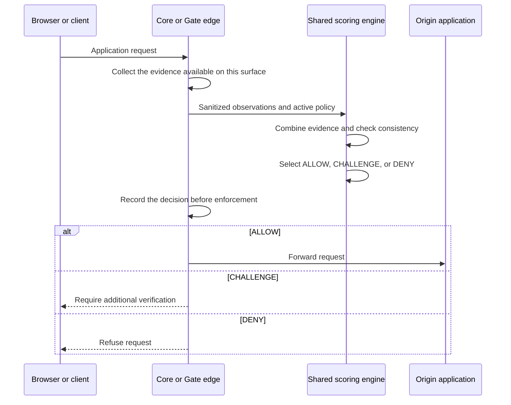

# How humanymous evaluates a request

**Diátaxis quadrant:** Explanation — understand how the pieces fit together.
**Audience:** integrators, operators, evaluators, and developers.

This page explains the request path in plain language. The [glossary](../reference/glossary.md) is the canonical vocabulary reference.

humanymous has two execution surfaces that share scoring code but do not collect identical evidence:

- The **Core detection engine** serves the full browser detector and can observe the client's connection negotiation directly.
- **humanymous Gate** is the deployable reverse proxy. It applies route policy and edge protections, but its current browser collector and network capture are narrower than Core's.

Core's measured results therefore do not describe Gate's coverage.

## From request to verdict

A complete Core evaluation follows seven named stages:

1. **Static client inspection** observes browser properties associated with direct automation.
2. **Client fingerprinting** derives characteristics from rendering, audio, screen, and hardware observations.
3. **Client integrity checks** look for modified browser functions and runtime hooks.
4. **Interaction analysis** observes pointer, keyboard, scroll, and event characteristics without requiring motor richness or speed.
5. **Network and protocol inspection** observes connection negotiation, Hypertext Transfer Protocol version 2 behavior, and header characteristics.
6. **Consistency checks** compare what the browser claims with what the server observed.
7. **Risk aggregation and verdict selection** combine evidence, apply active thresholds, and evaluate enforcement rules.

No numbered stage code is needed to understand or operate this flow.

## Evidence is not identity

The engine evaluates observations, not a person's identity.

- A **signal** is one observation, such as a WebDriver flag, a protocol mismatch, or missing interaction.
- A **consistency check** compares two claims or observations.
- A **fingerprint** is a derived client characteristic used for token binding, request metering, and correlation.
- A **risk score** summarizes the weighted evidence. It is not ground truth.
- An **enforcement rule** can raise a score-based verdict when a predicate has enough confidence.

Low-confidence evidence receives limited influence. Evidence from the same family is deduplicated, and a single stage has a bounded maximum contribution so a cluster of correlated observations cannot dominate the whole score.

## Verdicts

The result is one of three verdicts.

| Verdict | Meaning | Edge behavior |
|---|---|---|
| ALLOW | The active policy permits the request. | Forward to the origin, unless an attested route requires an additional proof. |
| CHALLENGE | The request requires another verification step. | Do not contact the origin until verification succeeds. |
| DENY | The active policy refuses the request. | Stop before contacting the origin. |

The built-in defaults challenge at a risk score of 30 and deny at 70. Runtime settings can change those thresholds. An enforcement rule can also promote a verdict independently of the score.

An unknown state is possible before enough evidence arrives. Ordinary safe-method routes may fail open; strict and state-changing routes fail closed.

## What Core observes

Core is the reference measurement surface. When it directly terminates the browser connection, it can combine:

- the complete browser-side detector;
- interaction evidence;
- Transport Layer Security ClientHello fingerprints;
- Hypertext Transfer Protocol version 2 behavior;
- header ordering and presence;
- cross-session observations;
- consistency checks between browser claims and network behavior.

A content delivery network or proxy that terminates and creates a new encrypted connection hides the original client's network fingerprint. Core must receive the raw client connection for those observations to describe the browser.

## What Gate observes

Gate is the enforcement surface. The current reference build combines a narrower browser beacon with request headers, source-address intelligence, rate state, route policy, and edge protections.

Gate currently does not extract the same ClientHello and protocol evidence as Core. A page that says “the engine detects” must identify whether it means Core or Gate.

This difference is deliberate documentation truth, not a second scorer: both surfaces use the same scoring implementation for the evidence they actually provide.

## Trust tokens and replay protection

A valid **verdict trust token** can let an ordinary route reuse a previous ALLOW without scoring again. It is short-lived and bound to client characteristics.

A **request-integrity token** binds a request to its session and body using keyed message authentication. It makes tampering or replay detectable.

Neither token is human identity. A forged, expired, or incorrectly bound token is rejected.

## Challenges and attested routes

A proof-of-work challenge demonstrates computational effort, not humanity. It can clear a score-based challenge but cannot override a rule-promoted verdict.

An **attested route** is stricter. An otherwise allowed request must present an accepted possession proof or complete a step-up path. This prices access to a high-value route without claiming to identify every coherent automation setup.

The current reference Gate does not yet route every challenged visitor through a complete, user-solvable Pass flow. Deployments must not promise that experience until they wire and test it.

## Enforcement and audit

Gate evaluates edge protections before forwarding a request:

- source bans and request-rate limits;
- request-smuggling rejection;
- trusted-header protection;
- trust-token validation;
- long-lived connection upgrade checks;
- decision-sweep detection;
- route-specific fail-open or fail-closed behavior.

Gate writes the action to its audit sink before the action takes effect. The audit trail is tamper-evident, not tamper-proof.

## Runtime settings

Operators can change selected runtime settings without restarting Gate:

- enforcement-rule modes;
- challenge and denial thresholds;
- signal-weight multipliers;
- network evidence policy;
- route policy;
- request-rate limits.

The server determines whether a change strengthens protection, weakens an ordinary safeguard, affects an integrity-critical safeguard, or weakens a sensitive route. Protection-reducing changes require a distinct Approver and expire.

When no settings overlay is active, the built-in and startup behavior remains unchanged. That empty-overlay state is the reference baseline used for default regression measurements.

## The detection boundary

Internally consistent real-browser or human-assisted automation can resemble legitimate traffic across browser, network, and interaction evidence. Client and network signals alone cannot reliably separate that class from real users.

humanymous raises its cost through request metering, reputation, and opt-in attested-route verification. It does not claim to solve the boundary.

## Related

- [Glossary](../reference/glossary.md) — canonical reader-facing terms.
- [What Gate is and is not](../explanation/what-gate-is.md) — product scope and limits.
- [Supported topologies](../reference/supported-topologies.md) — where network evidence is available.
- [Verdicts and enforcement rules](../reference/hard-rules-verdicts.md) — exact decision behavior.
- [Which piece am I using?](../explanation/which-piece-am-i-using.md) — Core, Gate, Ledger, and the Detection Observatory.
