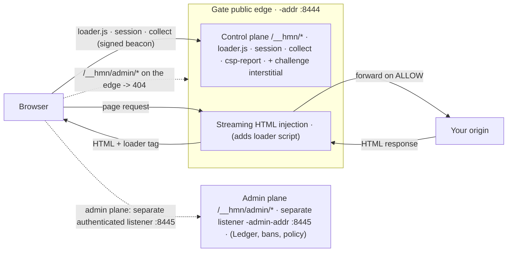

# The `/__hmn/` control plane and the injected detection bundle

> **Quadrant:** Explanation (with an endpoint reference table).
> **Audience:** Integrators debugging an integration, a Content-Security-Policy conflict, or a routing collision.

This page explains the two things humanymous Gate ("Gate") adds to the request/response path that you can observe from your own app: a namespace of client-facing endpoints under `/__hmn/`, and a small detection bundle that Gate streams into your HTML. If a route stopped working after you put Gate in front of your origin, if your CSP started reporting violations, or if your single-page-app router began fighting a path, this is the page that tells you why and where to look.

This repository is a reference implementation, not a production-hardened build. Where a detail is deferred to production or not fixed by the facts on hand, this page says so rather than guessing.

For the full request lifecycle and shared vocabulary, see [How Gate sees a request](../concepts/how-gate-sees-a-request.md). For what Gate does and does not rewrite in a response, see [Will this break my app?](./will-this-break-my-app.md). For every flag named here, see the [CLI, Config & Per-Route Policy Reference](../reference/cli-config-policy.md).

## The two surfaces you can observe

When Gate fronts your origin, two of its behaviors are visible from the browser and from your own code:

1. **The control plane** — a reserved namespace, `/__hmn/`, served by Gate on the public edge. Your origin never sees these requests; Gate answers them itself.
2. **The injected bundle** — a loader `<script>` that Gate adds to HTML responses as they stream through, which pulls the detection code and beacons signals back to the control plane.

Everything on this page is about how those two surfaces interact with *your* paths, *your* CSP, and *your* router.

The two surfaces, and how the admin plane sits apart from both, look like this:



## The `/__hmn/` control plane

`/__hmn/` is Gate's client-facing namespace on the public edge (the `-addr` listener, `:8444` by default). Requests to these paths are handled by Gate and are **not** forwarded to your origin. The detection bundle talks to these endpoints; the challenge interstitial is served from here too.

### Client-facing endpoints

- **`/__hmn/loader.js`** — the bundle loader. This is the script the injected `<script>` tag points at. The browser fetches it from your origin's path space (it is same-origin to your page, because Gate is terminating TLS in front of you).
- **`/__hmn/session`** — establishes the detection session that later signals are bound to.
- **`/__hmn/collect`** — the signal beacon. The browser posts collected client-side signals here. It beacons on the **same TLS connection** the server is capturing L5 network- and protocol-layer signals from, which is what lets Gate line up client-side evidence with the JA3/JA4 and HTTP/2 fingerprint of the very same connection.
- **`/__hmn/csp-report`** — a Content-Security-Policy report sink. It accepts CSP violation reports and returns **HTTP 204** (no content).

### The challenge / PoW interstitial

When a verdict is CHALLENGE, Gate serves an accessible proof-of-work (PoW) interstitial from the control plane, and your origin is never contacted for that request. The reference ships a **minimal** interstitial — HTTP 401, `Cache-Control: no-store`, a short "Please complete a quick check to continue." message, and it loads `/__hmn/loader.js` to run the PoW. A full, self-hosted WCAG-conformant challenge experience is a production responsibility, not something the reference page claims to be. For the client's-eye view of that page, see [Why am I seeing this?](../help/why-am-i-seeing-this.md) and [Challenge accessibility](../help/challenge-accessibility.md).

### The admin plane is not here

`/__hmn/admin/*` is **not** served on the public edge. Requests to admin paths on the public listener return **404** (deny-by-default). The Ledger and all admin APIs live on a **separate authenticated listener** (`-admin-addr`, `127.0.0.1:8445` by default (loopback)), cross-origin to the edge. So if you are probing `:8444` and expecting an admin endpoint to answer, it will 404 by design — that is not a routing bug, it is the isolation boundary. See the [CLI, Config & Per-Route Policy Reference](../reference/cli-config-policy.md) for the two listeners.

### Endpoint reference

All paths below are on the **public edge** (`-addr`) unless noted. "Origin contacted?" means whether your upstream origin sees the request.

| Path | Method(s) | Purpose | Notable response | Origin contacted? |
|---|---|---|---|---|
| `/__hmn/loader.js` | GET | Loads the detection bundle referenced by the injected `<script>` | JavaScript bundle loader | No — served by Gate |
| `/__hmn/session` | GET/POST | Establishes the detection session signals bind to | **200**, JSON `{"sessionId": "<id>"}` | No — served by Gate |
| `/__hmn/collect` | POST | Browser signal beacon; sent on the same TLS connection Gate captures L5 from | **200**, JSON `{"sessionId","riskScore","verdict","hardRuleFired"}`; non-POST returns **405** | No — served by Gate |
| `/__hmn/csp-report` | POST | CSP violation report sink | **204** No Content | No — served by Gate |
| Challenge / PoW interstitial | (served on CHALLENGE) | Accessible PoW interstitial; loads `/__hmn/loader.js` | **401**, `Cache-Control: no-store` | No — origin never contacted |
| `/__hmn/admin/*` | — | Admin plane is **not** exposed on the public edge | **404** (deny-by-default) | No — 404 at the edge |

> **Note:** These methods and shapes are read from the control-plane handlers in `internal/gate/control.go` (`handleSession`, `handleCollect`). `/collect` is POST-only and answers other methods with **405**; both paths sit under the `/__hmn/` control prefix and are served entirely by Gate.

## The injected detection bundle

On a route configured to inject (that is, any route except the `off` preset), Gate streams a small loader `<script>` into your HTML response as it passes through. The browser runs it, which pulls `/__hmn/loader.js`, which collects client-side signals and beacons them to `/__hmn/collect`.

Three properties of the injection matter when you are debugging:

- **HTML only.** Injection happens on HTML responses. Non-HTML responses — JSON, JavaScript, CSS, images, downloads — pass through untouched. If you are seeing the loader appear somewhere it should not, it is in an HTML response; it will never be spliced into your API JSON.
- **Single-pass and add-only.** The rewrite is a single streaming pass that only *adds* the loader. It does not restructure, minify, or otherwise rewrite your existing markup.
- **Idempotent.** Re-processing an already-injected response does not inject a second time. You get one loader, not one per proxy hop.

Gate inserts exactly this markup once, at the first `<head>` boundary, using a bounded 64 KiB look-ahead:

```
<!--hmn-injected--><script src="/__hmn/loader.js" defer></script>
```

The leading `<!--hmn-injected-->` comment is an idempotency marker: if the injector sees it already present, it passes the page through untouched. If no head boundary is found within the 64 KiB look-ahead, the page is streamed through without injection (rather than buffering without bound).

For the fuller picture of *what* the bundle collects across L1–L7, see [How Gate sees a request](../concepts/how-gate-sees-a-request.md).

## Avoiding collisions

Most integration surprises come from one of four places. Here is how to keep each one clean.

### Keep your app off the `/__hmn/` prefix

`/__hmn/` is reserved by Gate on the public edge, and requests to it are answered by Gate, not forwarded upstream. If your own application serves anything under `/__hmn/`, those paths will be shadowed — the browser will reach Gate's control plane, not your route. The fix is simple: do not mount application routes under `/__hmn/`. It is a deliberately unusual prefix precisely to make a collision unlikely.

### Expect the loader in your HTML

Your HTML responses on injecting routes will contain a loader `<script>` that you did not author. That is expected. If a strict template test, a snapshot test, or an HTML integrity check fails because of an unexpected `<script>`, that is the injection — either run those checks against the origin directly (before Gate) or update them to tolerate the loader. Remember the loader is only added to **HTML**; your non-HTML assets are unchanged.

### CSP interaction

The bundle loads a script from **your origin's path space** (`/__hmn/loader.js` is same-origin to your page, because Gate terminates TLS in front of you). If you run a strict Content-Security-Policy, that script must be permitted, or the browser will block it and detection will not run.

Practically:

- Your `script-src` must allow the loader to execute. Since it is same-origin, a policy that already allows `'self'` for scripts typically covers it; a nonce- or hash-only policy will not, because Gate adds the tag after your template rendered its nonces.
- Use `/__hmn/csp-report` as a **report sink** while you tune the policy. Point your `report-uri` / `report-to` at it, run in report-only mode, and watch what the browser flags before you enforce. The endpoint accepts reports and returns 204.

The injected loader tag carries **no CSP nonce** — it is a plain `<script src="/__hmn/loader.js" defer>`. Gate adds its own directives to the response CSP (including `connect-src 'self'` and a `report-uri` pointing at `/__hmn/csp-report`), but it does not mint a nonce for the loader. So if your origin serves a nonce-only or strict `script-src`, you must explicitly permit the loader — for example by allowing the `/__hmn/` script source in `script-src`.

> **Note:** CSP is enforced by the browser, not by Gate. A blocked loader shows up as a client-side CSP violation and as *missing* beacons at `/__hmn/collect` — which the engine can itself read as "bundle injected but no beacon." If detection looks silent for real browsers, check the browser console for a CSP block first.

### SPA-router considerations

Single-page apps route in the browser, so two things are worth checking:

- **Do not let your client router claim `/__hmn/`.** A catch-all route or history-API handler that intercepts every path can swallow requests meant for the control plane. Exclude `/__hmn/` from your client-side routing so those requests reach the network (and thus Gate).
- **Injection happens on the HTML document, not on client navigations.** The loader is added to the HTML response Gate streams. Subsequent in-app view changes are client-side and are not re-injected — which is fine, because the bundle is already running on the page. If your app serves distinct HTML documents per entry point, each *document* response gets the loader (idempotently), not each virtual route change.

## Where to go next

- [How Gate sees a request](../concepts/how-gate-sees-a-request.md) — the full L1–L7 lifecycle and the shared glossary.
- [Will this break my app?](./will-this-break-my-app.md) — exactly where Gate touches (and does not touch) a response, plus a monitor-first rollout.
- [CLI, Config & Per-Route Policy Reference](../reference/cli-config-policy.md) — the `-addr`, `-admin-addr`, and preset flags behind the two listeners and the injecting routes.
