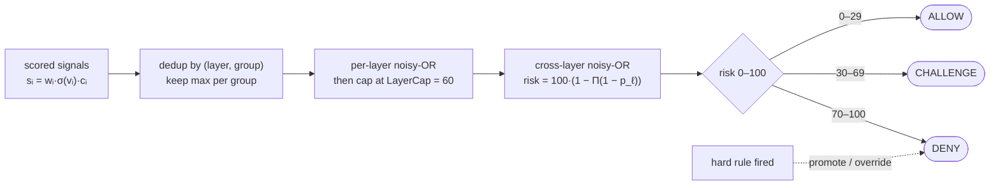

> **Quadrant:** Explanation (with embedded reference tables).
> **Audience:** Blue detection engineers extending or debugging the engine, plus advanced evaluators who want to *predict* a score before running the request.

# Inside the detection engine: signals, scoring math and the score trace

This page explains how *our own* detector reaches a verdict. It is defensive documentation: the goal is that a Blue engineer can look at a set of collected signals and reason forward to the risk number and the request verdict — and, when the two disagree with intuition, know exactly which rule or which cap did it. It is not evasion guidance, and it does not describe how to defeat any third party's product. Everything below is a description of code we control: `internal/signals`, `internal/scoring` and the policy in `policy.go`.

The engine has a deliberately small number of moving parts. If you hold four ideas in your head — the signal schema, the two kinds of verdict, the exact combine pipeline, and the hard-rule table — you can predict most outcomes by hand.

## The signal schema

Every observation the engine makes, whether it was collected in the browser by the WASM client, in page JavaScript, or on the Go server, is normalised into one shared `Signal` struct (`internal/signals/signals.go`). One schema, two producers: the WASM client and the Go server emit the same shape so that the scorer never has to care where a signal came from.

| Field | Type / domain | Meaning |
| --- | --- | --- |
| `id` | lowercase dotted `l{n}.{group}.{item}` | Stable signal identity, e.g. `l1.cdp.proxy_leak`. The leading `l{n}` mirrors the layer. |
| `layer` | `L1`..`L7` | Which detection layer produced it. |
| `value` | any | The raw observed value. |
| `expectedHuman` | any | What a genuine browser would have produced, for contrast. |
| `verdict` | `OK` \| `SUSPICIOUS` \| `BOT` \| `UNKNOWN` | The **per-signal** verdict (see below). |
| `weight` | `0..100` | Maximum score this signal may contribute. |
| `score` | `0..weight` | The **actual** contribution after severity and confidence. |
| `confidence` | `0..1` | How sure the collector is about `value`. |
| `collected` | `js` \| `wasm` \| `server` | Producer that emitted the signal. |
| `notes` | string | Free-text teaching / debugging context. |

> **Note:** `weight` is a ceiling, not the contribution. A signal with `weight = 40` can still contribute `score = 0` if its severity or confidence is low. Never read `weight` as "how much this fired for."

## The two verdicts, and why `fired()` vs `firedBot()` is load-bearing

The word "verdict" is used for two different things, and conflating them is the most common source of confusion when predicting an outcome.

- **Per-signal verdict** — the `verdict` field above: `OK`, `SUSPICIOUS`, `BOT`, or `UNKNOWN`. It describes one observation.
- **Request verdict** — the engine's final decision for the whole request: `ALLOW`, `CHALLENGE`, or `DENY`. It is what the caller acts on.

The hard-rule predicates bridge these two, and they distinguish between them on purpose:

- `fired(id)` is true when the signal with that `id` is **`SUSPICIOUS` *or* `BOT`**.
- `firedBot(id)` is true only when the signal is **`BOT`**.

This is load-bearing. A hard rule can name signals that are all "present" in the collected set and still **fail to fire**, because a rule written with `firedBot(...)` needs those signals at `BOT` severity, not merely `SUSPICIOUS`. So "all the named signals are there" is not sufficient to predict a `DENY` — you must check the *severity* each predicate demands. When you are debugging a rule that "should have matched but didn't," check `firedBot` vs `fired` first.

## The L6 cross-checks, and cross-check-first

Layer `L6` does not measure botness directly; it measures **agreement between layers**. A cross-check (`CrossCheck` schema) has its own `x.` identifier namespace and this shape:

| Field | Meaning |
| --- | --- |
| `id` | `x.` namespace, e.g. `x.ua_vs_ja4`, `x.ua_vs_h2`, `x.browser_no_js` |
| `inputs` | the signals/claims being compared |
| `claim` | what the client asserts (typically from the UA) |
| `observed` | what the lower layers actually measured |
| `consistent` | `bool` — do claim and observation agree? |
| `weight` | maximum contribution |
| `score` | actual contribution |

Examples: `x.ua_vs_ja4` compares the User-Agent's claimed engine against the JA4 TLS fingerprint; `x.ua_vs_h2` compares it against the HTTP/2 fingerprint; `x.browser_no_js` compares a browser UA claim against the presence of any client-side JS evidence.

**Cross-check first** is the governing principle here: an *inter-layer disagreement* outweighs any single-layer botness score. A client can look perfectly human on every individual axis and still be caught because its axes contradict each other — a UA claiming Chrome while the TLS and HTTP/2 fingerprints resolve to a different engine is a stronger tell than any one nervous score. This is why `L6` carries real weight and why several hard rules key off cross-check failure.

## From a raw signal to a scored contribution

Each signal's contribution is computed the same way, before any combination happens:

```
score = clamp(weight × severity × confidence, 0, weight)
```

- `weight` is the ceiling from the schema.
- `severity` scales by how far `value` diverges from `expectedHuman` (and maps to the per-signal verdict).
- `confidence` is the collector's certainty.
- The result is clamped to `0..weight`, so a signal can never exceed its own ceiling.

This is why two signals with identical `weight` can contribute very differently: the one collected with low confidence, or whose value only mildly diverges from the human baseline, lands lower.

## The combine pipeline, exactly

Combination happens in `internal/scoring/combine.go`, in this exact order. `ScoreWithTrace` reuses the same steps through `combineTrace`, so the trace you read in the Observatory is the real pipeline, not a reconstruction.

1. **`dedupGroups`** — correlated signals are grouped by `(layer, group)`. Within each correlation group, only the **highest-scoring** signal is kept; the rest are dropped so that one phenomenon observed three ways does not count three times. Signals with an empty group are uncorrelated and each stand alone.
2. **`capByLayer`** — within each layer, the surviving signals accumulate by **noisy-OR**, then the per-layer probability is **clamped to `LayerCap = 60`** (0.60). No single layer may contribute more than 60% on its own.
3. **Final noisy-OR across layers** — the capped per-layer probabilities combine into the risk score:

```
risk = 100 × (1 − Π(1 − p_layer))
```

### The same, formally

Each signal contributes a score bounded by its own weight — severity zeroes out non-bot verdicts, confidence scales it, and the result can never exceed the weight ceiling:

$$s_i = w_i \cdot \sigma(v_i) \cdot \operatorname{clamp}_{[0,1]}(c_i), \qquad \sigma(\text{BOT})=1,\ \sigma(\text{SUSPICIOUS})=\tfrac{1}{2},\ \sigma(\text{OK})=\sigma(\text{UNKNOWN})=0$$

Correlated signals are de-duplicated to the strongest per group $g$, converted to a probability, noisy-OR'd within their layer, and capped at `LayerCap`:

$$p_\ell = \min\!\left(\frac{\text{LayerCap}}{100},\ \; 1 - \prod_{g \in \ell}\left(1 - \frac{\max_{i \in g} s_i}{100}\right)\right)$$

The seven capped layer probabilities combine by a final cross-layer noisy-OR into the 0–100 risk:

$$\text{risk} = 100 \cdot \left(1 - \prod_{\ell = 1}^{7} \left(1 - p_\ell\right)\right)$$

Because every stage is a noisy-OR of values in $[0,1]$, risk is **saturating**: more tells always raise it, but never past 100, and the per-layer cap keeps any single layer from dominating.



### Worked example: an L6 84% clamped to 60%

Suppose `L6` produced two cross-checks that both fired, each contributing a per-check probability of `0.60`:

- `x.ua_vs_ja4` → `0.60`
- `x.ua_vs_h2` → `0.60`

Their within-layer noisy-OR is:

```
p_L6_raw = 1 − (1 − 0.60)(1 − 0.60)
         = 1 − (0.40 × 0.40)
         = 1 − 0.16
         = 0.84
```

That is 84%. But `LayerCap = 60`, so `capByLayer` clamps it:

```
p_L6 = min(0.84, 0.60) = 0.60      (capHit = true)
```

Now let a single `L1` signal (say `l1.cdp.proxy_leak`) contribute `p_L1 = 0.30`. The final combine multiplies the *complements* of the **capped** per-layer probabilities:

```
risk = 100 × (1 − (1 − p_L6)(1 − p_L1))
     = 100 × (1 − (1 − 0.60)(1 − 0.30))
     = 100 × (1 − (0.40 × 0.70))
     = 100 × (1 − 0.28)
     = 72
```

Risk `72`. Under policy `1.0.0` that is `DENY` (see thresholds below). Note two things you can now predict by hand: the raw 0.84 never reaches the final product — the cap does its job first — and the layer still enters the product at its ceiling of 0.60, which combined with a modest L1 is already enough to cross the deny line.

## FP mitigation runs *before* combination

`applyFPMitigation` runs **before** the combine pipeline. It is a **damp, not a promotion**: it can only *lower* scores, never raise them. For example, when the client looks like a privacy-hardened but genuine browser, canvas and WebGL divergence scores are **halved** before they enter `dedupGroups`, because those axes are noisy for privacy browsers and we would rather lose a marginal detection than mislabel a real person.

> **Note:** This ordering is deliberate and tied to the low-false-positive principle. Because the damp happens first, every downstream number — the deduped keep, the layer cap, the final noisy-OR — already reflects the mitigation. If you are predicting a score for a privacy-browser session, halve the affected inputs *before* you run the arithmetic above.

## The hard-rule table as data

Hard rules live in `internal/scoring/hardrules.go` as a **list of `promotionRules`**, each `{id, verdict, pred, why}`. They are data, not scattered `if` statements, which is why they can be enumerated, tested, and published verbatim.

They are evaluated in **first-match precedence order** — which is *not* numeric order:

```
1, 2, 3, 4, 5, 6, 7, 8, 9, 13, 10, 16, 14, 18, 20, 19, 21, 15, 17, 12, 11
```

The first rule whose predicate matches wins; evaluation stops there. So HR-13 is checked before HR-10, and the CHALLENGE heuristics (HR-10, HR-17, HR-12, HR-11) sit late so a stronger DENY can pre-empt them.

Predicate helpers available to a rule's `pred`:

- `fired(id)` — signal is `SUSPICIOUS` or `BOT`.
- `firedBot(id)` — signal is `BOT` only.
- `crossFail(x.id)` — the named cross-check is inconsistent.
- Context: `hasClient` (any WASM/JS signal was collected at all), `browserClaim` (the UA claims a real browser), `combined` (the combined risk score).

The one-line `why` field is the **teaching text**. It is not a comment — it publishes to the Observatory's "Why this verdict" panel and to the hard-rules reference page, so it is written to be read by a human predicting or auditing a verdict.

> **Warning:** This page documents the **engine plane only: HR-1 through HR-21.** Rules HR-22..HR-30 belong to the Gate (proxy edge) plane and are out of scope here; do not expect them in `internal/scoring/hardrules.go`.

### Engine-plane hard rules (HR-1..HR-21)

Listed in precedence order. `verdict` is what the rule promotes to on match.

| Order | Rule | Verdict | `why` (teaching text) |
| --- | --- | --- | --- |
| 1 | HR-1 | DENY | Hard automation artifact present (Selenium / Puppeteer / Playwright). |
| 2 | HR-2 | DENY | UA claims a browser but TLS **and** HTTP/2 both resolve to a different engine. |
| 3 | HR-3 | DENY | Synthetic (untrusted) events combined with a webdriver / CDP tell. |
| 4 | HR-4 | DENY | Webdriver flag together with a patched native getter hiding it. |
| 5 | HR-5 | DENY | RIT tamper / invalid HMAC together with a TLS engine mismatch. |
| 6 | HR-6 | DENY | Runtime hooking / prototype pollution with a webdriver / CDP tell. |
| 7 | HR-7 | DENY | Headless browser plus a second automation indicator. |
| 8 | HR-8 | DENY | Patched native getter in a chromeless / headless window (stealth tool). |
| 9 | HR-9 | DENY | A CDP leak together with any automation hint. |
| 10 | HR-13 | DENY | Disabled Console API (Patchright) with a chromeless / automation tell. |
| 11 | HR-10 | CHALLENGE | Heuristic: no client-side (WASM / JS) signals at all. |
| 12 | HR-16 | DENY | RIT token that fails the **body** HMAC (request-body tamper). |
| 13 | HR-14 | DENY | TLS fingerprint rotated within a single session. |
| 14 | HR-18 | DENY | Browser UA with zero client-side JS evidence (HTTP parrot). |
| 15 | HR-20 | DENY | AI browser-agent signature (teleport click plus a second agent / CDP tell). |
| 16 | HR-19 | DENY | One fingerprint across many subnets (residential-proxy rotation), or a PoW solved implausibly fast. |
| 17 | HR-21 | DENY | Destructive-abuse flood / HTTP-2 DoS (Rapid Reset, CONTINUATION flood) / credential-stuffing velocity. |
| 18 | HR-15 | DENY | Multi-axis rotation (UA changed together with TLS / IP rotation). |
| 19 | HR-17 | CHALLENGE | Heuristic: a replayed or absent RIT token on an API call. |
| 20 | HR-12 | CHALLENGE | Heuristic (can catch some humans): zero interaction over the observation window. |
| 21 | HR-11 | CHALLENGE | Heuristic: a consistent browser from a datacenter ASN. |

> **Note:** The heuristic CHALLENGE rules (HR-10, HR-11, HR-12, HR-17) are explicitly softer and can occasionally match genuine humans — HR-12 in particular. They sit later in precedence so that any confident DENY pre-empts them, and they promote only to CHALLENGE, never DENY.

### Score thresholds (policy `1.0.0`)

When no hard rule matches, the request verdict comes from the combined risk against `policy.go` thresholds:

| Risk | Verdict | Constant |
| --- | --- | --- |
| `0`–`29` | ALLOW | below `ChallengeAt` |
| `30`–`69` | CHALLENGE | `ChallengeAt = 30` |
| `70`–`100` | DENY | `DenyAt = 70` |

A hard rule overrides these thresholds: a matched DENY rule denies even if the score is low, and a CHALLENGE rule raises an otherwise-ALLOW score to CHALLENGE.

## The PoW boundary

The signal `l7.pow.solved` (a valid proof-of-work) has a **narrow, one-directional** effect: it upgrades **only a score-based CHALLENGE to ALLOW**. It never overrides a hard-rule verdict.

So a request that landed at CHALLENGE purely because its risk was in the `30`–`69` band can clear to ALLOW by solving the PoW. But a request denied by, say, HR-1 or held at CHALLENGE by HR-12 is unaffected — the PoW cannot buy its way past a rule verdict. (And note the other direction: under HR-19 a PoW solved *implausibly fast* is itself a DENY signal.)

## The ScoreTrace: the observable form of the decision

`internal/scoring/scoretrace.go` exposes `Engine.ScoreWithTrace`. It shares `assemble()` and `decide()` with the production `Score()` path and runs the same `combineTrace` (which reuses the identical `dedupGroups` keep-rule, noisy-OR, and `promotionRules` table). It records what the engine did without changing the decision.

Trace shapes, mapped to their Observatory panel:

| Trace shape | Fields | Observatory panel |
| --- | --- | --- |
| `ContribTrace` | `{id, layer, group, score}` | "Signals" — every scored contribution that entered combination. |
| `DedupTrace` | `{layer, group, keptId, droppedId, keptScore, droppedScore}` | "Correlation" — which signal won its `(layer, group)` group and which was dropped. |
| `LayerTrace` | `{layer, rawProb, cappedProb, capHit}` | "Layers" — per-layer noisy-OR before and after the `LayerCap` clamp; `capHit` flags the 84%→60% case. |
| `HardRuleEval` | `{rule, verdict, why, matched, won}` | "Why this verdict" — every rule evaluated in precedence order, which matched, and which one won. The `why` string is shown verbatim. |

### The golden invariant

A golden test asserts:

```
trace.Score == Combine
ScoreWithTrace == Score
```

That is: the traced score equals the plain combined score, and the traced verdict equals the production verdict. This is what lets the Observatory's "Why this verdict" panel show *exactly* what the engine did — the trace is not a parallel re-implementation that can drift. The production `Score()` path is untouched by tracing.

> **Note:** When you extend the engine, keep this invariant green. If `ScoreWithTrace` and `Score` diverge, the panel is lying to whoever is debugging a verdict, which defeats the entire point of the trace.

## Related

- [How Gate sees a request](../concepts/how-gate-sees-a-request.md)
- [Hard rules and verdicts (reference)](../reference/hard-rules-verdicts.md)
- [How to extend detection](../how-to/extend-detection.md)
- [Observatory architecture](./observatory-architecture.md)
