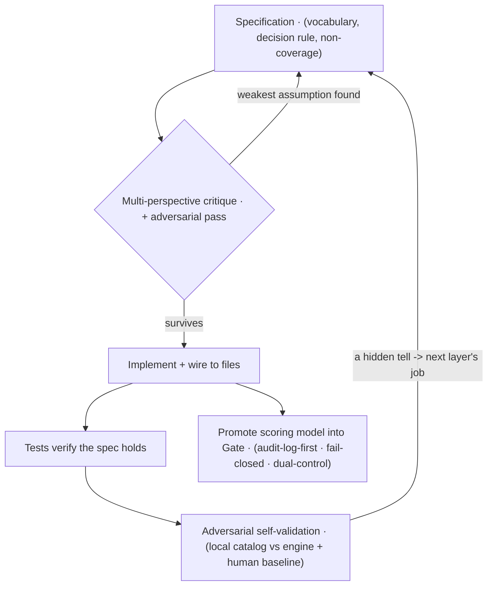

<!-- Quadrant: Explanation. -->
<!-- Audience: evaluators and developers who want to understand the method behind this reference implementation, not just its surface behavior. -->

# How this reference implementation was built

**Diátaxis quadrant:** Explanation — read for understanding, not to complete a task.
**Audience:** evaluators judging the rigor behind humanymous Gate, and developers who want to extend it in the same spirit it was written.

This page describes the *method* — how the detection engine and humanymous Gate were designed and validated — rather than how to run them. If you want to operate or integrate the system, start at the [documentation hub](../README.md). If you want to see the design decisions themselves, the [detection engine internals](detection-engine-internals.md) and [red catalog architecture](red-catalog-architecture.md) pages go layer by layer.

humanymous Gate is a reference implementation, not a production-hardened build. The method below is what a reference implementation can honestly claim: a traceable path from a written intent to a verified behavior.

The method, at a glance — a spec-first path with an adversarial loop that feeds the next design round:



The backward arrows are the point: a tell a new profile hides, or a weak assumption a critique finds, becomes the next specification's input — so nothing in the scoring path is folklore.

## Specification before code

Every capability began as a written specification — a single source of truth for one behavior — before any code existed. The spec fixed the vocabulary (which signal, which layer, which verdict), the decision rule, and the boundary of what the behavior does *not* cover. Implementation notes wired the spec to concrete files; tests verified the spec held.

The value of this order is traceability. When a signal fires in production, you can walk backward from the log line to the rule that promoted it, to the spec that defined the rule, to the reason the rule exists. Nothing in the scoring path is folklore; each contribution has a stated origin.

> **Note:** The internal specifications and planning notes are development artifacts, not part of the published product surface. This page and the rest of `docs/` are the reader-facing account of what they contain.

## Design pressure-tested from several perspectives

A design was not committed on one author's first instinct. Each significant decision was examined from several roles at once — the integrator who has to wire it, the operator who has to run it, the compliance owner who has to defend the data handling, and an evaluator looking for the over-claim — and then subjected to an adversarial critique pass whose only job was to find the weakest assumption. Only the design that survived that pass became a specification.

This is slower than writing to the first idea, and it is deliberate. Detection logic fails in the gaps between perspectives: a signal that reads cleanly to the author blinds a layer the operator depends on, or leaks an identifier the compliance owner must keep out of an end-user string. Converging the perspectives before implementation is cheaper than discovering the gap in a verdict.

## Adversarial self-validation as the forcing function

The engine was driven by attacking it. A local catalog of automation profiles — headless browsers, patched drivers, stealth toolkits, TLS parrots, protocol-level floods — runs against the engine, and the block or challenge outcome is the signal that shapes the next design round. A tell that a new profile hides becomes the next layer's job to catch.

Two rules keep this honest and safe:

- **Defensive-only, self-target-only.** Every profile in the catalog targets *your own* deployment. The harness has no third-party target and is never framed as probing one. See [self-validation: red-team your own deployment](../how-to/self-validation-red-team.md).
- **The human baseline is a first-class case.** A real-browser profile runs alongside the automated ones. A design that blocks more bots by also challenging the human baseline has not improved; it has traded one error for another. False positives are measured, not assumed away.

> **Important:** No detection is complete. Anti-detect tooling combined with real human click-farms (the T4 tier) is an explicit design boundary, not a solved problem — it is mitigated by rate and reputation, not eliminated. Any page that implies otherwise is wrong.

## Scored, not a binary flag

The engine does not emit a bot/human boolean. Each request is scored across seven layers — static client signals, fingerprint, client integrity, behavior, network and protocol, cross-check consistency, and the scoring step itself (L1–L7) — into a risk score from 0 to 100, which resolves to a verdict: ALLOW (0–29), CHALLENGE (30–69), or DENY (70–100).

Two mechanisms sit on top of the score:

- **Hard rules** promote a verdict on high-confidence evidence. When a single tell is decisive — a headless browser that also declares `navigator.webdriver`, for instance — hard rule HR-7 promotes the verdict to DENY regardless of the accumulated score. The rules are a data-driven table, each with a stated reason, evaluated in a fixed order.
- **Cross-checks** (the `x.` namespace) score *consistency between layers* rather than any single layer. A client that claims one browser engine in its user-agent but presents another engine's TLS fingerprint is inconsistent, and the inconsistency is itself a signal.

Weighting low-confidence signals weakly keeps the false-positive rate bounded; hard rules keep high-confidence evidence from being diluted by the score. The design accepts a bounded false-positive rate rather than claiming none.

## From an engine to an enforcement layer

The same scoring model was then promoted into humanymous Gate — a reverse proxy that terminates TLS, streams the detection bundle into the origin's HTML, scores each request, and enforces the verdict at the edge before the origin is contacted. Three properties were designed in from the start rather than added later:

- **Audit-log-first.** Nothing enforces until the decision has a home. Every verdict is written to a tamper-evident, append-only hash chain with periodic signed checkpoints *before* it takes effect.
- **Fail-closed.** When a required signal is missing — a strict route with no returned detection beacon — the edge challenges rather than allows. The safe default is to withhold access, not grant it.
- **Dual-control on sensitive actions.** Irreversible or fleet-wide actions (cryptographic erasure, the kill switch) require a second, distinct role to commit. No single principal can act alone.

## Observing the decision as it happens

To make the layered decision inspectable during development, the engine can emit a live trace of how a score was assembled — each layer's contribution, the cross-checks, the hard-rule evaluation, and the final verdict — through a loopback-only developer surface, the Detection Observatory. It is a development tool: it fails closed if asked to bind anything other than loopback, so it cannot become a remotely reachable surface. See [the Observatory architecture](observatory-architecture.md).

## Real networks, not one loopback host

For most of its life the system was validated with attacker and defender on the same machine. That is enough to exercise the client and TLS layers, but it silently hides the network layer: on `127.0.0.1` there is one address, no subnet diversity, and nothing that reads as a datacenter origin. Signals that key on the network can never fire there.

The validation environment now runs the defenders and the automation catalog as separate containers across a real, if local, network boundary. A container's real address is classified by its origin; one fingerprint appearing across several real subnets raises the cross-session correlation signal `l5.correlation.proxy_rotation` — the residential-proxy-rotation pattern that a single loopback host cannot produce. The attacker containers attach only to an internal network with no route off-box, so the defensive, self-target-only boundary is enforced by the network itself, not by convention.

This is verifiable. From the repository root:

```
make up
```

```
make war
```

`make up` starts the defenders; `make war` runs the automation catalog against the engine and writes the per-profile verdicts. In the reference run, every profile in the catalog was blocked or challenged and the human baseline was not denied (reference-measured). Your own run reproduces the numbers for your environment; treat any figure here as reference-measured, not a guarantee.

## What the method does and does not give you

The method gives a traceable line from intent to verified behavior, a bounded and measured false-positive posture, and an enforcement layer whose every decision is recorded before it acts.

It does not give a finished product. This is a reference implementation: it favors clarity and verifiability over the operational hardening a production deployment needs, it does not solve the T4 ceiling, and every accuracy figure is measured against a reference catalog rather than live adversarial traffic. Where a page states a limit, the limit is real.

## Where to go next

- [Which piece am I using?](which-piece-am-i-using.md) — the three surfaces (engine, Gate, Observatory) and how they differ.
- [Detection engine internals](detection-engine-internals.md) — the layers, scoring, hard rules, and cross-checks in detail.
- [Self-validation: red-team your own deployment](../how-to/self-validation-red-team.md) — run the catalog against your own edge.
