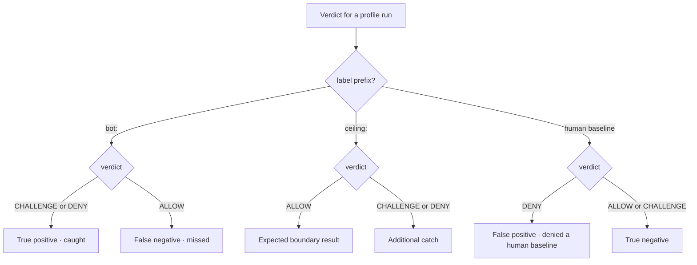

# The Red catalog: architecture of the bundled attack profiles and the raw-protocol client

> Diátaxis quadrant: **Explanation**. Audience: **Red-team developers** who want to understand how the bundled defensive test catalog and the Go raw-protocol client are built — and what each profile proves about your own detector.

> **Important — rules of engagement.** This material is purely **defensive, local-only, and self-target-only**. The catalog exists to test, understand, and extend **your own** detector's coverage against **your own** loopback engine (`127.0.0.1:8443`). It is not a third-party evasion toolkit. Every profile reproduces a tell so your detector has something honest to catch; nothing here is a recipe for defeating someone else's system. See [Red-team rules of engagement](../reference/red-team-rules-of-engagement.md) before you run or extend anything.

## Why the catalog is shaped the way it is

The Red catalog is a **fixed, enumerable set** of test profiles plus a small Go raw-protocol client. Its job is not to be an open-ended adversary — it is to give your detector a repeatable, reviewable battery of known-automated samples so you can measure detection **without** measuring it in a vacuum. Two design choices carry most of that weight: the catalog is grouped by the tell it reproduces, and it ships a **human baseline** alongside the bot profiles.

For the machine-readable profile-by-profile table (labels, expected enforcement rules, which need a browser), see the [Red-team catalog reference](../reference/red-team-catalog.md). This page explains the *architecture* behind that table.

## The human baseline turns a detection rate into a false-positive-aware one

There are **65 entries** in the runner's `PROFILES` order: **63 automated behavior profiles, one coherent boundary case, and one synthetic human baseline**. The code groups them into five increasing cost bands:

- **Direct HTTP automation — 15:** non-browser clients, protocol impersonation, header and token tricks, and the cheapest behavior tells.
- **Off-the-shelf browser automation — 12:** default browser drivers, single-axis protocol churn, and resource abuse.
- **Stealth-patched browser automation — 17:** modified browser surfaces, residual inconsistencies, multi-axis rotation, and interaction humanizers.
- **Real-browser automation — 19:** real engines combined with artificial-intelligence cadence and proxy, virtual-private-network, Tor, or source-spoofing infrastructure.
- **Coherent browser or human-assisted automation — 1:** the deliberately allowed boundary case.

`test/e2e/tiers.mjs` is the machine-readable membership list. `assertCoverage()` fails if it drifts from the runner catalog.

Two of them carry a non-`bot:` label: `human.mjs` (the human baseline) and `native_coherent_ceiling.mjs` (the coherent browser or human-assisted automation detection ceiling). The baseline is load-bearing for false-positive accounting; the ceiling is the honest boundary the design does not claim to solve. `classify()` in `test/e2e/runner.mjs` reads the profile's exported `label`: a `bot:` prefix is an automated sample, a `ceiling:` prefix is the detection ceiling, and anything else is the human baseline. The classification rules are:

- **bot** profile → `CHALLENGE` or `DENY` is a true positive; `ALLOW` is a false negative.
- **ceiling** profile → `ALLOW` is the honest expected result (the detection ceiling, priced via the attested / ceiling-guard mechanism, not a bypass); a `CHALLENGE` or `DENY` is a bonus catch, not the pass condition.
- **human** profile → `DENY` is a false positive; anything else is a true negative.

That two-axis scoring — what the profile *is* against what the engine *did* — is what turns a raw verdict into a labelled outcome:

Because a human `CHALLENGE` counts as a true negative, the reported human false-positive rate is denial-only — see the note below.

The consequence is the whole point of shipping a baseline: a catalog that only ran bot profiles could report a high detection rate while silently denying real people. Running `human` in the same battery converts "how many bots did we catch" into "how many bots did we catch **without** denying a human."

> **Note.** Because a human `CHALLENGE` is scored as a **true negative, not a false positive**, the `humanFPR` field is denial-only. It under-reports human friction: a challenge is still friction a real person feels. Inspect the challenge rate on the baseline separately; do not read a low reported rate as "no human impact." This matters most for the datacenter-network browser, no-interaction, and missing-or-replayed request-integrity-token heuristics.

## Anatomy of a browser profile: reproduce the tell, don't drive the real tool

The browser profiles (`selenium`, `puppeteer`, the Playwright variants, `undetected`, `patchright`, `direct_cdp`, and friends) export `needsBrowser = true` and are driven through the shared `test/redteam/_driver.mjs` helper, `drive(baseURL, {headless, initScripts, ...})`. That helper launches an **installed Edge** (`chromium.launch` with channel `'msedge'`) or Playwright Firefox, injects init scripts, and toggles headless/headful.

The critical architectural decision: a browser profile **reproduces the exact artifacts** an automation tool would leave, rather than driving the genuine tool. `selenium.mjs` does not spin up a real ChromeDriver — it uses `addInitScript` to **plant** the tells: the `cdc_` property that ChromeDriver injects, and `navigator.webdriver`. The profile is a faithful *fixture* of the artifact surface, not a live integration.

This buys three things:

- **Determinism.** The tell is present every run, regardless of which exact driver version is installed on the machine.
- **Reviewability.** You can read the init script and see precisely which browser-side collection stages signal you intend to trip.
- **Portability.** The battery runs from one installed browser channel instead of a matrix of real drivers.

So a browser profile answers a scoped question: *given this specific client-side artifact, does my detector's browser-side collection path fire the right signal and enforcement rule?* `selenium` is expected to reach **hard automation artifact rule** (hard automation artifact), `direct_cdp` to reach **browser-control leak plus automation evidence rule** (a Chrome DevTools Protocol leak plus an automation hint). See [enforcement rules and verdicts](../reference/hard-rules-verdicts.md) for the full ordered table.

## Why a raw Go client exists: reaching what a browser cannot

A browser — even a scripted one — cannot **rotate its own encrypted-connection fingerprint mid-session** and cannot **forge or replay a request-integrity token** at will. Those behaviours live below the browser's application programming interface. The catalog therefore ships `cmd/redteam`, a Go client built on **uTLS**, to exercise the network defenses and request-integrity path that browser profiles cannot reach.

The division of labour is clean:

- **Browser simulations → browser-side collection stages.** Client-side artifacts, integrity/guard checks, and event/interaction signals.
- **`cmd/redteam` (Go, uTLS) → network and protocol inspection plus request integrity.** Encrypted-connection and HTTP/2 implementation consistency, traffic rotation, correlation, abuse velocity, and the request-integrity-token lifecycle.

`cmd/redteam` exposes **18 `-attack` values**: `tls-static`, `tls-rotate`, `ua-rotate`, `rit-replay`, `rit-tamper`, `rit-absent`, `flood`, `distributed`, `privacy-evasion`, `signal-forgery`, `nonbrowser-ua`, `sec-chua-absent`, `sec-fetch-absent`, `ja4-churn`, `multi-axis-rotate`, `grease-absent-js`, `coherent-ceiling`, `xff-spoof` (default `-host 127.0.0.1:8443`).

> **Warning.** The `-host` default is **advisory, not enforced** — the CLI connects to whatever `host:port` you pass it. Keeping it on loopback is the operator's responsibility. (This is deliberately unlike the Detection Observatory launcher, which is structurally locked to `127.0.0.1:8443`.)

> **Note:** `cmd/redteam/main.go` declares exactly two flags — `-attack` and `-host`. There are no run-count or session flags; each invocation runs one attack and prints the resulting verdict JSON to stdout. Invocation is `redteam -attack <name> -host <host:port>`.

## TLS control via uTLS: a chosen ClientHello, and the static-parrot case

The Go client's leverage over network and protocol inspection stage comes from uTLS: it sends a **chosen `ClientHelloID`** and can force HTTP/1.1 (`forceHTTP11`). That lets a profile present a specific, controllable TLS fingerprint instead of whatever the Go standard library would emit.

The **static-parrot** case (`tls-static`) is the instructive one. It presents a fixed ClientHello with **no extension permutation** across the session. A genuine modern browser permutes certain ClientHello extensions between connections; a fingerprint that stays byte-identical is itself a tell. So `tls-static` is expected to trip the **intra-session TLS-consistency** rules and reach **in-session protocol-fingerprint rotation rule** (the TLS fingerprint behaviour rotated / is inconsistent within one session). Its sibling `tls-rotate` changes the TLS engine mid-session and reaches the same enforcement rule from the opposite direction. What this proves: your detector is not merely reading a fingerprint once, it is holding the client to a *consistent* fingerprint over the session.

## The session and request-integrity token flow

The request-integrity token profiles exercise the request-integrity token lifecycle end to end:

1. `session()` establishes the cookie and the initial request-integrity token **seed / counter** (`n`).
2. Each subsequent request carries a **live token** derived from that seed and counter.
3. The server **rotates the seed** on the response via the `X-HM-Seed` header; the client is expected to follow the rotation.

Two attacks break that contract in different places:

- **`rit-replay`** re-sends a token whose counter is now stale → the engine sees `l5.rit.stale_replay`. Expected outcome: **missing or replayed request-integrity token rule** (a replayed or absent request-integrity token on an API call — a CHALLENGE heuristic).
- **`rit-tamper`** signs one body and sends another → `l5.rit.header_tampered` / `l5.rit.body_mismatch`. Expected outcome: **request-body integrity failure rule** (a request-integrity token that fails the body HMAC).

What this proves about your detector: the token is bound to the request body and to a monotonically advancing counter, so neither a copy nor a swap survives.

## Correlation and abuse constructions

Two network-stage attacks are built by controlling headers and velocity rather than fingerprints:

- **`distributed`** holds **one fixed fingerprint** while rotating the `X-Forwarded-For` subnet across requests → `l5.correlation.proxy_rotation`, reaching **cross-session correlation rule** (one fingerprint across many subnets — residential-proxy-style rotation).
- **`flood`** drives velocity that is **metered by JA4 + subnet, not by raw IP** → `l5.abuse.flood`, which produces a **score-based CHALLENGE** plus the fingerprint-keyed rate-limit ban ladder. (A lone flood is deliberately *not* a scoring DENY — Hypertext Transfer Protocol version 2 denial-of-service protection rule excludes `l5.abuse.flood` to avoid CGNAT lockouts and is reserved for HTTP-2 DoS; the ban ladder is enforced at the Gate.)

The `distributed` and `flood` cases prove your rate/correlation logic keys on the *client identity* (fingerprint, JA4+subnet) rather than the trivially-rotated IP.

## Why every raw attack spoofs full browser headers

Each `cmd/redteam` attack sends a **complete, browser-like header set**. This is intentional and is the sharpest part of the catalog's design. If the raw client sent obviously non-browser headers, the header consistency checks (`x.ua_vs_ja4`, `x.ua_vs_h2`, `x.browser_no_js`, `x.uach_present`) would light up immediately and the engine would catch the request for the *wrong* reason — a header inconsistency the real attack would never have.

By keeping the header cross-checks **quiet**, the catalog forces the engine to catch the request on the **specific network or anti-tamper signal the attack is actually about**. That is the honest test: `tls-static` must be caught by TLS-consistency, not by a sloppy header; `rit-tamper` must be caught by the body HMAC, not by a missing UA. Each raw attack is deliberately mapped to one intended signal → one intended enforcement rule, and spoofing the headers is how you isolate that path.

For how those consistency checks and per-stage signals are assembled into a verdict, see [How Gate sees a request](../concepts/how-gate-sees-a-request.md).

## Which tool tests which stage (summary)

| Tool | Stages exercised | How |
| --- | --- | --- |
| Browser simulations (`.mjs`, `needsBrowser=true`) | browser-side collection stages | `_driver.mjs` injects planted artifacts (e.g. `cdc_`, `navigator.webdriver`) via `addInitScript` in installed Edge / Playwright Firefox |
| `cmd/redteam` (Go, uTLS) | network and protocol inspection stage + request-integrity token | chosen ClientHelloID, mid-session fingerprint/UA rotation, spoofed `X-Forwarded-For`, request-integrity token replay/tamper, full browser headers |

One profile sits apart: **`rapid_reset`** never completes a scored `collect`. There is no `SessionReport` to score, so instead of a verdict it surfaces on the **`network.abuse`** path — the pipeline records the abuse event rather than a per-request score. It is expected to reach **Hypertext Transfer Protocol version 2 denial-of-service protection rule** through the H2-DoS family. Treat its absence of a normal scored verdict as *by design*, not as a gap.

## The coherent browser or human-assisted automation ceiling is a catalog boundary, not a scoreboard

The catalog is a **fixed set of adversaries you chose to reproduce** — not the field of all possible adversaries. The most capable tier the design acknowledges is **coherent browser or human-assisted automation**: anti-detect tooling combined with real-human click-farms. coherent browser or human-assisted automation is a stated design boundary, mitigated by rate and reputation, **not** solved. The catalog cannot and does not claim otherwise.

The practical rule for reading results:

- A profile that slips through is a **coverage finding about your detector** — an entry to add, a signal to strengthen, an enforcement rule to reorder.
- It is **not** an evasion recipe, and it is not evidence the field of adversaries has "won."

Every number the catalog produces is **reference-measured on your machine**, against your loopback engine, with the profiles you enabled. It bounds what *this battery* found; it does not bound what a novel adversary could do. Keep that honesty in the framing whenever you report a block-rate.

## See also

- [Red-team catalog reference](../reference/red-team-catalog.md) — the profile-by-profile table (labels, expected enforcement rules, `needsBrowser`).
- [Red-team rules of engagement](../reference/red-team-rules-of-engagement.md) — the defensive, local-only, self-target-only boundary you operate within.
- [enforcement rules and verdicts](../reference/hard-rules-verdicts.md) — the ordered Core enforcement-rule table and verdict thresholds.
- [How Gate sees a request](../concepts/how-gate-sees-a-request.md) — how per-stage signals and consistency checks combine into a verdict.
