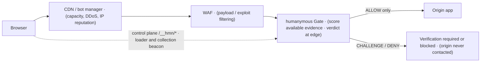

# Where Gate fits: vs WAF, CDN bot manager, and CAPTCHA

> **Quadrant:** Explanation. **Audience:** security buyers, threat modelers, and skeptical reviewers deciding where humanymous Gate ("Gate") sits — or does not sit — in an existing stack.

This page is written engineer-to-engineer, limitations first. If you already run a WAF, a CDN bot manager, or a CAPTCHA vendor, the honest question is not "is Gate better" — it is "what does Gate decide that those do not, where does it overlap, and where is it simply not the right tool." This page answers that without selling. It names the threat tiers Gate is reliable on, the tier where it degrades gracefully, and the tier it does not solve at all.

This repository is a **reference implementation**, not a production-hardened build. Where a capability is deferred to production (a production responsibility), this page says so and links the [production-vs-reference reference](../reference/production-vs-reference.md).

## The one-sentence placement

Gate decides **whether the caller is a human-driven browser or an automated client**, using a risk score built from behavioral, TLS/HTTP-2, and cross-layer-consistency evidence — and it enforces that decision at the edge before your origin is contacted. It is not a payload firewall, not a network CDN, and not a CAPTCHA vending machine. It is complementary to all three.

Placed in a stack, each stage does its own job and Gate owns only the human-or-automation verdict:

The CDN and WAF sit ahead of Gate for the jobs they own; Gate makes the per-request, auditable human-or-automation call the other two do not model.

## Start with what it does not replace

Before the comparison, three boundaries that a buyer needs on the table first.

- **It is not a WAF.** Gate does not inspect request payloads for SQL injection, cross-site scripting, path traversal, or application-layer exploits. If your problem is "a malformed request is exploiting my app," Gate is the wrong layer. Run a WAF for that, and run Gate alongside it for the "is this a human" question a WAF does not answer.
- **It is not a finished CAPTCHA replacement.** Gate does not require a third-party CAPTCHA service. The reference includes proof-of-work and Pass components, but the Gate does not connect them into a complete recovery flow for every challenged visitor. A deployment must supply and test the accessible flow it promises.
- **It does not solve human-assisted abuse.** Anti-detect browser stacks driven by real people (click-farms) are a stated design boundary, mitigated only by rate limiting and reputation. More on this in the threat-tier section below.

Everything that follows should be read against those three.

## Gate vs a rule/signature WAF

A signature or rule-based WAF matches requests against known-bad patterns: a payload that looks like an injection string, a header that matches a CVE probe, a rate that crosses a static threshold. That is pattern-matching against a catalog. It is effective for what it is built for — malformed and exploit-shaped requests — and it is fundamentally **static**: a request either matches a rule or it does not.

Gate is doing a different job with a different mechanism:

| | Rule/signature WAF | humanymous Gate |
| --- | --- | --- |
| Core question | Is this request *shaped* like a known attack? | Is this caller a *human-driven browser* or automation? |
| Method | Static rules / signatures matched per request | A risk score (0–100) aggregated across seven detection layers, then enforcement rules |
| Behavioral evidence | Not modeled | interaction analysis stage — mouse, keystroke, scroll, `isTrusted` |
| TLS / HTTP-2 evidence | Not modeled | network and protocol inspection stage — JA3/JA4, HTTP/2 fingerprint, header order |
| Cross-layer consistency | Not modeled | consistency-check stage — does the UA agree with UA-CH, the JS environment, and the TLS engine? |
| Output | Match / no-match (block or allow) | A score plus a verdict (ALLOW / CHALLENGE / DENY), deterministic and auditable |
| A well-formed automated request | Passes (nothing matches) | Can still be flagged — the *engine*, not the payload, gives it away |

The load-bearing difference is the last row. A stealth automation client can send a perfectly well-formed HTTP request that no WAF rule matches — correct headers, valid method, benign body. A WAF has nothing to catch. Gate is looking somewhere else: at the **disagreement between layers**. A user agent that claims Chrome while the TLS and HTTP/2 fingerprints resolve to a different engine (browser and network-engine mismatch rule) is not something a payload signature can see, because the payload is fine — it is the *consistency* that fails. Gate weights inter-layer disagreement above any single "botty" heuristic, precisely because consistency is harder to fake than any one attribute.

So the two are not competitors. A WAF answers "is this request malicious in shape." Gate answers "is this caller a human." Run both. For the full layer model and enforcement-rule catalog, see [how Gate sees a request](../concepts/how-gate-sees-a-request.md).

## Gate and a CDN bot manager: complementary

A CDN bot manager lives at the network edge, usually bundled with your CDN/DDoS layer. It brings things Gate does not: global anycast capacity, volumetric DDoS absorption, IP reputation feeds at internet scale, and a managed good-bot allowlist for search crawlers. Those are real and Gate does not reproduce them.

Where they meet is the "is this a human" decision, and the honest framing is **complementary, not redundant**:

- A CDN bot manager typically scores from network-edge signals and its own reputation graph, and its detection logic is a managed black box you configure but do not see inside.
- Gate scores the **evidence its current collector actually supplies**, and every decision is written to a **tamper-evident audit log**. Core demonstrates the richer browser and network correlation path; Gate does not currently extract Core's full ClientHello or HTTP/2 evidence. The reasoning remains inspectable per decision through contributors, descriptive rule names, and the score.

A common shape: keep the CDN in front for capacity, DDoS, and coarse reputation; put Gate at the application edge for the fine-grained, auditable human-or-automation verdict on the routes that matter (login, checkout, admin). The CDN sheds volume; Gate makes the per-request call you can defend in an incident review.

> **Note:** The reference does **not** ship a good-bot allowlist admin endpoint — that is a reserved concept, not exposed here. If your posture depends on allowlisting specific crawlers, that responsibility currently sits with your CDN layer, not Gate. See [production-vs-reference](../reference/production-vs-reference.md).

## Why Gate is not a CAPTCHA replacement

It is tempting to read "CHALLENGE" as "shows a CAPTCHA." It does not, and the distinction matters for buyers evaluating against a CAPTCHA vendor.

- Gate's CHALLENGE withholds the request from the origin and returns a minimal reference response. The repository contains proof-of-work and Pass components, but the deployed recovery path is an operator responsibility.
- Proof-of-work proves *that CPU work was spent*, not *that the caller is human*. So a score-based CHALLENGE (no enforcement rule) is promoted to ALLOW when the session presents `l7.pow.solved` — but proof of work **never** overrides an enforcement rule, because spending CPU does not prove humanity.
- A CAPTCHA product's job — presenting a human-interaction puzzle and returning a pass/fail token — is not what Gate does. If your requirement is specifically "make the user prove humanity by completing an interactive task," that is a CAPTCHA, and Gate's proof of work challenge is not a drop-in for it.

The reference ships only a **minimal HTTP 401 response**, not a complete accessible visitor-recovery experience. Any accessibility-conformance statement is a target for the deployed challenge, not a claim about the reference response. See [challenge accessibility](../help/challenge-accessibility.md).

## The threat model in buyer language: five attacker cost bands, from direct HTTP automation through coherent browser or human-assisted automation

Gate's honesty is easiest to check against attacker tiers. Reliability degrades as the adversary gets closer to "a real browser driven by a real human," and the design says so explicitly.

- **direct HTTP automation — non-browser HTTP clients.** Scripts and tools that speak HTTP but are not a browser at all (curl-class clients, bare HTTP libraries). **Reliable.** A browser UA with zero client-side JS evidence trips an enforcement rule (browser claim without execution evidence rule); there is no engine to fake the client and network signals coherently.
- **off-the-shelf browser automation — naive automation.** Off-the-shelf Selenium, Puppeteer, undetected-chromedriver with default tells. **Reliable.** Hard automation artifacts (hard automation artifact rule) and headless-plus-a-second-tell (headless browser plus another automation indicator rule) are high-confidence DENY conditions.
- **stealth-patched browser automation — stealth-patched with residual leaks.** Automation patched to hide the obvious flags but still leaking a Chrome DevTools Protocol tell, a patched native getter, or a UA-vs-TLS mismatch. **Reliable.** This is where cross-layer consistency (consistency-check stage) and Chrome DevTools Protocol-leak rules (stealth browser modification rule, browser-control leak plus automation evidence rule, browser and network-engine mismatch rule) earn their place — the patch fixes one layer and the disagreement surfaces in another.
- **real-browser automation — real-engine automation.** Tools like nodriver, camoufox, and patchright that drive a genuine browser engine with few static tells. **Degrades gracefully — lower confidence.** Here the static and fingerprint layers give less, and the decision leans on **behavioral (interaction analysis stage) and network (network and protocol inspection stage)** evidence. Gate still scores and can still challenge or deny, but with lower confidence, and the honest expectation is fewer certain verdicts, not none. This is a "raises the cost, flags many, catches fewer with certainty" tier, not a solved one.
- **coherent browser or human-assisted automation — anti-detect stacks driven by real humans.** Click-farms: genuine human behavior on a genuine engine behind anti-detect tooling. **Not solved. A stated design boundary.** Much of what coherent browser or human-assisted automation emits *is* real human behavior on a real engine, so detection alone cannot separate it from a legitimate user. Gate mitigates coherent browser or human-assisted automation **only** through rate limiting and reputation (the escalating ban ladder, fingerprint- and subnet-level metering) — it does not claim a detection answer. If your threat model is dominated by paid human labor, Gate raises the cost but does not close the gap, and you should plan for that with rate and reputation controls, not detection.

> **Important:** The tier where Gate is strongest (direct HTTP automation–stealth-patched browser automation) is also the tier most commodity automation lives in. The tiers where it degrades or stops (real-browser automation–coherent browser or human-assisted automation) require an adversary willing to spend real engineering or real human labor. Place Gate against your *actual* expected adversary, not the worst imaginable one.

## Other honest limits a reviewer should weigh

Three residuals, stated plainly, that a skeptical reviewer will (and should) ask about:

- **The safe-GET fail-open residual.** On a `balanced` route, when the verdict is still Unknown and the method is a safe read (GET/HEAD), Gate fails **open** — it passes the request rather than blocking it. This is a deliberate, documented residual that protects real first-time visitors and wanted crawlers, and it is covered meanwhile by fingerprint- and subnet-level rate metering. You can close it on sensitive routes with the `strict` preset, which fails **closed** (Unknown → challenge). Unsafe methods (POST/PUT/PATCH/DELETE) always fail closed regardless of preset. Full treatment in [will this break my app?](./will-this-break-my-app.md).
- **Tamper-evident, not tamper-proof.** The audit log is a hash chain with per-record HMAC and Ed25519 Signed Tree Heads co-signed by an independent witness. Tampering with checkpointed history is detectable. But records written *after* the last signed checkpoint remain re-writable by the writer until the next checkpoint — the unanchored in-window residual. This is the honest scope of the guarantee: tamper-**evident**, not tamper-proof.
- **Reference vs production.** This build is a reference implementation. Several things a production deployment needs — a self-hosted WCAG challenge UI, real KMS/HSM and ACME certificates, mutual Transport Layer Security/SSO admin auth, automated key rotation, a standalone offline audit verifier, SIEM log shipping — are production responsibilities, not shipped here. (Shared fleet state — bans and verdicts default to in-process/single-node — now has an **experimental, off-by-default** `-redis` backend; see [CLI flags](../reference/cli-config-policy.md).) Do not evaluate the reference as if it were the production surface. The full list is in [production-vs-reference](../reference/production-vs-reference.md).

## When your existing stack is enough — and when Gate is not a fit

A calm buyer's checklist. Gate is **not the right addition** if:

- **Your problem is payload exploits, not automation.** If what you need is injection/XSS/exploit filtering, a WAF already covers it and Gate adds nothing there.
- **Your problem is volumetric DDoS or global edge capacity.** That is a CDN/anycast job. Gate is an application-edge verdict layer, not a traffic-absorption layer.
- **You specifically need an interactive human-proof puzzle.** If your requirement is a CAPTCHA-style interaction returning a pass/fail token, Gate's proof of work challenge is not a substitute.
- **Your adversary is predominantly coherent browser or human-assisted automation (human click-farms).** Gate does not solve this tier; rate and reputation controls — which you may already have — are the mitigation, and Gate's contribution there is incremental, not decisive.
- **You cannot place a reverse proxy in the request path.** Gate must sit in front of the origin to apply route policy and enforce before origin contact. Direct encrypted-connection termination alone does not activate Core's full network fingerprint collection in the current Gate.

Gate **is** a fit — and complementary to the above — when:

- You need a **human-or-automation** verdict on specific high-value routes (login, checkout, signup, admin), and you need that verdict to be **auditable** and defensible per-decision, not a black-box score.
- Your expected adversary is largely **direct HTTP automation–stealth-patched browser automation commodity automation** (Selenium/Puppeteer/undetected-chromedriver), with some real-browser automation you want flagged and rate-limited even at lower confidence.
- You want **behavioral + TLS/HTTP-2 + cross-layer-consistency** evidence that a payload WAF and a network CDN structurally do not model.
- You want to run it **alongside** your WAF and CDN, each doing its own job, rather than replacing either.

The mechanical summary, in bounded terms: Gate **reduces** commodity automation reaching your origin, **raises the cost** of stealth automation by forcing cross-layer coherence, **flags and challenges** what it is unsure about, and **blocks** what fires an enforcement rule — while being candid that it does not filter payloads, does not absorb volumetric floods, and does not resolve human-assisted coherent browser or human-assisted automation traffic.

## Related pages

- [Supported topologies](../reference/supported-topologies.md) — which detection layers are active in each deployment shape; the raw-TLS requirement and why a fronting CDN silently disables the network plane.
- [What Gate is (and is not)](./what-gate-is.md) — the mechanism, the score-not-a-flag design, and the audit posture, in depth.
- [Will this break my app?](./will-this-break-my-app.md) — the safety model, fail-open/fail-closed behavior, and a monitor-first rollout.
- [Production vs reference](../reference/production-vs-reference.md) — the canonical list of what this reference build does not ship for production.
- [How Gate sees a request](../concepts/how-gate-sees-a-request.md) — layers, verdicts, enforcement rules, and the shared glossary.
- [Challenge accessibility](../help/challenge-accessibility.md) — why CHALLENGE is proof-of-work, and what the interstitial does and does not promise.
