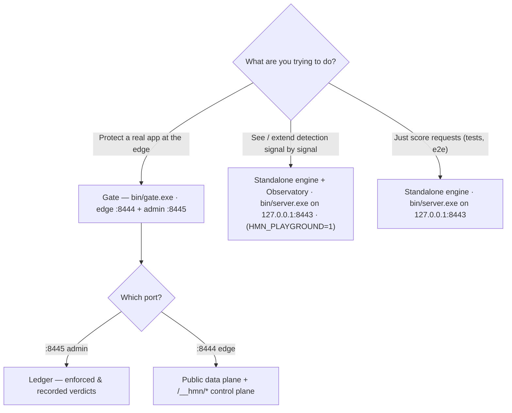

# Which piece am I using? Detection engine, Gate proxy, and the Observatory

**Diátaxis quadrant:** Explanation. **Audience:** any first-time reader — especially integrators and Red/Blue developers — who has now met two binaries and three ports and wants to know which one they are actually touching.

> **Note:** This is a defensive, local-only, self-target-only project. Everything below runs against your own loopback for understanding your own detector. Nothing here is about evading a third party's site.

There is exactly **one** detection brain: the L1–L7 signal scoring in `internal/scoring`, which takes a request's client, network, and cross-check signals and returns a risk score and an `ALLOW | CHALLENGE | DENY` verdict. That one brain ships in **two runnable forms** — a standalone detection engine and the Gate reverse proxy — plus **one developer viewer**, the Detection Observatory. Whenever you are looking at a verdict, you are looking at one of these three surfaces. Naming the surface first removes almost all of the confusion, because the same score can reach you through a bare HTTP endpoint, through an enforcing edge proxy, or through a read-only per-signal explainer.

## The three surfaces at a glance

| Surface | Binary | Build | Port(s) | What it does | Who it is for | Production-facing |
|---|---|---|---|---|---|---|
| Standalone detection engine | `bin/server.exe` | `go build -o bin/server.exe ./cmd/server/` (plus `GOOS=js GOARCH=wasm go build -o web/detector.wasm ./cmd/wasm/`) | `127.0.0.1:8443` only | Scores requests across L1–L7 and returns the verdict. No edge enforcement, no admin plane, no audit log. Used by the tests and as the host for the Observatory. | Developers seeing, testing, and extending detection; the Red catalog and e2e runner | No — a reference/testing surface |
| Gate reverse proxy | `bin/gate.exe` | `go build -o bin/gate.exe ./cmd/gate/` | edge `:8444` + admin `:8445` | Wraps the same engine and adds TLS termination, streaming bundle injection, edge enforcement, a tamper-evident audit log, the Ledger, bans, and dual-control | Operators protecting a real app at the edge | Yes — this is the production piece |
| Detection Observatory | (a dev-gated page **on** `bin/server.exe`) | same build as the engine, then run with `HMN_PLAYGROUND=1` | served on `127.0.0.1:8443` | A read-only SPA that shows the engine's per-signal scoring in isolation: the ScoreTrace, hard-rule evaluations, and live self-test runs | Developers who want to *understand* a verdict signal by signal | No — dev-gated and loopback-only |

To run the standalone engine after building:

```
bin/server.exe -addr 127.0.0.1:8443 -web web
```

The engine's flags are `-addr`, `-web`, and `-rit` (default `true`). The Observatory appears on that same server only when it is dev-gated on with `HMN_PLAYGROUND=1`, and it refuses to start on a non-loopback `-addr` (fail-closed).

## The one sentence that prevents the mistake

**The Observatory on `:8443` is NOT the Ledger on `:8445`, and a promoted Gate build never exposes the Observatory.** They live on different binaries and different ports, they serve different audiences, and they carry different data. If you are on `:8443` you are on the developer viewer; if you are on `:8445` you are on the operator's admin plane.

## Two lenses on the same brain

Because both binaries embed the same `internal/scoring` engine, they answer the same question — but they show it through different lenses:

- **Ledger Overview (`:8445`, Gate):** the *enforced and recorded* verdicts on the running proxy — what actually happened to real requests at the edge, written to the tamper-evident audit log.
- **Detection Observatory (`:8443`, engine):** the engine's per-signal scoring *in isolation* — how a single session was scored, layer by layer, with nothing enforced and nothing recorded to an audit log.

One lens is "what the edge did to live traffic"; the other is "how the scorer reached this number." Neither replaces the other.

## Decision guide



- **I want to protect an app.** Use **Gate** (`bin/gate.exe`, edge `:8444` + admin `:8445`) and start with the [monitor-mode quickstart](../tutorials/quickstart-monitor-mode.md).
- **I want to see, understand, or extend detection.** Use the **standalone engine plus the Observatory** — see [run the detection engine](../how-to/run-detection-engine.md) and [the Detection Observatory](../how-to/detection-observatory.md).
- **I want to run in production.** Follow the **Operator path** in [start here: operator](../start-here/operator.md).
- **I am wiring the detector into an app or a build.** Start with [start here: integrator](../start-here/integrator.md).

## Why the verdicts stay consistent

Both binaries embed the **same** `internal/scoring` engine, so a request that scores as `CHALLENGE` on the standalone engine scores the same way inside Gate — the difference is only whether that verdict is enforced and recorded (Gate) or simply returned and, optionally, explained (engine + Observatory). For the shared per-request scoring path that all three surfaces sit on top of, see [how Gate sees a request](../concepts/how-gate-sees-a-request.md).
