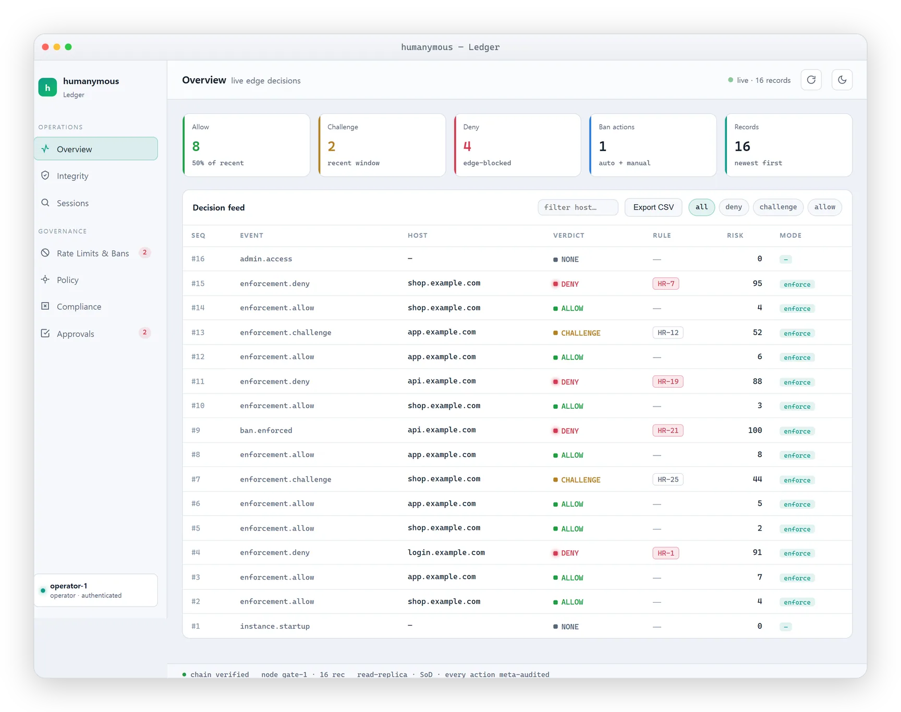
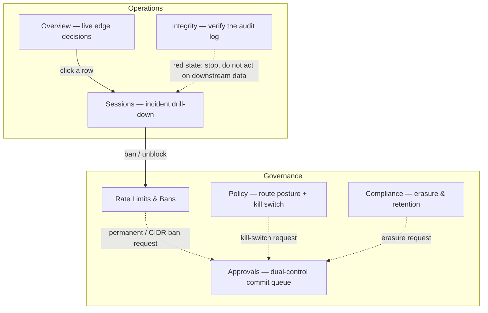
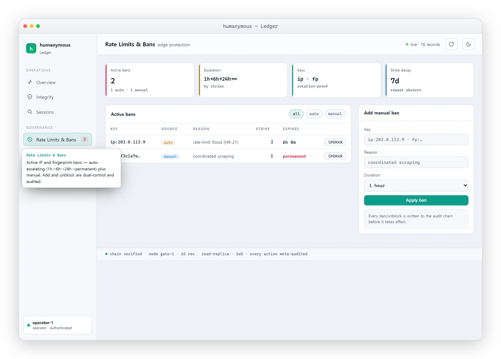
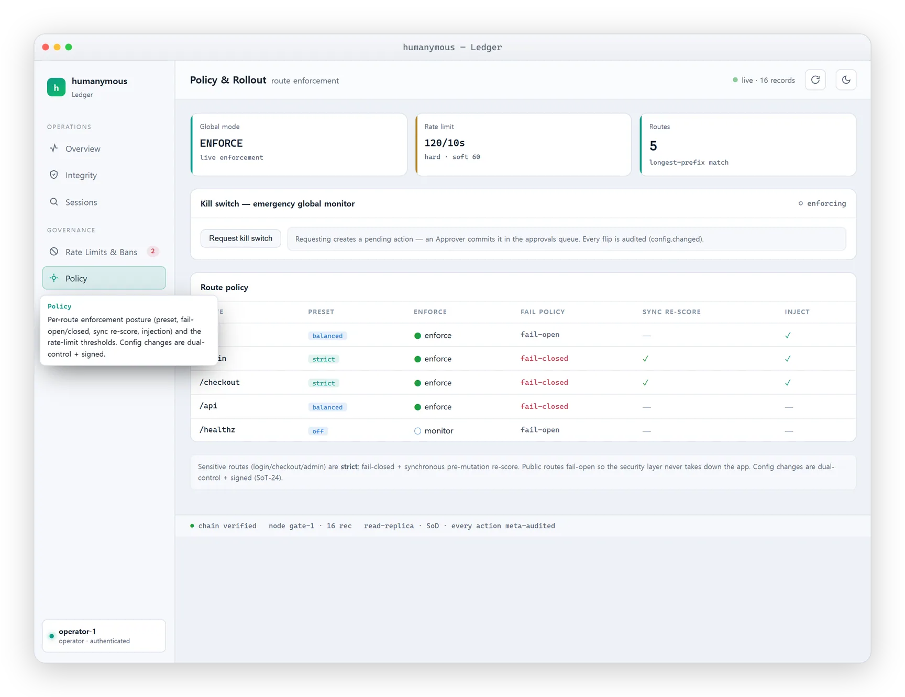
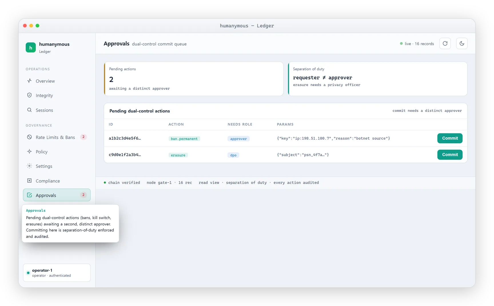

# Ledger tour for operators

> **How-to / annotated tour.** For a new or occasional on-call operator learning the humanymous Gate Ledger.
> **Audience:** you are on the security-operator rotation, you have a token, and you need to know what each view answers and how to act from it — without breaking anything.

This page walks the seven views of the Ledger in the order you will use them on a shift. For each view you get three things: the question it answers, what the badges and subtitles mean, and how to act from it. This is a reference implementation, not a production-hardened build, so treat the numbers you see as reference behavior and confirm before you widen the blast radius of any action.

If you have never seen how Gate scores a request, read [How Gate sees a request](../concepts/how-gate-sees-a-request.md) first. For what the hard-rule IDs and dotted signal IDs mean when you drill in, keep [Hard rules, verdicts & signal-ID reference](../reference/hard-rules-verdicts.md) open in a second tab.

## Open the console

The Ledger is a single-page app served on the **separate admin listener** (default `127.0.0.1:8445` (loopback)), not on the public edge. The `/__hmn/admin/*` path returns `404` on the public edge by design.

```
https://localhost:8445/__hmn/admin/console
```

<picture>
  <source media="(prefers-color-scheme: dark)" srcset="../assets/screenshots/framed/hero-ledger-dark.webp" />
  
</picture>

In dev the console is injected with the **Operator** token, so it can read every view and *request* actions. Any two-person (dual-control) action must be committed by a genuinely **distinct** token — an Approver or DPO, never your own. Actor identity is derived server-side from the token; you cannot act as someone else by editing a request body.

A few things to know before you click around:

- The dev listener uses a self-signed certificate, so expect a browser certificate warning.
- The console **loads each view once**, then caches it — the first visit to a view fetches, and every navigation after that is instant.
- There is a **light / dark theme toggle**.
- There is a **refresh button** whose job is to *re-verify the chain now* — it re-runs the integrity check and re-pulls the current data, rather than waiting for the next poll.
- Navigation is **keyboard-operable** (the nav items expose `role="button"`, `tabindex`, and `aria-current`), and there is a hamburger menu on narrow screens.

The seven views are grouped into two sections: **Operations** (Overview, Integrity, Sessions) and **Governance** (Rate Limits & Bans, Policy, Compliance, Approvals). The arrows below trace the triage path you walk most shifts — spot a pattern on Overview, drill into a sample decision in Sessions, then act in Rate Limits & Bans; a two-person action you request lands in Approvals for a distinct approver to commit:



---

## Operations

### Overview — "live edge decisions"

**Question it answers:** What is the edge deciding *right now*?

This is your home base: a live feed of every edge decision — ALLOW, CHALLENGE, DENY — computed from the audit stream, with summary tiles above it. When a pattern shifts, you notice it here first: a DENY rate climbing sharply, or CHALLENGE landing on a route that normally passes.

**How to act from it:** the first judgment is always *attack or false-positive?*

- A jump in CHALLENGE/DENY on routes that normally pass, with users reporting blocks, points to a **false-positive spike**.
- One fingerprint across many subnets, a destructive flood, or a fingerprint sweeping many sessions points to an **abuse surge**.

You do not decide from the Overview alone. **Click a row to drill into it** — that opens the full evidence for that decision in the Sessions view (below). Read the contributing signals there before you ban anyone or conclude a verdict was unjust.

> **Note:** There is **no dedicated false-positive or appeal-queue view** in this reference. False-positive triage is done exactly this way — spot the pattern on Overview, then drill into a sample decision in Sessions to read why it fired. Do not go looking for an appeals inbox; it is not here.

### Integrity — "tamper-evident audit log"

**Question it answers:** Can I still trust the audit log itself?

The Integrity view (also labelled "Chain Integrity") verifies the audit log **live** via `SelfVerify` on this node: hash linkage, the per-record HMAC (the node holds the HMAC key), Ed25519 Signed Tree Heads, and the local witness when configured. An **external** auditor who only holds published public keys uses `GET /__hmn/admin/keys` + exported checkpoints and may get class `hmac-unchecked` — see [Verify the audit log](./verify-audit-log.md).

A **green / passing** state means the chain verified end to end. This is "tamper-evident," not "tamper-proof" — records written after the last signed checkpoint remain re-writable by the writer until the next checkpoint is signed, which is an honestly-scoped in-window residual, not a gap in the verification.

A **red** integrity state is a signal that something is wrong with the log's own integrity — for example a hash break, an HMAC mismatch, a sequence gap, a linkage break, a checkpoint mismatch, or a missing node (a suppression alert). This is not a routine verdict question; it means the record of decisions may have been altered.

**How to act from it:** if the Integrity view goes red, stop and follow the dedicated procedure — do not treat it as noise and do not act on downstream data until you understand the mismatch. See [Verify the audit log](./verify-audit-log.md) for what each mismatch class means and the exact steps to confirm and escalate. Use the **refresh button** to re-verify the chain on demand.

### Sessions — "incident drill-down"

**Question it answers:** *Why* did this specific decision happen?

This is where an Overview row lands when you click it, and it is where you go when a user gives you an incident handle. You look up any decision by its **record seq** (the incident reference), and you get the full evidence for it: the timeline, the top contributing signals, and the pseudonymized subject.

The top contributors are dotted signal IDs of the form `l{n}.{group}.{item}` (lowercase; layer tokens are uppercase L1–L7) — for example `l1.navigator.webdriver`, `l2.webgl.param_consistency`, `l4.mouse.click_no_trajectory`. The L6 consistency cross-checks use a separate `x.` namespace (`x.ua_vs_ja4`, `x.ua_vs_h2`, `x.browser_no_js`). Read these against the [Hard rules, verdicts & signal-ID reference](../reference/hard-rules-verdicts.md) to understand what tipped the score and which hard rule, if any, overrode it.

The subject is **pseudonymous, not anonymous** — identifiers such as IP, JA4, and device fingerprint are stored only as per-subject-key-derived pseudonyms, never raw. You are reading a stable pseudonym, not a person's raw address.

**How to act from it:** this is the evidence step, not the action step. Once you have read the contributors and confirmed whether the verdict was just, you go to Rate Limits & Bans to ban or unblock the subject, or you conclude it was a false positive and unblock. For the end-user-facing explanation of a block, see [Why am I seeing this?](../help/why-am-i-seeing-this.md).

---

## Governance

### Rate Limits & Bans — active bans and the ladder

**Question it answers:** Who is currently blocked, and how do I block or release someone?

This view lists the active **IP and fingerprint bans**. A **badge shows the active ban count** so you can see at a glance whether the ban list is growing. Bans come from two sources: automatic escalation on the ladder **1h → 6h → 24h → permanent** (with strike decay over time), and manual bans you add. Ban keys are `ip:<addr>` or `fp:<fingerprint>`.

<picture>
  <source media="(prefers-color-scheme: dark)" srcset="../assets/screenshots/framed/console-bans-dark.webp" />
  
</picture>

**How to act from it — and who has to co-sign:**

- **Temporary bans** and **lifts (unblock)** are single **Operator** actions. You can do these yourself.
- **Permanent or CIDR bans** are **dual-control**: you request as Operator, and a **distinct Approver** commits it. You cannot approve your own request.
- **Bulk bans are temporary-only** — permanent or CIDR entries are rejected from a bulk add and need the dual-control path.

Every add and unblock is audited. For the exact request/commit steps, the escalation ladder details, and how bans interact with the kill switch, see [Kill switch and bans](../runbooks/kill-switch-and-bans.md). For the full role-to-capability matrix, see [RBAC and separation of duties](../reference/rbac-separation-of-duties.md).

### Policy — "route enforcement"

**Question it answers:** What posture is each route running, and can I change it here?

The Policy view (also labelled "Policy & Rollout") shows the **per-route posture**: the preset, whether the route fails open or closed on an unknown verdict, whether it re-scores synchronously before a mutation, and whether injection is on — plus the rate-limit thresholds. Config changes in this view are **dual-control and signed** (they carry a signed config version), so a posture change is a recorded, two-person event.

<picture>
  <source media="(prefers-color-scheme: dark)" srcset="../assets/screenshots/framed/console-policy-dark.webp" />
  
</picture>

The one thing to be clear about on a shift:

> **Important:** Per-route presets are set at **startup**, in the route table, and there is **no runtime per-route policy-write endpoint** in this reference. Changing a single route's preset means editing the route table and restarting Gate. The only *runtime* enforcement lever is the **kill switch** (and the `-monitor` boot flag). Do not expect to retune one route live from this view.

So you read posture here to understand *why* a route is behaving as it is (for example, `/login`, `/checkout`, and `/admin` default to the strict preset; `/health` maps to the off preset), but you do not live-edit a route's preset. For the day-to-day posture and rollout workflow, see [Deployment and policy operations](./deployment-policy-operations.md).

**How to act from it — the runtime lever you *do* have:** the kill switch. It is a dual-control flip that demotes hard-rule enforcement to monitor **fleet-wide** — detection keeps scoring and logging, traffic flows, and manual bans still enforce.

> **Warning:** The kill switch is fleet-wide. It stops hard-rule enforcement everywhere Gate runs, not on one route or one node. Traffic that would have been challenged or denied will pass. Pull it only as a deliberate, two-person decision, and plan to restore enforcement. The procedure is in [Kill switch and bans](../runbooks/kill-switch-and-bans.md).

### Compliance — "erasure & retention"

**Question it answers:** How do I honor a right-to-erasure request, and how long is data kept?

This view covers cryptographic erasure (crypto-shred) and retention labels. A right-to-erasure request is honored by **destroying the per-subject linkage key** for a **session subject** — the chain and its Merkle anchors stay intact and verifiable; the records are never deleted, but that session can no longer be re-linked. HOT / WARM / COLD are **declared** windows (~90d / ~1y / ~7y) shown for operator orientation — the reference does **not** auto-enforce them or write to WORM media.

Erasure is **DPO-gated and dual-control**: an Operator can request it, but the committer must be a **distinct DPO** — a generic Approver cannot commit an erasure. There is a **cancellable hold window** (default 5 minutes) before a due erasure executes.

This view also shows a **"Scheduled erasures (hold window)"** list: every approved erasure waiting out its hold window before the crypto-shred commits, with a live countdown to execution and a per-row **Cancel** button. Cancelling a scheduled shred during its window stops the linkage-key destruction, and every cancel is itself written to the audit chain. This is the safety net for a mistaken or superseded request — you can pull it back any time before the window closes.

> **Warning:** Cryptographic erasure (crypto-shred) is irreversible. Once the hold window passes and the linkage key is destroyed, the subject's pseudonym linkage is gone for good — the records remain in the chain but can no longer be tied back to the subject. Confirm the request is correct before the hold window closes; if in doubt, **Cancel** the scheduled erasure and re-request once you are certain.

**How to act from it:** follow the dedicated procedure rather than improvising — see [Erasure and crypto-shred](../runbooks/erasure-crypto-shred.md) for the request, hold-window, cancel, and DPO-commit steps.

### Approvals — "dual-control commit queue"

**Question it answers:** What two-person actions are pending, and how do I commit one as the second approver?

Every dual-control action — a **permanent or CIDR ban**, the **kill switch**, or an **erasure** — is *requested* in its own view but not applied immediately; it lands here as a pending item. The Approvals view is that commit queue, with a **badge showing the pending count**. Each row shows the action kind, its parameters, and the role required to commit it, plus a **Commit** button.

<picture>
  <source media="(prefers-color-scheme: dark)" srcset="../assets/screenshots/framed/console-approvals-dark.webp" />
  
</picture>

Committing is separation-of-duty enforced: the committer must be a **genuinely distinct** identity from the requester, and the console's injected Operator token is a *requester*, not an approver — so committing needs a distinct **Approver** token (or, for an erasure, a distinct **DPO** token; a generic Approver cannot commit an erasure). Every commit is written to the audit chain.

**How to act from it:** open Approvals with the second person's token, confirm the pending action is the one that was intended, and click **Commit** — this is the step that actually applies the ban / flips the kill switch / schedules the erasure. If a request was made in error, it is not committed; the requester's action simply never takes effect. For the exact request-then-commit steps per action, see [Kill switch and bans](../runbooks/kill-switch-and-bans.md) and [Erasure and crypto-shred](../runbooks/erasure-crypto-shred.md); for who may commit what, see [RBAC and separation of duties](../reference/rbac-separation-of-duties.md).

---

## Where to go next

- [Kill switch and bans](../runbooks/kill-switch-and-bans.md) — the exact request/commit steps for every lever in Rate Limits & Bans and Policy.
- [Verify the audit log](./verify-audit-log.md) — what a red Integrity state means and how to confirm it.
- [Erasure and crypto-shred](../runbooks/erasure-crypto-shred.md) — the Compliance-view procedure end to end.
- [RBAC and separation of duties](../reference/rbac-separation-of-duties.md) — who can commit which dual-control action.
- [Hard rules, verdicts & signal-ID reference](../reference/hard-rules-verdicts.md) — reading the top contributors in a Sessions drill-down.
- [Incident runbooks](../runbooks/incident-runbooks.md) — symptom-indexed playbooks that tie these views together under pressure.