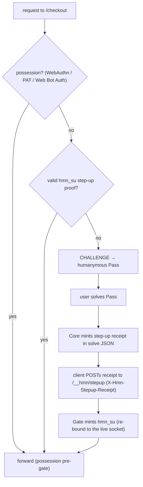

# Configure attested routes (the attestation floor)

**Diátaxis quadrant:** How-to. **Audience:** integrators and operators running humanymous Gate ("Gate" after first mention) who want to raise the cost of automated access to specific high-value routes.

This guide shows how to put the **attestation floor** on an operator-marked route: what to change, the two configuration preconditions that Gate refuses to start without, how a real user clears the floor, and how to confirm it works. It is written against the reference implementation; for the boundary with production see [Production vs reference](../reference/production-vs-reference.md).

## What the floor does, and what it does not

Past the coherent browser or human-assisted automation ceiling, a coherent engine-level spoof cannot be told apart from a human by detection alone — that is a design boundary, not a bug (see [What is Gate?](../explanation/what-gate-is.md)). The attestation floor does not try to detect the spoof. On a route you mark `attested`, it **prices the ALLOW**: a scoring-ALLOW no longer takes the free fast-path. The request must carry one of

- **possession** — a WebAuthn, Privacy Pass, or Web Bot Auth trust-upgrade (the possession pre-gate forwards it before scoring runs), or
- **a step-up proof** — the `hmn_su` cookie, minted when the user solves a [humanymous Pass](../help/why-am-i-seeing-this.md) challenge.

Without either, the ALLOW is demoted to a Pass challenge. The demotion is always **CHALLENGE→Pass, never DENY**: an unattested human solves the same Pass an anonymous visitor already solves. The floor never blocks a human categorically, and it is not a lockout.

It converts a spoof's unlimited free high-value passes into either possession it cannot mint or a per-session human Pass solve. It does not close the ceiling: a real human on their own connection, and a single one-shot coherent request, remain open by construction. Compute cost (proof of work) is deliberately **not** the friction — a native solver clears any false-positive-safe difficulty faster than a real browser, so it would tax real, no-JS, and assistive-technology users first. The friction is the interactive Pass.

## Before you start

You need a Gate in front of an origin (see [Deployment & policy operations](deployment-policy-operations.md)) and the Core engine serving the Pass challenge. Decide **which routes** are high-value and mutating — a checkout, a funds transfer, a password change, an API-key mint. Do not floor a whole site; browse traffic belongs on `balanced`.

## Step 1 — set a shared token key (required)

The Pass runs on the Core; the floor is enforced on the Gate. When a user solves the Pass, the Core mints a short-lived **step-up receipt**; the Gate verifies it and mints the `hmn_su` cookie. Both sides must sign and verify with the *same* key. Set the same value on the Core and the Gate:

```bash
export HMN_TOKEN_KEY=$(openssl rand -hex 32)   # the SAME value on Core and Gate
```

If any route uses the `attested` preset and `HMN_TOKEN_KEY` is unset (or malformed), **both the Gate and the Core refuse to start**:

```
routes: route "/checkout" uses preset "attested" but no shared HMN_TOKEN_KEY is set —
the step-up receipt from the Core Pass could never verify at the Gate, making the route
an unredeemable Pass loop for humans; set a shared HMN_TOKEN_KEY (hex, ≥16 bytes) across
Core and Gate
```

This is deliberate. Without a shared, persistent key the Gate's per-boot random key could never verify a Core-minted receipt, so `/__hmn/stepup` could never mint `hmn_su`, and the route would become a Pass loop no human could clear — worse than the lockout the no-lockout rule forbids. Failing at boot makes the misconfiguration impossible to ship.

## Step 2 — mark the route

Add the route to your `-routes` file, one `<prefix> <preset>` per line:

```text
# routes.conf
/checkout   attested
/transfer   attested
/health     off
```

Start the Gate with `-routes routes.conf`. Longest-prefix match wins; everything unmatched stays `balanced`.

The `attested` preset is **refused on a catch-all prefix**. `/ attested` (or an empty prefix) is a configuration error at load time, and the same refusal is enforced a second time inside `NewServer` so a programmatic route table cannot bypass it:

```
routes ...: preset "attested" is refused on the catch-all prefix "/" —
mark specific high-value routes (e.g. /checkout), not the whole site
```

## Step 3 — wire a credential verifier (recommended)

With a credential verifier configured, a returning user who holds possession (a passkey, a Privacy Pass token, or an allow-listed agent signature) skips the Pass entirely — the possession pre-gate forwards them before scoring. Without one, the floor still holds, but *every* user (including real humans) must solve a Pass to clear it, and the Gate logs a startup warning:

```
WARNING: route "/checkout" uses preset "attested" but NO possession verifier
(-agent-keys/-pat-issuers/-webauthn-creds) is configured — every user (incl. returning
humans) must solve a Pass to clear the floor (still no-lockout, but no attestation fast-path).
```

See [Configure credential verifiers](configure-credential-verifiers.md) for wiring WebAuthn, Privacy Pass, and Web Bot Auth.

## Step 4 — keep the Pass in the Gate's cookie jar

The step-up receipt is bound to the session id (`hsid`). The Core mints it against the Core's `hsid`; the Gate verifies it against the request's `hsid`. Those are the same value only when the browser sends one `hsid` cookie to both. Two topologies satisfy this:

- **Co-serve the Pass through the Gate** (recommended) — the Pass is same-host, so one `hsid` cookie covers both. Different ports are fine; cookies are not port-scoped.
- **Share a cookie `Domain`** — if the Pass is on a sibling subdomain, set an explicit `Domain` on `hsid` so both hosts receive it.

A split-domain Pass with no shared cookie makes `hsid` diverge. The receipt then never matches, `/__hmn/stepup` returns 403, `hmn_su` is never minted, and a real human who genuinely solved the Pass loops. Gate makes this self-diagnosing (see below) rather than silent, but the fix is the cookie jar. On a multi-host deployment, also run NTP — the receipt carries only a ±120 s clock-skew leeway. See [Supported topologies](../reference/supported-topologies.md).

## How a user clears the floor



The user solves the Pass **once per window**. `hmn_su` is TTL'd and rides subsequent requests, so a multi-step checkout does not re-challenge on every step.

## Confirm it works

- An unattested ALLOW to the attested route returns a challenge (HTTP 401), and the origin is not contacted. On any other (`balanced`/`strict`) route the same session still passes — the floor touches only marked routes.
- After a Pass solve and a successful `POST /__hmn/stepup`, the next request to the attested route passes.
- A possession-bearing request passes without a Pass.

Watch the audit log for the diagnostic reasons at `/__hmn/stepup`:

| Audit reason | Meaning | Fix |
|--------------|---------|-----|
| `sid_mismatch` | A validly-signed receipt for a *different* `hsid` — the cookie jar diverged. | Co-serve the Pass behind the Gate or share the `hsid` cookie `Domain` (Step 4). |
| `expired` | The receipt aged out beyond the skew leeway. | Check Core↔Gate clock skew / NTP; the client can re-solve for a fresh receipt. |
| `bad_sig` | Absent, forged, or key-mismatched receipt. | Confirm the *same* `HMN_TOKEN_KEY` on Core and Gate. |

## Bounding a shared credential (ceiling-guard #2)

Possession is not unlimited. A single WebAuthn credential that fast-paths from more than `CredFanoutCap` distinct /24 subnets (default 8) within the tracking window — a stolen or shared passkey fronting a proxy farm — has its trust-upgrade **withheld on attested routes** and reverts to Pass. Fan-out is counted on every route but withheld only where the operator priced the ALLOW, so a roaming human on one passkey is never newly challenged on ordinary browse traffic. The revert is to CHALLENGE, never DENY.

## Related

- [Configure credential verifiers](configure-credential-verifiers.md) — give possession-holders the fast-path past the floor.
- [CLI, configuration & policy reference](../reference/cli-config-policy.md) — the `attested` preset, `HMN_TOKEN_KEY`, and the step-up surface.
- [Supported topologies](../reference/supported-topologies.md) — the cookie-jar and shared-key prerequisites.
- [Why am I seeing this? (humanymous Pass)](../help/why-am-i-seeing-this.md) — the challenge from the user's side.
