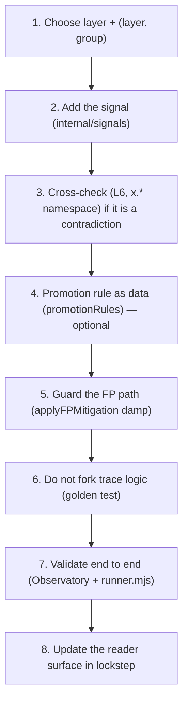

# Extend the detector: add a signal, a cross-check, or a hard rule

**Quadrant:** How-to (task-oriented). **Audience:** Blue detection engineers and contributors adding coverage to **their own** engine.

> **Warning:** This page is defensive-only, local-only, and self-target-only. It teaches you to extend the detection catalog of the engine **you build and run** on your own loopback (`127.0.0.1`), validated against automation simulators you launch yourself. It is not third-party evasion guidance and gives you nothing to point at a host you do not operate. Every number you produce here is reference-measured on your machine — it describes your run, not a guarantee about live traffic.

This is the procedure for adding one unit of coverage — a signal, a cross-check, or a hard rule — to the standalone detection engine (`internal/scoring`, `internal/signals`) so it fires, scores honestly, and shows up truthfully in the Observatory and the reference tables. It assumes you can already build and run the engine and drive a red profile against it. If you cannot yet, do [Run the detection engine](run-detection-engine.md) first.

For the model you are extending — layers, dedup, noisy-OR, the hard-rule table, and the ScoreTrace — read [Detection engine internals](../explanation/detection-engine-internals.md) alongside this page. The verdict tables you will update at the end live in [Hard rules, verdicts and signal-ID reference](../reference/hard-rules-verdicts.md).

The full procedure, end to end:



## Before you start

- You have the engine building and running on loopback: `bin/server.exe -addr 127.0.0.1:8443 -web web` (and, for client tells, the rebuilt `web/detector.wasm`). See [Run the detection engine](run-detection-engine.md).
- You can run the red harness: `node test/e2e/runner.mjs`. See [Red-team catalog](../reference/red-team-catalog.md).
- You know which layer your evidence belongs to (L1–L7) and whether it is collected in the browser (`js`/`wasm`) or on the server. If not, read [Detection engine internals](../explanation/detection-engine-internals.md) first.

> **Note:** Everything below changes the standalone engine (the one the tests and the Observatory exercise). Because Gate embeds the **same** `internal/scoring`/`internal/signals` engine, coverage you add here is the coverage the proxy runs at the edge. You do not edit two engines — see [Which piece am I using?](../explanation/which-piece-am-i-using.md).

## Step 1 — Choose the layer and the group

Every signal carries a `layer` (L1–L7) and an `id` of the form `l{n}.{group}.{item}` (lowercase; layer **tokens** are uppercase L1–L7, but signal **IDs** are lowercase). The `group` is not cosmetic — it drives dedup.

During combination, `dedupGroups` keeps the **highest-scoring** signal per `(layer, group)` correlation group and drops the rest. So the rule is:

- **Signals that share a root cause must share a `(layer, group)`.** Two tells that are really the same underlying fact (for example, two different reads of the same webdriver leak) belong in one group so they cannot double-count into the score.
- **Independent tells must use distinct groups** (or an empty group). An empty group means the signal always stands alone and is never deduped against a sibling.

Pick the group deliberately. Putting an independent tell in an existing group silently suppresses it whenever a stronger sibling fires; putting a correlated tell in its own group inflates a single root cause into two contributions.

## Step 2 — Add the signal

Mint the id and set its fields honestly. The signal schema is in `internal/signals/signals.go`:

- `id` — lowercase `l{n}.{group}.{item}`, e.g. `l1.cdp.proxy_leak`.
- `layer` — `L1`..`L7`.
- `weight` — the **maximum** contribution, 0..100. This is the ceiling this signal can ever add.
- `confidence` — 0..1, how sure you are the observation means what you think.
- `verdict` — the **per-signal** verdict (`OK` | `SUSPICIOUS` | `BOT` | `UNKNOWN`), distinct from the request verdict. `SUSPICIOUS`-or-`BOT` is what `fired(id)` reads; `BOT` alone is what `firedBot(id)` reads (this matters in Step 4).
- `collected` — `js` | `wasm` | `server`, where the evidence was gathered.
- plus `value`, `expectedHuman`, `score`, `notes`.

Set weight and confidence honestly. The per-signal score is `weight × severity × confidence`, clamped to `0..weight` — with severity fixed by the per-signal verdict (BOT = 1, SUSPICIOUS = ½, OK/UNKNOWN = 0):

$$s_i = w_i \cdot \sigma(v_i) \cdot \operatorname{clamp}_{[0,1]}(c_i)$$

- **Low confidence means a weak weight, never a penalty.** A tell you are unsure about gets a small ceiling; it does not push the score negative and it does not get promoted by wishful weighting.
- The layer cap (`LayerCap = 60`) and noisy-OR mean an over-weighted signal cannot dominate a layer on its own — but honest weighting is still your job, because the golden and e2e checks in Steps 6–7 will catch a weight that flips a human baseline.

Emit it from the right place:

- **L1–L4 client tells** (navigator/CDP/UA/window, integrity/guard, mouse/key/event) are collected in the browser and emitted from **`cmd/wasm`** (`collected: wasm` or `js`), then carried in the `client.signals[]` of the `SessionReport`.
- **L5/L6 signals** (traffic/RIT/correlation/abuse; cross-checks) are computed on the **server path** (`collected: server`) and land in `network.signals[]` / `crosschecks[]`.

## Step 3 — Add a cross-check (L6), if the tell is a contradiction

If your evidence is not a single observation but a **contradiction between two claims** — "the UA says Chrome but the TLS fingerprint says something else" — model it as a cross-check, not a plain signal. Cross-checks are the L6 family and carry the `x.` group prefix (e.g. `x.ua_vs_ja4`, `x.ua_vs_h2`, `x.browser_no_js`, `x.uach_present`) — **not** `l6.x.*`.

A `CrossCheck` (see `internal/signals/signals.go`) has: `id` (in the `x.` namespace), `inputs`, `claim`, `observed`, `consistent` (bool), `weight`, `score`. Fill `inputs`/`claim`/`observed` explicitly and set `consistent = false` when the two disagree. That is exactly what a hard rule reads through `crossFail(id)` in Step 4 — a cross-check that does not set `consistent` cannot be promoted.

## Step 4 — Author a promotion rule as data (optional)

A signal or cross-check contributes to the risk score on its own. You only add a hard rule when a specific **combination** should promote the verdict regardless of the score. Hard rules are data, not code branches: append a `promoRule{id, verdict, pred, why}` to the `promotionRules` list in `internal/scoring/hardrules.go`.

Build `pred` from the predicate helpers:

- `fired(id)` — a signal with that id is `SUSPICIOUS`-or-`BOT`.
- `firedBot(id)` — that id is `BOT` only.
- `crossFail(id)` — a named cross-check came back `consistent == false`.
- context: `hasClient`, `browserClaim`, `combined`.

Choose the verdict deliberately:

- **DENY** only for a combination you are confident is automated — typically two independent tells (an artifact plus a webdriver/CDP tell), so a single false read cannot promote to a block.
- **CHALLENGE** for a heuristic. **Any rule that can catch a real human must be CHALLENGE, never DENY.** The existing heuristics `HR-10`, `HR-11`, `HR-12`, `HR-17` are all CHALLENGE for exactly this reason (e.g. zero-interaction and datacenter-ASN can describe some real people).

Place the rule by **precedence, not number.** `promotionRules` is evaluated in first-match order, which is not numeric order (see the ordered table in [Hard rules, verdicts and signal-ID reference](../reference/hard-rules-verdicts.md)). Insert your rule where its verdict should win relative to the rules around it — a broad CHALLENGE placed above a specific DENY will shadow the DENY.

Write a plain-language `why` field. It is not an internal note: it **publishes** to the Observatory trace and to the hard-rules reference table. Name the mechanism in Blue voice ("a CDP leak together with any automation hint"), never third-party evasion framing, and never an internal spec identifier.

> **Note:** Give your rule the next id in the engine-plane sequence for its plane. The detection engine evaluates **HR-1..HR-21 only**. `HR-22..HR-30` are Gate-plane rules (proxy edge: bans, rate-limit, smuggling, token) that this engine never evaluates and the Observatory never shows — do not reuse or extend into that range here.

## Step 5 — Guard the false-positive path

Before you ship a DENY, decide whether the honest move is a **damp**, not a promotion. `applyFPMitigation` runs **before** combination and reduces scores that a legitimate-but-unusual client would otherwise trip. It is a damp, not a promotion — the worked example is the privacy-browser case, where canvas/webgl scores are **halved** so a privacy browser's blocked-fingerprinting reads do not stack into a bot score.

Use `applyFPMitigation` (in `internal/scoring`) when your new signal will also fire for a legitimate configuration — a privacy browser, a hardened extension, an older device. Damp it there instead of, or in addition to, weighting it down.

Then check your change against the baselines before shipping any DENY:

- Confirm the privacy-browser and old-device baselines still score ALLOW (or at worst CHALLENGE), not DENY.
- Remember the metric asymmetry: `classify()` scores a human CHALLENGE as TN, so `humanFPR` is **DENY-only** and under-reports friction. Inspect the human baseline's challenge-rate separately — a rule that starts challenging real humans will not show up in `humanFPR`.

## Step 6 — Do not fork the rule logic (the divergence guard)

The Observatory trace must show what the engine actually did. `Engine.ScoreWithTrace` shares `assemble()`/`decide()` with `Score()` and uses `combineTrace`, which **reuses** the same `dedupGroups` keep-rule, the same noisy-OR, and the same `promotionRules` table. Because of that, the golden test asserts `trace.Score == Combine` and `ScoreWithTrace == Score`.

So: add your signal, cross-check, and rule in **one** place (the shared data/logic) and let both paths read it. Never add a special case to the trace path — that is exactly what the golden test exists to catch. Run it after every change to the scoring logic.

Run the golden trace-equivalence tests (they assert `trace.Score == Combine` and `ScoreWithTrace == Score`):

```
go test ./internal/scoring/ -run 'ScoreWithTrace|CombineTrace'
```

## Step 7 — Validate end to end

1. **Watch it fire in the Observatory.** With the engine running dev-gated (`HMN_PLAYGROUND=1`) on loopback, launch the matching bundled profile and open its `GET /playground/explain/{id}` trace. Confirm your signal appears with the score you expect, that dedup kept/dropped the right sibling, and — if you added a rule — that it shows as `matched`/`won` with your `why` text. See [Detection Observatory](detection-observatory.md) and [Observatory architecture](../explanation/observatory-architecture.md).

   > **Note:** If no profile exercises your tell yet, add one first — see [Write a red profile](write-a-red-profile.md). Adding a profile has three registration points (the `runner.mjs` `PROFILES` array, the `launchProfiles` allowlist in `cmd/server/launch.go`, and the Observatory catalog in `web/playground.html`); missing any one makes it silently absent.

2. **Run the harness.**

   ```
   node test/e2e/runner.mjs
   ```

3. **Confirm the trade-off is honest.** Your change is good only if `botTPR` improved **without** raising `humanFPR`, and without a spike in the human baseline's challenge-rate (Step 5). If a bot profile that should now be caught still passes (FN), re-check your group choice (Step 1) and per-signal verdict (Step 2 — `fired` vs `firedBot`). If a human baseline flipped to DENY, prefer a damp (Step 5) or a CHALLENGE (Step 4) over the DENY.

## Step 8 — Update the reader surface in lockstep

A rule that fires but is undocumented is a drift bug. When you add or change an engine hard rule:

- Add the row to the **engine-plane** hard-rule table in [Hard rules, verdicts and signal-ID reference](../reference/hard-rules-verdicts.md) — id, verdict, the `why`, and the signal/cross-check IDs it fires on.
- Add the corresponding derivation-index row so the page's provenance stays current (see [Versioning & derivation index](../reference/versioning-derivation-index.md)).
- Keep it on the engine plane: HR-1..HR-21 only, no `HR-22..HR-30`.

> **Important:** Reader-facing pages must never carry an internal source-of-truth identifier. Name the signal IDs (`l{n}.{group}.{item}`), the layer tokens (L1–L7), the cross-checks (`x.*`), and the hard rule (HR-N) — nothing else.

## Checklist

- [ ] Layer and `(layer, group)` chosen so correlated tells share a group and independent tells do not.
- [ ] Signal id lowercase `l{n}.{group}.{item}`; weight/confidence honest (low confidence → weak weight, no penalty); per-signal verdict set; emitted from `cmd/wasm` (L1–L4) or the server path (L5/L6).
- [ ] Cross-checks in the `x.` namespace with `inputs`/`claim`/`observed`/`consistent` set so `crossFail()` can read them.
- [ ] Any hard rule appended as a `promoRule` to `promotionRules`, verdict chosen deliberately (human-catching heuristic ⇒ CHALLENGE), placed by precedence, with a plain `why`.
- [ ] FP guarded: `applyFPMitigation` damp added where a legitimate client would trip; privacy-browser and old-device baselines re-checked before any DENY.
- [ ] Golden test run (no forked trace logic): `trace.Score == Combine`, `ScoreWithTrace == Score`.
- [ ] End-to-end: fires in the Observatory; `node test/e2e/runner.mjs` shows `botTPR` up, `humanFPR` flat, challenge-rate on the human baseline inspected.
- [ ] Reader surface updated in lockstep: engine-plane row in `hard-rules-verdicts.md` + derivation-index row; no internal spec IDs on reader pages.

## Related

- [Detection engine internals](../explanation/detection-engine-internals.md) — the model this page extends.
- [Hard rules, verdicts and signal-ID reference](../reference/hard-rules-verdicts.md) — the table you update in Step 8.
- [Run the detection engine](run-detection-engine.md) — build and run the engine on loopback.
- [Write a red profile](write-a-red-profile.md) — add the simulator that exercises your tell.
- [Red-team catalog](../reference/red-team-catalog.md) — the bundled profiles and their expected verdicts.
- [Detection Observatory](detection-observatory.md) · [Observatory architecture](../explanation/observatory-architecture.md) — where you watch it fire.
