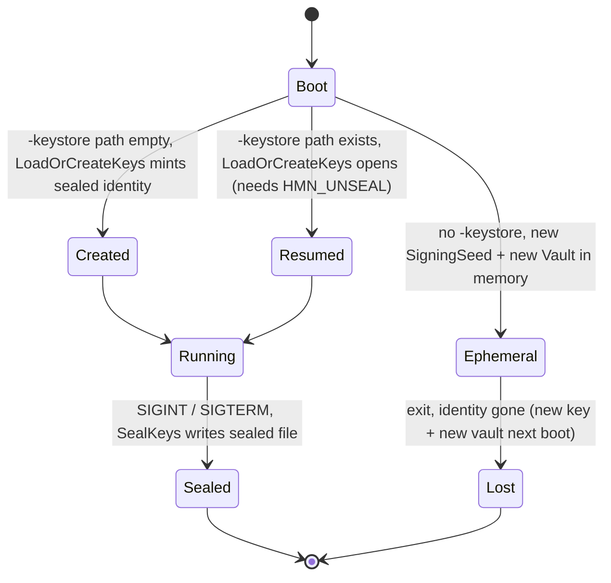

# Key management, rotation & recovery

**Diátaxis quadrant:** How-to. **Audience:** operators, security, and platform engineers running humanymous Gate.

This guide describes the load-bearing key material in a humanymous Gate ("Gate" after first mention) deployment: what each key protects, how the sealed keystore persists node identity, what breaks if a key or passphrase is lost, and how to think about rotation. It is written against the reference implementation; production deployments add controls that the reference does not ship (prod-delta). For the boundary between the two, see [Production vs reference](../reference/production-vs-reference.md).

Gate is the reverse-proxy enforcement layer. It terminates TLS, streams the detection bundle into HTML, scores layers L1–L7 inline, enforces the verdict at the edge, and writes every decision to a tamper-evident audit log. Several of the keys below are what make that audit log verifiable and what keeps pseudonymized subject data resolvable under dual-control.

---

## The key material at a glance

| Key material | Protects / enables | Where it lives | Rotation in the reference |
|--------------|--------------------|----------------|---------------------------|
| **SigningSeed** (Ed25519) | Signs the audit log's Signed Tree Heads (STHs); the verifier confirms the chain with the matching public key. | Sealed keystore, or ephemeral in memory. | Not automated (prod-delta). |
| **HMACKey** | Per-record HMAC over each audit record. | Sealed keystore, or ephemeral in memory. | Not automated (prod-delta). |
| **Vault snapshot** | Per-subject pseudonym linkage keys — resolve pseudonyms back to identifiers under dual-control. | Sealed keystore, or ephemeral in memory. | n/a (per-subject; destroyed by crypto-shred). |
| **Origin-cloaking HMAC** (`-origin-key`) | Signs `X-Hmny-Origin-Auth` so the origin can verify traffic came through Gate. | `-origin-key` flag (separate from the keystore). | Operator-managed flag value. |
| **Verdict-token epoch key** | Signs fingerprint-bound verdict trust tokens. | In-process only. | Rotates automatically every 15 minutes. |

The first three — SigningSeed, HMACKey, and the Vault snapshot — are the sealed node identity. They are the keys that persist across restarts only when you run with a keystore.

---

## The sealed keystore

The keystore is Gate's persistent node identity. Enable it with the `-keystore` flag and the `HMN_UNSEAL` environment variable:

```
HMN_UNSEAL="<passphrase>" bin/gate.exe -keystore /var/lib/gate/keystore.sealed -addr :8444 -admin-addr :8445
```

Boot fails if `-keystore` is set and `HMN_UNSEAL` is unset — the passphrase is required to open (or create) the sealed file. See [CLI, config & policy reference](../reference/cli-config-policy.md) for the full flag and environment table.

**What it seals.** The keystore holds three pieces of key material as one sealed blob:

- **SigningSeed** — the Ed25519 seed that signs the audit log's Signed Tree Heads. The verifier checks the chain against the corresponding public key.
- **HMACKey** — the key for the per-record HMAC that binds each audit record.
- **Vault snapshot** — the per-subject pseudonym linkage keys that let a pseudonym be resolved back to the identifiers it was derived from offline by whoever holds this sealed material (no product dual-control path).

**How it is sealed.** The blob is sealed with `scrypt` (N=2^15) key stretching over the `HMN_UNSEAL` passphrase, then encrypted with AES-256-GCM.

**Lifecycle.** On boot, `LoadOrCreateKeys` opens an existing keystore or mints a new sealed identity if none exists at the path. On `SIGINT`/`SIGTERM`, `SealKeys` writes the current identity back to the sealed file before exit. Expect one of these startup lines:

```
keystore: created new sealed node identity at <path>
```

```
keystore: resumed persisted node identity from <path>
```

The lifecycle of the node identity across a boot/shutdown, with and without a keystore:



> **Warning:** Without `-keystore`, the keys are **ephemeral**. A restart mints a **new SigningSeed** — the verifier public key changes, so previously exported checkpoints no longer verify against the new key and audit-trust continuity is broken — and a **new Vault** — every per-subject pseudonym linkage key is lost, which is equivalent to an accidental mass crypto-shred: the existing audit records survive but can no longer be resolved to any subject. Run any node whose audit log or pseudonym linkage must outlive a restart with a keystore.

---

## The separate origin-cloaking key

The `-origin-key` flag is a **separate** HMAC key, unrelated to the keystore. Gate uses it to sign the `X-Hmny-Origin-Auth` header so the origin can confirm a request arrived through Gate rather than directly (supporting the direct-origin-hit hard rule). It is not part of the sealed node identity and is not stretched or stored in the keystore.

If `-origin-key` is unset, an ephemeral random key is used per boot — the origin must be configured with the same value for validation to succeed, so an ephemeral key only works if the origin re-reads it each boot. Set an explicit `-origin-key` (and configure the matching secret at the origin) whenever the origin validates the header. Treat this value as a shared secret between Gate and the origin, and store it in your secrets manager alongside `HMN_UNSEAL`.

---

## The verdict-token epoch key

The verdict trust token — the fingerprint-bound token that lets a valid ALLOW take a fast path without re-scoring — is signed by an in-process **epoch key that rotates every 15 minutes** automatically. This rotation is internal and needs no operator action. Because the key lives only in process memory, verdict tokens do not survive a restart and are not part of the keystore; a restart simply begins a new epoch, and clients re-establish tokens on their next scored request.

---

## Blast radius — what breaks if a key is lost

Use this table to size the impact of losing each piece of key material and to prioritize backups.

| Lost item | Immediate effect | Blast radius |
|-----------|------------------|--------------|
| **SigningSeed** | The verifier public key changes; STHs signed by the old seed no longer verify against the new key. | Audit-trust **continuity** breaks — you can still verify going forward under the new key, but the chain across the key change is no longer continuous under one public key. |
| **Vault snapshot / keystore** | Per-subject pseudonym linkage keys are gone. | Pseudonym linkage is lost for all subjects — records remain and still verify, but can no longer be resolved to a subject. Equivalent to a **mass crypto-shred**. |
| **`HMN_UNSEAL` passphrase** | The sealed keystore cannot be opened at all. | Same blast radius as losing the keystore itself: you lose chain-signing continuity **and** vault linkage together (≈ mass crypto-shred), because the SigningSeed, HMACKey, and Vault snapshot are all inside the file you can no longer open. |

> **Warning:** Losing `HMN_UNSEAL` is not recoverable. There is no reset path for a sealed keystore — the passphrase is the only way in. **Back up the passphrase out-of-band** (a secrets manager or an offline escrow separate from the keystore file), and back up the sealed keystore file itself. If either is lost, treat the node identity as gone and plan for the mass-crypto-shred outcome above.

Note that a lost vault or an accidental ephemeral-restart mass-shred, while destructive to linkage, keeps the audit records intact and independently verifiable — the same design property that makes deliberate crypto-shred safe for the log. See [Right-to-erasure (crypto-shred) runbook](../runbooks/erasure-crypto-shred.md) for the deliberate case.

---

## Back up & restore the keystore + audit WAL

The two pieces of durable node state live on the `hmn-data` named volume in the release compose (`deployments/compose.release.yaml`): the **sealed keystore** at `/data/keystore` and the **durable audit WAL** at `/data/audit`. ACME certificates live separately on `hmn-acme` (`/acme-cache`). Back up `hmn-data` on a schedule; the `HMN_UNSEAL` passphrase is backed up **out-of-band** and is never in the volume (see the warning below).

### Capture (Docker named volume)

Stop or quiesce the Gate first so the WAL is at rest, then tar the volume into a backup volume (or a host bind mount):

```
docker run --rm \
  -v hmn-data:/data:ro \
  -v backup:/backup \
  alpine tar czf /backup/hmn-data-$(date +%F).tar.gz -C /data .
```

`hmn-acme` (ACME certs) is reproducible — Let's Encrypt re-issues on the next boot — so it is optional to back up; the keystore and WAL are **not** reproducible.

### Restore (Docker named volume)

Recreate the volume and unpack the archive into it, then start Gate with the **same `HMN_UNSEAL`** the keystore was sealed under:

```
docker volume create hmn-data
docker run --rm \
  -v hmn-data:/data \
  -v backup:/backup \
  alpine sh -c 'tar xzf /backup/hmn-data-<date>.tar.gz -C /data'
```

### PVC-snapshot equivalent (Kubernetes)

If `hmn-data` is a PersistentVolumeClaim, use a `VolumeSnapshot` instead of a tar:

```
kubectl apply -f - <<'YAML'
apiVersion: snapshot.storage.k8s.io/v1
kind: VolumeSnapshot
metadata:
  name: hmn-data-snap
spec:
  volumeSnapshotClassName: <your-snapshot-class>
  source:
    persistentVolumeClaimName: hmn-data
YAML
```

Restore by provisioning a new PVC with `spec.dataSource` pointing at the snapshot, then mounting it back at `/data`. Snapshot the volume while the pod is quiesced (or use an application-consistent snapshot) so the WAL is captured at rest.

### Validate the restore

A restored volume is only trustworthy if the chain still verifies. Replay + verify the WAL against the restored keystore before you put the node back in service — this is the same offline verification `gate` runs, exercised as a one-shot:

```
HMN_UNSEAL="<passphrase>" gate \
  -audit-wal /data/audit \
  -keystore /data/keystore \
  -audit-verify
```

It **requires** `-audit-wal` pointing at a non-empty WAL (an empty chain or omitting `-audit-wal` exits non-zero with `class=empty-chain` — a vacuous green is not a pass). It replays the WAL, verifies the hash chain / HMAC / Signed Tree Heads under the keystore's signing key, and checks independent **witness** co-signatures when a witness key is configured. Success prints `audit-verify: OK (<n> records)` and exits `0`; any mismatch prints `audit-verify: FAILED class=<class> seq=<n> …` and exits non-zero. A non-zero exit means the backup is corrupt, the keystore does not match the WAL, or witness attestation failed — do not return that node to service. (In a container, run the same flags as a one-shot against the `hmn-data` volume with `HMN_UNSEAL` supplied.)

### Loss blast radius

- **Lose the WAL (`/data/audit`)** → you lose the local audit chain since the **last exported checkpoint (STH)**. Anything you archived via `GET /__hmn/admin/proof` / the `lastSTH` still verifies independently; the records appended after it are gone with the WAL. Export and archive checkpoints off-box so a WAL loss has a bounded tail.
- **Lose the keystore or `HMN_UNSEAL` (`/data/keystore`)** → **mass crypto-shred**: the SigningSeed, HMACKey, and Vault snapshot all go together (they are one sealed blob). Chain-signing continuity breaks and every per-subject pseudonym linkage is unresolvable, exactly as in the [blast-radius table](#blast-radius--what-breaks-if-a-key-is-lost) above. This is why `HMN_UNSEAL` is backed up **out-of-band**, never inside `hmn-data`.

> **Warning — crypto-shred ↔ backup interaction.** A backup taken **before** a right-to-erasure crypto-shred still contains the per-subject **linkage key** for the erased subject. Restoring that backup, or keeping it reachable, **re-arms re-identification** of a subject you were legally required to shred. Treat keystore backups as sensitive linkage material: scope their retention, and after an erasure either re-run the shred against restored/rotated copies or expire the pre-erasure backups on a schedule aligned with your erasure obligations. The WAL/records themselves stay crypto-shred-safe (the records survive but are unresolvable) — it is the **keystore backup** that carries the linkage key back.

---

## Rotation — concept only in the reference

> **Important:** Automated rotation of the SigningSeed and HMACKey is **not implemented** in the reference. There is no shipped rotation command, endpoint, or scheduler for these keys. Rotating them would require re-anchoring the audit chain, so rotation is a prod-delta and an operational procedure — not something the reference binary does for you. Do not script against a rotation command; none exists here.

The reasoning: the SigningSeed anchors the audit log. Every Signed Tree Head is signed under it, and the verifier trusts a single public key for the chain. Swapping the seed changes the public key, so any checkpoint signed before the swap stops verifying under the new key. Rotation therefore cannot be a silent in-place key swap; it has to be a deliberate, recorded re-anchoring.

Conceptually, a production rotation procedure would:

1. **Anchor a final checkpoint** under the current key and export it, so the pre-rotation chain has a fixed, publishable end-state that verifies under the outgoing public key.
2. **Introduce the new key with a grace window** during which the outgoing public key stays published for verification of historical checkpoints while the new key signs new STHs going forward.
3. **Re-anchor** — record the key transition in the log itself and publish the new public key, so a verifier can follow the chain across the boundary: old key up to the transition checkpoint, new key after it.
4. **Retire the old key** only after the grace window, keeping its **public** key published for as long as historical checkpoints must remain verifiable.

The 15-minute verdict-token epoch key already rotates on its own and needs none of this — it signs short-lived tokens, not the durable audit chain. Rotation concern applies to the durable signing and HMAC keys only.

> **Note:** the reference exposes a checkpoint-export affordance a rotation procedure can build on, though not an automated re-anchoring command. `GET /__hmn/admin/proof?seq=<n>` returns the latest Signed Tree Head — its `treeSize`, `merkleRoot`, Ed25519 `sig`, and independent-witness `witnessSig` — alongside an RFC 6962 inclusion proof, all verifiable under the outgoing public key; `GET /__hmn/admin/integrity` additionally reports the `lastSTH` (`treeSize` + `root`). Exporting and archiving that final STH is the "anchor a final checkpoint" step above. The re-anchoring and key-transition recording around it remain a manual operational procedure — the reference ships no command for them.

---

## Operational checklist

- Run any node whose audit log or pseudonym linkage must survive a restart **with `-keystore` + `HMN_UNSEAL`**. An ephemeral node is only safe for throwaway/dev use.
- **Back up two things separately:** the sealed keystore file, and the `HMN_UNSEAL` passphrase (out-of-band). Losing either loses the node identity. Back up the `hmn-data` volume (keystore + audit WAL) on a schedule and **validate every restore** with `gate -audit-wal … -keystore … -audit-verify` — see [Back up & restore the keystore + audit WAL](#back-up--restore-the-keystore--audit-wal).
- **Expire pre-erasure keystore backups.** A keystore backup taken before a crypto-shred still holds the erased subject's linkage key; scope its retention so a restore cannot re-arm re-identification (same section).
- Store `-origin-key` as a shared secret with the origin, in your secrets manager.
- Publish and archive the **public** key so anyone can verify exported checkpoints — see [Verify the audit log](verify-audit-log.md). Reference surfaces: boot line `audit keys: …`, `GET /__hmn/admin/keys`, and `GET /__hmn/admin/checkpoints` (STHs + witness sigs).
- Treat SigningSeed/HMACKey rotation as a planned, re-anchoring operation, never an in-place swap. It is not automated here.
- Let the verdict-token epoch key rotate on its own; do not build tooling around it.

---

## Related

- [Verify the audit log](verify-audit-log.md) — how published STH/witness public keys verify the chain (and `hmac-unchecked` when no HMAC key), and how a key change affects verification.
- [Production vs reference](../reference/production-vs-reference.md) — the prod-delta list, including automated key rotation and KMS/HSM.
- [CLI, config & policy reference](../reference/cli-config-policy.md) — `-keystore`, `HMN_UNSEAL`, `-origin-key`, and startup lines.
- [Right-to-erasure (crypto-shred) runbook](../runbooks/erasure-crypto-shred.md) — deliberate destruction of a per-subject linkage key.
- [How Gate sees a request](../concepts/how-gate-sees-a-request.md) — the pseudonymization and audit-chain model the keys protect.
