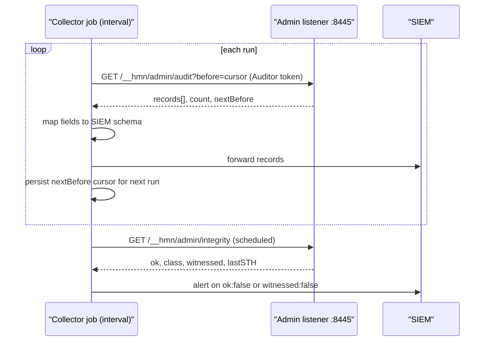

# Observability and SIEM integration

**Diátaxis quadrant:** How-to.
**Audience:** site reliability and security engineers connecting humanymous Gate to monitoring and security information and event management systems.

This guide shows you what observability surface the reference implementation of humanymous Gate exposes, how to collect its operational logs, how to pull edge decisions out of it with `curl`, how to scrape process metrics and wire liveness/readiness probes, and how to bridge decision data to a SIEM until native log shipping is in place.

> **Important:** This repository is a reference implementation, not a production-hardened build. Core and Gate can emit local JSON Lines operational logs, but those diagnostic records are not a standard SIEM decision schema and are not the tamper-evident audit stream. The poll-and-forward pattern below remains the supported path for decision data.

## What exists today

The reference Gate gives you six observability surfaces. Four are on the authenticated admin listener (`-admin-addr`, default `127.0.0.1:8445` (loopback)); operational logs are written to configured process sinks; the liveness/readiness probes are the exception — they answer unauthenticated on the **public edge** control plane so an orchestrator can reach them.

1. **The audit stream** — `GET /__hmn/admin/audit`, structured JSON records of every edge decision, with server-side filters and a paging cursor. This is your primary machine-readable feed, and the source of per-verdict rates (see below).
2. **The Ledger Overview KPIs** — a human-facing live feed of allow/challenge/deny decisions with rollup counters, at `https://localhost:8445/__hmn/admin/console`. See the [Ledger tour](audit-console-tour.md).
3. **Chain-integrity status** — the Integrity view and `GET /__hmn/admin/integrity`, which run live `SelfVerify` (hash chain + HMAC + Ed25519 STHs + witness when configured). Empty chains report `empty-chain`, not a green pass.
4. **Prometheus metrics** — `GET /__hmn/admin/metrics` on the admin plane, process/chain/ban gauges and counters in text-exposition format (see [Scrape process metrics](#scrape-process-metrics-__hmnmetrics)).
5. **Liveness and readiness probes** — `GET /__hmn/healthz` and `GET /__hmn/readyz`, unauthenticated on the public edge, for orchestrator probes and load-balancer drain ordering (see [Wire liveness and readiness probes](#wire-liveness-and-readiness-probes)).
6. **Operational logs** — best-effort lifecycle, dependency, warning, and internal-error diagnostics in formatted plain text or JSON Lines. They intentionally omit raw request identifiers and do not duplicate the audit decision record.

## Collect operational logs

Core and Gate share the same logging controls:

- `-log-level off|debug|info|warn|error`
- `-log-console-format off|plain|jsonl`
- `-log-console-stream stderr|stdout`
- `-log-plain-file PATH`
- `-log-jsonl-file PATH`

The matching environment variables are `HMN_LOG_LEVEL`, `HMN_LOG_CONSOLE_FORMAT`,
`HMN_LOG_CONSOLE_STREAM`, `HMN_LOG_PLAIN_FILE`, and `HMN_LOG_JSONL_FILE`.
Explicit flags take precedence. Gate defaults to readable plain text at `info`;
Core retains its opt-in `off` default. The Docker lab explicitly selects JSONL
for both daemons and bounds Docker's local log storage.

Plain and JSONL files can be enabled together. They append the same events in the
same process order, but they are best-effort diagnostics: a full or unavailable
sink may lose events. Do not place these files on the audit write-ahead-log,
keystore, or settings volume, and configure external rotation and retention.

For the local Docker lab:

```bash
mkdir -p deployments/artifacts/logs
# Linux only:
sudo chown 65532:65532 deployments/artifacts/logs
docker compose -f deployments/compose.yaml \
  -f deployments/compose/logging-files.yaml \
  up -d --build core origin gate
```

The host then receives `core.log`, `core.jsonl`, `gate.log`, and `gate.jsonl`
under `deployments/artifacts/logs/`. Each JSONL physical line is one JSON object
with `schema_version`, UTC `ts`, `level`, `service`, `component`, `event`,
`message`, process-local `sequence`, and `fields`.

After startup, verify that both files carry the same event sequence and every
JSONL line parses:

```bash
node scripts/assert-operational-logs.mjs
```

Operational logs never contain raw or shortened IP addresses, paths, headers,
cookies, bodies, session identifiers, administrator tokens, panic values, or
stacks. Verdicts and matched-rule details remain in the tamper-evident audit
stream. A CHALLENGE is a normal verdict, including for the automated browser
baseline named `human`; it is not an operational warning or error.

Gate exposes logger health on its authenticated metrics endpoint as
`hmn_gate_operational_log_queue_depth`,
`hmn_gate_operational_log_dropped_total{reason,level}`,
`hmn_gate_operational_log_write_errors_total`, and
`hmn_gate_operational_log_sink_healthy`. Alert on new drops or write errors and a
zero sink-health gauge; those conditions do not change enforcement or audit
ordering.

## Where per-verdict rates come from

The metrics endpoint deliberately does **not** emit per-verdict rates (allow/challenge/deny counts). Derive those from the **audit stream** (`GET /__hmn/admin/audit`), which your SIEM already ingests — the audit records carry `verdict`, `risk_score`, `route_class`, and `triggered_rules`, so rates and breakdowns are a query over data you already collect. `/__hmn/admin/metrics` covers the process, chain-growth, and ban-state gauges that a query over the audit stream cannot give you.

> **Note on `/health`:** The `/health` route is **not** a Gate health check. It is an *origin application* path that ships mapped to the `off` preset — Gate does not inject or enforce on it. It is a documented **bypass** of detection, not a liveness signal for Gate itself. Use `/__hmn/healthz` for Gate's own liveness; point orchestrator probes there, not at `/health`.

## Authenticate to the admin API

The admin API base is `/__hmn/admin/` on the admin listener. Every request needs a bearer token; the comparison is constant-time, and a missing or invalid token returns `404` (deny-by-default — the admin plane does not advertise itself). Every authenticated access is meta-audited (an `admin.access` record) before anything is served.

Tokens are configured through the `HMN_ADMIN_TOKENS` environment variable (`"auditor:tok,operator:tok,approver:tok,dpo:tok"`); if unset, Gate mints random tokens per boot but does not write bearer values to operational logs. For observability, configure and use an **Auditor** token — Auditor is read-only (`canRead`) and cannot request or approve any change. See [role-based access control and separation of duties](../reference/rbac-separation-of-duties.md) for the full role matrix.

Set your token once:

```
export HMN_ADMIN_TOKEN="<your-auditor-token>"
```

## Pull edge decisions from the audit stream

`GET /__hmn/admin/audit` returns edge-decision records as structured JSON. It supports these server-side filters, which you can combine:

- `verdict=` — `allow`, `challenge`, `deny`, or `none`
- `host=` — origin host
- `route=` — matched `route_class` (`html|api|upgrade|control|static`), not a URL path
- `rule=` — an enforcement-rule identifier (for example a specific HR)
- `minRisk=` — minimum risk score (0–100)
- `subject=` — a pseudonymous subject, matched against `session_pseudonym` **or** `actor.id_pseudonym` (see [Export one subject's records](#export-one-subjects-records-gdpr-art-15))
- `before=` — the paging cursor

Fetch the most recent deny decisions:

```
curl --silent \
  --header "Authorization: Bearer ${HMN_ADMIN_TOKEN}" \
  "https://localhost:8445/__hmn/admin/audit?verdict=deny"
```

> **Note:** The reference dev certificate is self-signed in memory. Against a dev instance you will need `curl --insecure` (or `-k`) to skip certificate validation. Do not carry that flag into any trusted environment.

### Page through history with the cursor

The response carries a `nextBefore` cursor. To page backward through older records, pass that value as the next request's `before=` parameter; repeat until the cursor is empty (no more records).

```
curl --silent \
  --header "Authorization: Bearer ${HMN_ADMIN_TOKEN}" \
  "https://localhost:8445/__hmn/admin/audit?verdict=deny&before=<nextBefore-from-previous-page>"
```

The response envelope is `{"records":[…],"count":<n>,"nextBefore":<seq>}` — records newest-first; page the next (older) batch with `?before=<nextBefore>`. `limit` defaults to 50, max 500.

Each record's canonical fields for a SIEM mapping: `event_id`, `seq`, `node_id`, `ts` (RFC3339 nanoseconds, UTC), `event_type`, `event_version`, `actor{kind,id_pseudonym}`, `tenant_id`, `session_pseudonym`, `host`, `route_class` (`html|api|upgrade|control|static`), `verdict` (`allow|challenge|deny|none`), `risk_score`, `triggered_rules` (`["HR-…"]`), `top_signals[{id,verdict,conf}]`, `enforcement_action`, `enforcement_mode` (`monitor|shadow|enforce`), `fail_mode` (`none|fail_open|fail_closed|degraded`), `fail_reason`, `latency_us`, `upstream{status,error_class}`, `tls{ja4_pseudonym,h2fp_pseudonym,sni_pseudonym}`, `config_version`, `key_id`, `data_class`, the chain fields `prev_hash`/`record_hash`/`hmac`, and `incident` (the opaque handle, added at read time). Note the subject is a pseudonym (`actor.id_pseudonym` / `session_pseudonym`), never a raw identifier. The full shapes live in the [CLI, config & policy reference](../reference/cli-config-policy.md#request--response-shapes).

### Narrow to what you care about

Combine filters to build focused queries an on-call engineer or a scheduled job can run. For example, high-risk challenges on HTML page requests whose host contains `checkout` (`route=` filters by `route_class`, and `host=` is a substring match — neither takes a URL path):

```
curl --silent \
  --header "Authorization: Bearer ${HMN_ADMIN_TOKEN}" \
  "https://localhost:8445/__hmn/admin/audit?verdict=challenge&host=checkout&route=html&minRisk=50"
```

Records are pseudonymous: raw identifiers (IP, TLS/HTTP fingerprints, UA, device fingerprint) are stored only as per-subject-key-derived pseudonyms, never raw. Your SIEM will ingest pseudonyms, not source IPs. Re-identification is a separate, dual-controlled action and is out of scope for a monitoring feed.

### Export one subject's records (GDPR Art. 15)

The `?subject=` filter scopes the stream to a single pseudonymous subject, for a subject-access request (GDPR Art. 15 / PIPA). Pass the deterministic pseudonym the Console shows for a subject; Gate matches it against **both** `session_pseudonym` and `actor.id_pseudonym`, so a subject who appears in either position is returned.

```
curl --silent \
  --header "Authorization: Bearer ${HMN_ADMIN_TOKEN}" \
  "https://localhost:8445/__hmn/admin/audit?subject=<subject-pseudonym>"
```

This produces a subject-scoped export you can hand to a data-subject-access workflow. It combines with the other filters and the `before=` cursor exactly as above (add `&limit=500` and page the cursor to drain a subject's full history). The filter takes a **pseudonym**, not a raw identifier — resolving a raw identity to its pseudonym (or the reverse) is a **custodial offline** act against the keystore, out of scope for this read-only feed (Gate has no re-identification API).

## Check chain integrity

`GET /__hmn/admin/integrity` runs the audit-log verification live and reports whether the tamper-evident chain is intact — the same logic the Console's Integrity view surfaces. Poll it on a schedule and alert on any failure class.

```
curl --silent \
  --header "Authorization: Bearer ${HMN_ADMIN_TOKEN}" \
  "https://localhost:8445/__hmn/admin/integrity"
```

The verification can report these mismatch classes, any of which should page your security on-call: hash-break, hmac-invalid, seq-gap, linkage-break, checkpoint-mismatch, and node-missing (a suppression alert).

`GET /__hmn/admin/integrity` returns `{"node","ok":<bool>,"class":"<mismatch-class>","records":<n>,"checkpoints":<n>,"witnessed":<bool>,"lastSTH":{"treeSize","root"}}`; on failure it adds `divergentSeq`, `detail`, and (if the witness attestation fails) `witnessFailAt`. Alert on `ok:false` or `witnessed:false`. The mismatch classes are `hash-break`, `hmac-invalid`, `seq-gap`, `linkage-break`, `checkpoint-mismatch`, and `node-missing` — see [Verify the audit log](verify-audit-log.md).

## Scrape process metrics (`/__hmn/admin/metrics`)

`GET /__hmn/admin/metrics` exposes Gate's process, chain-growth, and ban-state telemetry in Prometheus text-exposition format (`Content-Type: text/plain; version=0.0.4`). It is served on the **admin plane** and is auth-gated (any role — an Auditor token is enough), so Prometheus must scrape it **with a bearer token**, and behind mutual Transport Layer Security if you set `-admin-mtls-ca`.

```
curl --silent \
  --header "Authorization: Bearer ${HMN_ADMIN_TOKEN}" \
  "https://localhost:8445/__hmn/admin/metrics"
```

The endpoint emits these series:

| Metric | Type | Meaning |
|--------|------|---------|
| `hmn_gate_uptime_seconds` | gauge | Seconds since this Gate process started. |
| `hmn_gate_audit_records_total` | counter | Records sealed into this node's audit chain. |
| `hmn_gate_audit_checkpoints_total` | counter | Signed Tree Heads written. |
| `hmn_gate_audit_projection_dropped_total` | counter | Audit records dropped by the Tier-1/2 projection sinks (Redis/ClickHouse) under backpressure or outage. The durable write-ahead log is unaffected — it stays the durability authority; a non-zero increase means the downstream projection view is incomplete. |
| `hmn_gate_audit_integrity_ok` | gauge | The audit chain verifies end-to-end (`1`) or a mismatch was found (`0`) — re-checked each scrape (keep the interval ≥ 15s). |
| `hmn_gate_audit_witnessed` | gauge | The latest checkpoints carry a valid independent-witness co-signature (`1`) or not (`0`). |
| `hmn_gate_bans_active` | gauge | Currently active IP/fingerprint bans. |
| `hmn_gate_killswitch` | gauge | Kill switch engaged (`1`) or not (`0`). |
| `hmn_gate_monitor` | gauge | Effective global monitor mode (`1`) or enforcing (`0`). |
| `hmn_gate_goroutines` | gauge | Current goroutine count. |
| `hmn_gate_heap_alloc_bytes` | gauge | Heap bytes allocated and in use. |
| `hmn_gate_sys_bytes` | gauge | Total memory obtained from the OS. |

### What to alert on

The audit-chain series are the highest-signal structural alerts on this endpoint — they need no tuning and no invented thresholds. **Alert on `hmn_gate_audit_integrity_ok == 0`, `hmn_gate_audit_witnessed == 0`, and any increase in `hmn_gate_audit_projection_dropped_total`** (`increase(hmn_gate_audit_projection_dropped_total[10m]) > 0`). The first two are the metrics twin of the `GET /__hmn/admin/integrity` `ok:false` / `witnessed:false` conditions — same signal, now scrapeable without a poll. The drop counter surfaces a Tier-1/2 sink shedding records, which is otherwise only a once-a-minute WARN log. Also alert on `hmn_gate_killswitch == 1` (enforcement demoted node-local) and on `up == 0` (a metrics blackout hides all of the above). Ready-to-load rules live in [`deployments/observability/alerts.yml`](../../deployments/observability/alerts.yml).

> **Note:** Per-verdict rates are intentionally absent here — derive allow/challenge/deny rates from the audit stream (see [Where per-verdict rates come from](#where-per-verdict-rates-come-from)). Configure your Prometheus scrape job with the Auditor bearer token (`authorization` / `bearer_token_file`) and, in dev, `insecure_skip_verify: true` for the self-signed admin cert. A ready-to-merge scrape job is in [`deployments/observability/prometheus-scrape.yml`](../../deployments/observability/prometheus-scrape.yml); see the [observability README](../../deployments/observability/README.md).

## Wire liveness and readiness probes

Gate answers two probe endpoints on the **public edge** control plane, both **unauthenticated** (an orchestrator or load balancer must reach them without a token) and answered by Gate itself, not proxied to origin:

| Endpoint | Response while serving | Response while draining | Use as |
|----------|------------------------|-------------------------|--------|
| `GET /__hmn/healthz` | `200` `{"status":"ok","plane":"gate"}` | `200` (stays up) | Liveness probe. |
| `GET /__hmn/readyz` | `200` `{"status":"ready","plane":"gate"}` | `503` `{"status":"draining","plane":"gate"}` | Readiness probe. |

Point your orchestrator's **livenessProbe** at `/__hmn/healthz` and its **readinessProbe** at `/__hmn/readyz`.

**Drain ordering.** On `SIGINT`/`SIGTERM`, Gate flips the readiness gate first — so `/__hmn/readyz` returns `503 draining` while `/__hmn/healthz` keeps returning `200`. A load balancer sees the readiness failure and removes the node **before** the in-flight drain begins, so no new traffic lands on a node that is shutting down. The drain is bounded by `-shutdown-grace` (default `25s`); set it **≥ your orchestrator's termination grace** so the drain completes before the pod is killed. Do not gate liveness on readiness: a draining node is still alive, and a livenessProbe pointed at `/__hmn/readyz` would kill it mid-drain.

```
curl --silent "https://localhost:8444/__hmn/healthz"   # 200 ok
curl --silent -o /dev/null -w '%{http_code}\n' \
  "https://localhost:8444/__hmn/readyz"                # 200 ready, 503 once draining
```

> **Note:** These probes are on the **edge** listener (`-addr`, default `:8444`), not the admin listener — that is deliberate, so a load balancer fronting the public edge can reach them without admin credentials.

## Bridge to a SIEM in the meantime

Native SIEM shipping is a production concern the reference does not implement (see below). Until then, the supported pattern is **poll-and-forward**:

1. Run a small collector job on an interval.
2. Call `GET /__hmn/admin/audit` with an Auditor token, filtering to what you retain (or leaving filters off to capture all decisions).
3. Follow the `nextBefore` cursor to drain new records since your last run, persisting the cursor between runs so you never miss or double-ship.
4. Map each record's fields to your SIEM schema and forward.



This gives you allow/challenge/deny decisions, risk scores, matched routes, and triggered enforcement rules in your SIEM without waiting for native shipping. Because the feed is pull-based and the records are pseudonymous, your collector needs only network reach to the admin listener and a read-only token — keep that token scoped to Auditor and rotate it like any other credential.

> **Note:** You are polling, not streaming. Your SIEM's freshness is bounded by your poll interval. Size the interval against your audit volume so a single page-drain keeps up between runs.

## Explicitly production-only (production responsibility)

The following are **not** in the reference build. Do not document or configure them as working; plan for them as production deltas:

- Native SIEM shipping in a standard decision schema (for example OCSF or CEF) — local operational JSONL is diagnostic only; decision data still ships via the poll-and-forward pattern above.
- Server-sent-events (SSE) live-push for the Console and downstream consumers — the reference Console refreshes and polls rather than receiving pushes.

For the full list and the reasoning behind each, see [Production vs. reference](../reference/production-vs-reference.md).

## Related

- [CLI, config, and policy reference](../reference/cli-config-policy.md) — the `-admin-addr` flag, `HMN_ADMIN_TOKENS`, and other startup levers.
- [Ledger tour](audit-console-tour.md) — the Overview KPIs and Integrity view described here, in the UI.
- [Production vs. reference](../reference/production-vs-reference.md) — the complete production responsibility list.
