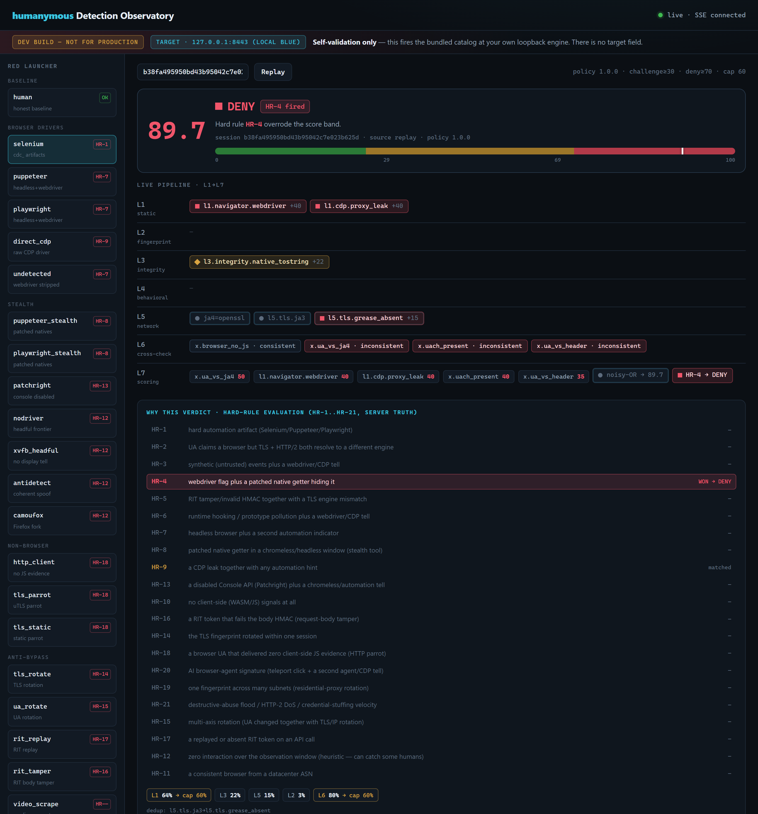
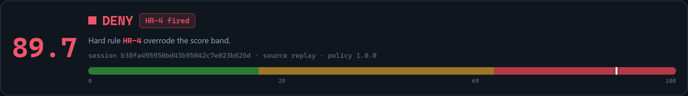
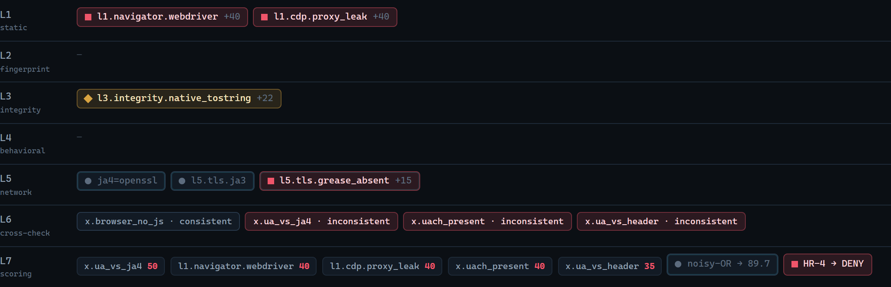
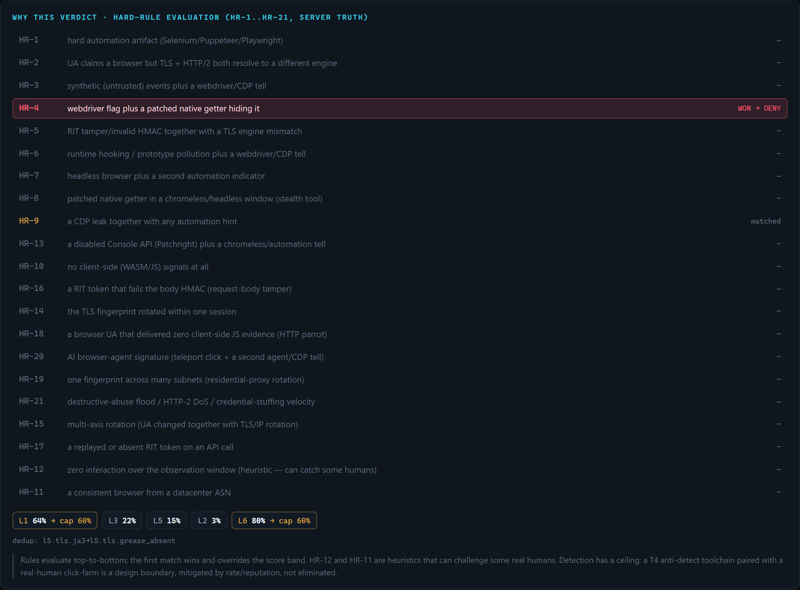
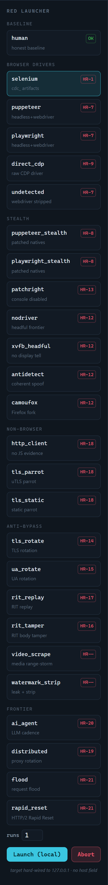

# A guided tour of the Detection Observatory

**Diátaxis quadrant:** How-to (annotated tour). **Audience:** Red/Blue developers who want to see what the Observatory looks like before running it.

This is a screenshot walkthrough of the live Detection Observatory. Every image below is the real page rendering a real session — a CDP-driven bot that scored **89.7** and was denied. To run it yourself, see **[Watch detection happen live](detection-observatory.md)**.

> **Note:** The screenshots show a development, loopback-only build. The page is disabled by default and refuses to bind a non-loopback address.

---

## The whole page at a glance

Three zones under a fixed guardrail banner:

- **Left — the Red launcher.** The bundled catalog, grouped by kind, each card showing its documented tell and the hard rule you expect it to trip.
- **Centre — the live pipeline.** The verdict and risk gauge on top, then the L1→L7 waterfall as signals arrive.
- **Below — "why this verdict".** The server's own hard-rule evaluation and score decomposition.

The banner never leaves the top: **DEV BUILD — not for production**, the fixed **target 127.0.0.1:8443**, and *self-validation only — there is no target field.*

---

## Reading the verdict

The score is **89.7**, and the marker sits deep in the red **DENY** band (the bands break at 29 and 69). The badge shows a hard rule fired — **HR-4** — and the line beneath states plainly that the hard rule *overrode the score band*. A hard rule wins regardless of the number: even a low score would deny here.

---

## The L1→L7 waterfall

Each firing signal is a chip in its layer lane, shape- and colour-coded so the verdict reads without relying on colour alone:

- **■ BOT** (red square) — `l1.navigator.webdriver`, `l1.cdp.proxy_leak`
- **◆ SUSPICIOUS** (amber diamond) — `l3.integrity.native_tostring`
- **● OK** (green circle) — honest signals
- An **inset tint** marks server-observed L5/L6 signals (the network fingerprint and the cross-checks the server derived, which arrive after the client batch).

At **L6** the cross-checks show which identity-consistency claims held and which broke; at **L7** the top contributors, the combined `noisy-OR → 89.7`, and the `HR → DENY` override are laid out as the final step.

---

## Why this verdict — the honest explainer

This panel is the point of the Observatory. It comes straight from the engine's own scoring — not a re-implementation — so what you read is what the engine did.

- **The hard-rule ladder** evaluates HR-1 through HR-21 **in order**. Here **HR-4** ("webdriver flag plus a patched native getter hiding it") is the first match, so it **WON**. Notice **HR-9** further down is also *matched* but did not win — the first match takes the verdict. This is exactly how the engine decides, made visible.
- **The per-layer decomposition** shows each layer's combined probability and where the per-layer cap clamped it: `L1 64% → cap 60%`, `L6 80% → cap 60%`. No single layer is allowed to dominate.
- **Dedup** shows where two tells from the same root cause were collapsed so they weren't double-counted.

---

## The Red launcher

Pick a profile, set **runs** (1–5), and press **Launch (local)**. The launcher requests a single-use nonce and fires that one profile at your own engine — the target is fixed in the server; there is no host field, so the Red side structurally cannot be aimed off-box. Before each run the stateful detectors are reset and runs are serialized, so a flood can't poison your next baseline. **Abort** cancels an in-flight run.

The `human` card is the honest baseline you expect to pass; everything else is automation you expect the engine to catch. Browser-driver profiles need a local browser installed — if one is absent the run reports a skip reason rather than failing silently.

---

## Run it yourself

- **[Watch detection happen live: the Detection Observatory](detection-observatory.md)** — the step-by-step how-to (enable, open, launch, read).
- **[Self-validation: red-team your own deployment](self-validation-red-team.md)** — the terminal version that runs the whole catalog and reports your block-rate / false-positive rate.
- **[Hard rules and verdicts](../reference/hard-rules-verdicts.md)** — what each hard rule and verdict in these screenshots means.
