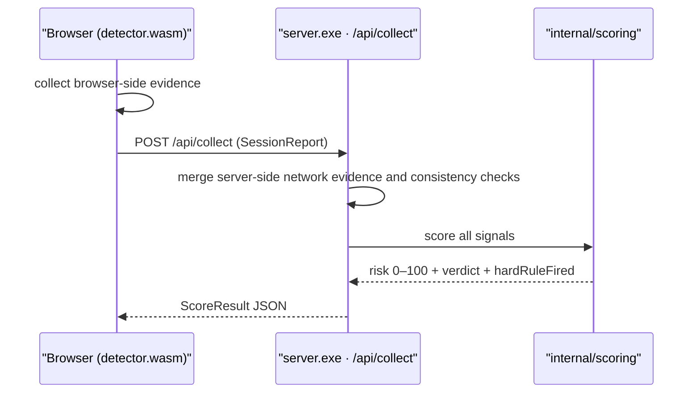

# Run the standalone detection engine (dev)

**Quadrant: How-to.** **Audience: Blue and Red developers who want to build and run the raw detection engine (`bin/server.exe` on `127.0.0.1:8443`) directly** — the engine-side equivalent of the Gate proxy Quickstart.

> **Note:** Defensive, local-only, self-target-only, educational. This page builds and runs *your own* detector on your own loopback so you can read its scoring output. It teaches nothing about evading third-party systems. Every number you observe is reference-measured on your machine, not a guarantee.

This page gets the detection engine compiled and serving on `127.0.0.1:8443`, shows you how to read a verdict with and without the Detection Observatory, and marks the boundary where the engine stops and the Gate proxy begins.

## When to use this instead of the Gate Quickstart

There are two binaries in this repo, and they do different jobs. The orientation map covers the full split — read [which piece am I using?](../explanation/which-piece-am-i-using.md) if you are unsure which one you want.

Use the **standalone detection engine** (this page) when you want the engine's per-request scoring across seven detection stages **without**:

- edge enforcement (the engine scores; it does not block a request at an edge),
- TLS termination or streaming bundle injection,
- the admin plane (no Ledger, no bans, no dual-control),
- a tamper-evident audit log.

Use the **Gate reverse proxy** instead — via [Quickstart: monitor mode](../tutorials/quickstart-monitor-mode.md) — when you want those production behaviors wrapped around the same engine. Both binaries embed the same `internal/scoring` engine, so the verdicts are consistent; the difference is everything *around* the score.

## Build

The engine needs two artifacts: the browser detection bundle (`web/detector.wasm`) and the server (`bin/server.exe`).

Build the WASM bundle first:

```
GOOS=js GOARCH=wasm go build -o web/detector.wasm ./cmd/wasm/
```

> **Important:** `web/detector.wasm` is the browser-side detection bundle — the code that runs in the visitor's page to collect the browser-side collection stages client signals. The server serves it from `web/`, so if you skip this step the page loads without a detector and the client signals never arrive. Build it before (or alongside) the server.

Then build the server:

```
go build -o bin/server.exe ./cmd/server/
```

## Run

Start the engine on loopback, pointing `-web` at the directory that holds `detector.wasm`:

```
bin/server.exe -addr 127.0.0.1:8443 -web web
```

### Core flags (full set)

`cmd/server` takes eight flags. The three above cover most local runs; the rest configure TLS, logging, and the operator surface.

| Flag | Default | Purpose |
|---|---|---|
| `-addr` | `:8443` (from source) | Listen address. The published image overrides this to `:443` (see below). |
| `-web` | `web` | Static web root — the directory holding `detector.wasm`, `index.html`, `demo.html`. |
| `-rit` | `true` | Enable request-integrity token anti-tamper (request-integrity token) verification. |
| `-acme-domain` | `""` | Comma-separated domain(s) for a Let's Encrypt cert via TLS-ALPN-01 (needs binding `:443` directly). Empty = self-signed. |
| `-acme-cache` | `acme-cache` | Directory to cache issued ACME certificates + the account key (persist this across restarts). |
| `-acme-email` | `""` | Optional contact email for the ACME account. |
| `-log-level` | `""` (off) | Structured log level: `off\|error\|warn\|info\|debug`. Also settable via `HMN_LOG_LEVEL`. |
| `-ops-token` | `""` (disabled) | Operator bearer token that enables `/api/explain` + `/api/counters`. Also settable via `HMN_OPS_TOKEN`. Empty = those endpoints are not registered. |

> **Warning:** The engine serves over TLS with a **self-signed development certificate**. Your browser and `curl` will flag it as untrusted — that is expected for a local dev cert. Trust it locally or pass your client's insecure/skip-verify flag for loopback testing only; never carry that habit to a real endpoint.

There is **no admin listener here** — the engine exposes `127.0.0.1:8443` only. The `:8445` admin plane and the `:8444` edge belong to the Gate proxy, not to this binary.

### Core ops surface

The Core has a small, deliberately minimal operations surface:

- **`GET /healthz`** — always on, **unauthenticated** liveness at the **root path** (not under `/__hmn/`). Returns `status`, `version`, and `uptimeSec`.
- **`GET /api/explain/{id}`** and **`GET /api/counters`** — mounted **only** when `-ops-token` / `HMN_OPS_TOKEN` is set, and require that bearer token (a missing or wrong token gets `404`, so the surface is non-discoverable). `/api/explain/{id}` returns the `ScoreTrace` for a stored session (re-scored from a copy); `/api/counters` returns runtime counters (uptime, goroutines, heap, GC).

Unlike the Gate, the Core has **no `/readyz` readiness probe and no Prometheus `/metrics` endpoint** — health is the single `/healthz` liveness check.

## Run the published Core image

The Core is published as `ghcr.io/modootoday/humanymous-core:latest` (built from `build/core.Dockerfile`). Its `ENTRYPOINT` is `/app/server -addr :443 -web /app/web -acme-cache /acme-cache`, so the **image binds `:443`** (whereas the from-source default is `:8443`) and terminates its own TLS — never front it with a TLS-terminating proxy or load balancer, since it needs the raw TLS/HTTP-2 handshake to read JA3/JA4.

**Real TLS (public domain).** Supply a domain and mount a persistent volume at `/acme-cache` so the issued cert + ACME account key survive restarts:

```
docker run -p 443:443 -v hmn-acme:/acme-cache \
  ghcr.io/modootoday/humanymous-core:latest -acme-domain your.domain
```

TLS-ALPN-01 needs `:443` reachable from the internet. Without `-acme-domain`, the image falls back to a **self-signed** cert on `:443`.

**Local demo (self-signed, non-privileged port).** Override `-addr` to avoid `:443` and skip ACME:

```
docker run -p 8443:8443 ghcr.io/modootoday/humanymous-core:latest -addr :8443
```

> **Note:** `HMN_PLAYGROUND` is intentionally **unset** in the published image, so the Detection Observatory and the local Red launcher are **never registered** there — they are loopback-only dev features you get only from a source build (see below).

## The `HMN_PLAYGROUND` gate

The Detection Observatory is a dev-gated page that runs *on this engine*. Whether it exists is controlled by one environment variable.

- **`HMN_PLAYGROUND` unset** — plain engine. The Observatory routes are not registered, the hub is nil, and there is **zero added surface and zero request-path cost**. This is the default and what you want for straight scoring.
- **`HMN_PLAYGROUND=1`** — the Observatory routes appear (`/playground`, `/playground/events`, `/playground/explain/{id}`, and the rest), and the **loopback fail-closed rule applies**: the server refuses to start on a non-loopback `-addr`, and every request's `Host` is re-checked for loopback.

To understand what those routes do and why they are safe to expose only locally, see [how the Detection Observatory is built](../explanation/observatory-architecture.md); to actually drive it, see the [Detection Observatory how-to](./detection-observatory.md).

## See a verdict without the Observatory

You do not need the Observatory to read a score — it is a viewer, not the scorer. A page load (or a posted client report) becomes a verdict through the collect path:



**Load a page in a browser.** Point a browser at `https://127.0.0.1:8443/` (accepting the dev cert). The `detector.wasm` bundle collects the client signals and POSTs a session report to `/api/collect`; the response is the scored verdict as JSON, containing `verdict` (`ALLOW` | `CHALLENGE` | `DENY`), `riskScore` (0–100), `hardRuleFired`, and `topContributors`.

**Or run a Red profile against it.** The Red runner drives one profile and prints the verdict:

```
node test/redteam/run-one.mjs human https://127.0.0.1:8443
```

`run-one.mjs` prints a minimal JSON line — `{label, verdict, riskScore, hardRuleFired}` — and intentionally drops `topContributors`. For the full per-stage trace, use the Observatory's `/playground/explain/{id}` or the e2e `results.json`; see the [self-validation how-to](./self-validation-red-team.md).

Post a minimal client report directly and read the verdict (the `-k` accepts the self-signed dev cert):

```
curl -sk -X POST https://127.0.0.1:8443/api/collect \
  -H "Content-Type: application/json" \
  -d '{"userAgent":"Mozilla/5.0 Chrome/126","signals":[{"id":"l1.navigator.webdriver","layer":"L1","verdict":"BOT","weight":40,"score":40,"confidence":0.95,"collected":"js"}]}'
```

The response is the ScoreResult: `{"sessionId":…,"riskScore":…,"verdict":…,"hardRuleFired":…,"topContributors":[…],"policyVersion":…}`. The `signals` array is the client-collected browser-side collection stages portion; the server merges its own network and consistency-check network signals before scoring.

The score comes from `internal/scoring`: each signal contributes `weight × severity × confidence`, the combiner deduplicates correlated evidence, caps each stage, and combines the stages into a 0–100 risk score. The built-in policy challenges at 30 and denies at 70; Runtime Settings can change those thresholds. Core's ordered enforcement rules can raise the score-based result. See [how humanymous evaluates a request](../concepts/how-gate-sees-a-request.md) and [detection engine internals](../explanation/detection-engine-internals.md).

## The boundary: what this engine does not do

This binary **scores**. It does not enforce at an edge, and it does not write the tamper-evident audit log. Those are the Gate reverse proxy's job — the proxy wraps this same engine and adds TLS termination, edge enforcement, the audit log, the Ledger, bans, and dual-control.

If you need any of that, do not try to bolt it onto the standalone engine — run the proxy instead, starting from [Quickstart: monitor mode](../tutorials/quickstart-monitor-mode.md). The Observatory is a Core feature, not a Gate one, and the published core image never exposes it (`HMN_PLAYGROUND` is unset there); the Observatory (`:8443`) is never the Ledger (`:8445`).

## Related

- [Which piece am I using?](../explanation/which-piece-am-i-using.md) — the two-engine orientation map.
- [Quickstart: monitor mode](../tutorials/quickstart-monitor-mode.md) — the Gate proxy equivalent of this page.
- [Detection Observatory how-to](./detection-observatory.md) — drive the dev-gated viewer on this engine.
- [Detection engine internals](../explanation/detection-engine-internals.md) — where the score comes from.
