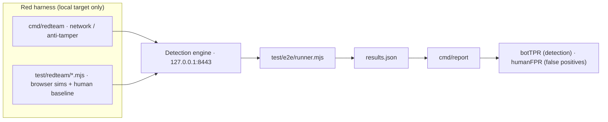

# Self-validation: red-team your own Gate deployment (defensive-only)

**Diátaxis quadrant:** How-to.
**Audience:** operators and evaluators validating an installation they own on their own machine.

> **Warning:** This procedure validates a deployment **you operate**, on your own loopback interface (`127.0.0.1`). The bundled tools are labeled "local target only" and default to localhost for that reason. Never point them at any host, domain, or IP you do not run yourself. This page gives you no evasion, bypass, or attack guidance against third parties — it only helps you confirm that **your own** detection and enforcement behave as expected, and helps you measure your own false-positive rate before you enforce anything.

<video autoplay loop muted playsinline poster="../assets/screenshots/anim/quickstart-cast-poster.webp" width="820" style="max-width:100%;border-radius:12px" aria-label="A local Docker self-validation run streams the fixed automation catalog and synthetic human baseline against Core, then reports expected verdicts, failures, and the documented coherent-automation boundary.">
  <source src="../assets/screenshots/anim/quickstart-cast.webm" type="video/webm" />
  <source src="../assets/screenshots/anim/quickstart-cast.mp4" type="video/mp4" />
</video>

## What this gives you

The goal is a measurement, not a guarantee. When you finish, you will have two numbers for **your** deployment:

- **A detection rate** — how often the bundled automation simulators are caught (CHALLENGE or DENY) rather than passed.
- **A false-positive rate** — how often the fixed synthetic human baseline is wrongly blocked.

Read both together. A high detection rate means little if the fixed synthetic human baseline is also being flagged, and the low-false-positive principle (privacy browsers, extensions, and older devices must not be scored as bots) is exactly what this exercise lets you verify before enforcement affects real visitors. Treat every number as **reference-measured** on your machine — it describes this run, not a promise about live traffic.

For where the detection engine sits relative to the proxy, see **[Where Gate fits](../explanation/where-gate-fits.md)**. For how enforcement and fail-open behavior work before you turn anything on, see **[Will this break my app?](../explanation/will-this-break-my-app.md)**.

The whole exercise is one measurement loop — the harness fires at your own local engine, the runner records every verdict, and the report reduces them to two numbers:



## Step 1 — Stand up in monitor mode first

Before you measure anything, put a deployment in front of a throwaway origin in **global monitor mode** (score and log every request, enforce nothing). This is the recommended starting posture and the safe place to observe verdicts.

Follow **[Quickstart: monitor mode](../tutorials/quickstart-monitor-mode.md)** end to end. When you can load your app through Gate and watch verdicts appear on the Overview stream in the Ledger — with nothing challenged and nothing blocked — you are ready to validate detection.

> **Note:** Monitor mode is where you confirm the false-positive picture without risk. Because enforcement is off, a wrong verdict is recorded but never delivered, so you can study it in the audit log before it could ever affect a real visitor.

## Step 2 — Understand what the harness targets

The bundled harness measures the **standalone Core detection engine** directly on **`127.0.0.1:8443`**. Gate reuses the scoring implementation but does not currently supply the same complete evidence set, so these results are not Gate accuracy results.

> **Important:** The harness default target (`127.0.0.1:8443`, the standalone detection server) is **distinct** from the Gate reverse proxy, which listens on `:8444`. When you run the harness you are exercising the detection engine itself, not the proxy edge. Do not repoint the harness at your Gate edge or any other host.

Build and start the detection server on loopback:

```
go build -o bin/server.exe ./cmd/server
```

```
bin/server.exe -addr :8443 -web web
```

Leave it running in its own shell. As with the rest of the reference build, it uses a self-signed dev certificate; the harness accepts it because the target is local.

## Step 3 — Know the two toolsets (high level)

The harness has two parts. You do not need to read their internals to validate a deployment — this is the level of detail you need.

**Network / anti-tamper checks — `cmd/redteam` (Go).** A local client that controls the TLS fingerprint (via uTLS) and request-integrity tokens precisely, to exercise defenses a normal browser cannot reach. Its own header states "local target only." It takes `-attack` and `-host` (default `127.0.0.1:8443`):

```
go build -o bin/redteam.exe ./cmd/redteam
```

```
bin/redteam.exe -attack tls-rotate -host 127.0.0.1:8443
```

The available `-attack` values are `tls-rotate`, `ua-rotate`, `rit-replay`, `rit-tamper`, `flood`, `distributed`, and `tls-static`. Each prints a JSON verdict for that single check. Use these to confirm your network-layer and anti-tamper defenses respond.

> **Warning:** Unlike the [Detection Observatory](detection-observatory.md) launcher — which is structurally locked to loopback — `cmd/redteam`'s `-host` default (`127.0.0.1:8443`) is **advisory, not enforced**: the CLI connects to whatever `host:port` you pass. Keeping it on your own box is your responsibility. See the [Red-team rules of engagement](../reference/red-team-rules-of-engagement.md).

> **Note:** `flood`, `distributed`, and `tls-static` are the same raw-protocol attacks that the `flood.mjs` / `distributed.mjs` / `tls_static.mjs` catalog profiles wrap (via `_bin.mjs`), so they appear both as standalone `-attack` values here and as rows in the e2e catalog above.

**Browser-automation simulators — `test/redteam/*.mjs`.** A catalog of profiles that reproduce the client-side and behavioral tells of common automation stacks — for example `selenium`, `puppeteer`, `puppeteer_stealth`, `playwright_plain`, `playwright_stealth`, `undetected`, `nodriver`, `patchright`, `camoufox`, `antidetect`, `direct_cdp`, `ai_agent`, `flood`, and `rapid_reset`, among others. Crucially, the catalog also includes **`human`** — a fixed synthetic human baseline you expect to be ALLOWed. That baseline turns this from "does it catch automation samples" into "does the same run also flag this fixed non-automation sample?"

## Step 4 — Run the full suite (Docker — authoritative)

**Authoritative e2e is Docker compose**, not a host process on loopback. The catalog runs inside the `bots` image on an internal lab network against the `core` service so the network plane and isolation policy match CI.

From the repository root (Docker required):

```
make e2e
```

Or the equivalent one-shot:

```
bash scripts/e2e-docker.sh
```

That path builds/starts the stack, runs the automation catalog, asserts every bot is blocked with no human false DENY, runs Gate conformance, and (unless skipped) multi-subnet swarm + feature overlays. Artifacts land under `deployments/artifacts/` (including `core-results.json`).

> **Note:** `node test/e2e/runner.mjs` against a host-only server remains available for **profile authoring**, but it is **not** completion authority — loopback cannot exercise multi-subnet correlation or the lab network boundary. Prefer `make attack` / `make e2e` for any claim about the suite.

## Step 5 — Summarize as a measurement

Turn the raw results into the two numbers that matter with `cmd/report`, which aggregates the Docker attack artifact (or a local results file):

```
go build -o bin/report.exe ./cmd/report
```

```
bin/report.exe -in deployments/artifacts/core-results.json -out docs/report.html
# or: make report-html  (prefers the Docker artifact when present)
```

It prints a one-line summary and writes an HTML report:

```
wrote docs/report.html — botTPR=<pct>% humanFPR=<pct>% (<n> bot runs, <n> human runs)
```

Read it as follows:

- **botTPR** is the detection (true-positive) rate across the automation profiles — your block-rate measurement.
- **`humanFPR`** is the machine field for the false-positive rate on the fixed synthetic human baseline — the number you most want near zero before enforcing.

> **Important:** `humanFPR` counts only a hard **DENY** on the human baseline. A human that receives a **CHALLENGE** is scored TN, not false positive — so `humanFPR` is a DENY-only metric and does not capture challenge friction on real people. Inspect the baseline's challenge rate separately (in the audit log or the [Detection Observatory](detection-observatory.md)). A nonzero `humanFPR` can also come from the heuristic enforcement rules (datacenter-network browser rule / no interaction observed rule / missing or replayed request-integrity token rule) firing on privacy browsers or older devices — expected, not a defect; see [enforcement rules and verdicts](../reference/hard-rules-verdicts.md).

Both are measurements from this run on your machine, not guarantees. If `humanFPR` is anything but zero, investigate the flagged baseline runs in the audit log **before** you move any route from monitor to enforce. That is the whole point of measuring first.

## What this exercise does — and does not — tell you

- It **confirms** that your own detection engine responds to known automation stacks and to network/anti-tamper probes, and it **quantifies** your false-positive rate on an honest baseline. Those are real, reproducible signals about your deployment.
- It does **not** prove your deployment blocks all automation. The simulators are a fixed catalog, not the full field of adversaries, and the coherent browser or human-assisted automation tier (anti-detect toolchains paired with real-human click-farms) is an explicit design boundary that this harness does not resolve — it is mitigated by rate limiting and reputation, not eliminated. See **[What Gate is (and is not)](../explanation/what-gate-is.md)** for the attacker-tier framing.
- This page is **defensive-only by design.** It contains no tuning to make automation evade detection. If you find a profile that slips through, treat it as a finding about your own coverage to raise with the maintainers — not something to optimize against.

> **Tip:** Re-run Steps 4–5 whenever you change detection configuration or upgrade the engine, and keep the `humanFPR` measurement in view. A change that raises detection but also raises false positives is a regression in the low-false-positive principle, not an improvement.

## Related

- **[Watch detection happen live: the Detection Observatory](detection-observatory.md)** — the interactive, real-time version of this workflow: fire a profile and watch the seven-stage pipeline reach its verdict.
- **[Quickstart: monitor mode](../tutorials/quickstart-monitor-mode.md)** — stand up the monitor-first posture this procedure assumes.
- **[Where Gate fits](../explanation/where-gate-fits.md)** — how the detection engine relates to the proxy edge.
- **[Will this break my app?](../explanation/will-this-break-my-app.md)** — fail-open behavior and staged rollout before you enforce.
- **[enforcement rules and verdicts](../reference/hard-rules-verdicts.md)** — how verdicts and enforcement rules map to the ALLOW / CHALLENGE / DENY outcomes you see in the results.
