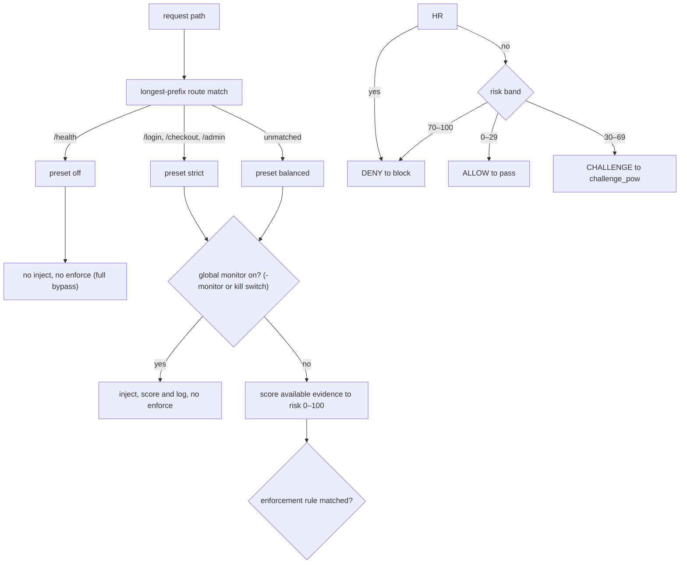

# CLI, config & per-route policy reference

**Diátaxis quadrant:** Reference. **Audience:** integrators and operators running humanymous Gate.

This page lists every command-line flag, environment variable, policy preset, route-table default, threshold, and ingress limit in the reference build of humanymous Gate ("Gate" after first mention). It is descriptive and complete, not a walkthrough — for a guided first run see the [Quickstart (monitor mode)](../tutorials/quickstart-monitor-mode.md); for rollout and safety reasoning see [Will this break my app?](../explanation/will-this-break-my-app.md).

> **Note:** This repository is a reference implementation, not a production-hardened build. Values below are the reference defaults. Several production-shaped features **do** ship in the binary (for example `-acme-domain` / `-tls-cert` edge TLS, `-admin-mtls-ca`, Prometheus `GET /__hmn/admin/metrics`, and `/__hmn/healthz` + `/__hmn/readyz`); production responsibility is the remaining operational surface (SIEM shipping, external IdP/SSO, multi-node shared state beyond the optional Redis path).

Gate is the reverse-proxy enforcement layer. It injects its current browser collector where configured, scores the evidence that collector and the edge supply, enforces the verdict, and writes decisions to a tamper-evident audit log. It does not currently collect Core's complete seven-stage evidence set.

---

## CLI flags

Flags are defined in `cmd/gate/main.go`. The binary is built to `bin/gate.exe` from `./cmd/gate` (module `github.com/modootoday/humanymous`).

| Flag | Default | Meaning |
|------|---------|---------|
| `-addr` | `:8444` | Public edge listen address (HTTPS). Terminates TLS, injects the bundle, scores, and enforces. |
| `-admin-addr` | `127.0.0.1:8445` | Separate authenticated admin listener, cross-origin to the edge. Serves the Ledger and admin API only. **Defaults to loopback** — bind it off-host only behind mutual Transport Layer Security/SSO (a startup warning fires otherwise). |
| `-upstream` | `http://127.0.0.1:9000` | Origin upstream base URL that Gate fronts. (`upstream` is the flag alias for the origin.) |
| `-node` | `gate-1` | Node id; the owner of this node's audit hash chain. |
| `-monitor` | `false` | Global monitor mode: score and log everywhere, enforce nothing. Downgrades every route to monitor. See [Monitor disambiguation](#monitor-disambiguation). |
| `-origin-key` | `""` (random ephemeral) | Origin-cloaking HMAC key. The origin validates the `X-Hmny-Origin-Auth` header against it. |
| `-keystore` | `""` (ephemeral keys) | Path to a sealed keystore for persistent node identity. Requires the `HMN_UNSEAL` environment variable; boot fails without it. |
| `-tls-cert` / `-tls-key` | `""` (self-signed) | Bring-your-own edge TLS certificate + key (PEM). |
| `-acme-domain` | `""` | Comma-separated domain(s) for a Let's Encrypt edge cert (TLS-ALPN-01, needs `:443`). `-acme-cache` / `-acme-email` / `-acme-directory` tune it. See [HTTPS / TLS certificates](../how-to/https-tls-certificates.md). |
| `-acme-cache` | `acme-cache` | On-disk cache directory for issued ACME certificates (and the account key). **In a container this MUST be an absolute path on a writable, persistent volume** (e.g. `-acme-cache /acme-cache` on a named volume) — the relative default resolves onto the read-only rootfs, which breaks issuance and would otherwise re-issue on every restart and exhaust Let's Encrypt rate limits. |
| `-acme-email` | `""` | Optional ACME account contact email (Let's Encrypt expiry/policy notices). |
| `-acme-directory` | `""` (production Let's Encrypt) | ACME directory URL. Empty = production Let's Encrypt. Set the Let's Encrypt **staging** URL (`https://acme-staging-v02.api.letsencrypt.org/directory`) to dry-run issuance without burning production rate limits (staging certs use an untrusted root → browsers warn; validation only). Also accepts ZeroSSL or an internal step-ca directory URL. |
| `-routes` | `""` (built-in presets) | Path to an external route-policy file (`<prefix> <preset>` per line). |
| `-audit-wal` | `""` (ephemeral) | Durable audit write-ahead log directory (survives restarts). With `-audit-verify`, **required** and must be non-empty: replays the chain, checks HMACs (when a keystore supplies the key)/STHs/**witness** co-signatures, exits non-zero on empty chain or any break. Without `-keystore`, `-audit-verify` does **not** mint a random HMAC (that would always fail `hmac-invalid`); HMAC is skipped (`hmac-unchecked` path in the library). For a full verify of a production write-ahead log, pass the matching `-keystore` + `HMN_UNSEAL`. Boot also logs `audit keys: … sth_public=… witness_public=…` (public material only). |
| `-shutdown-grace` | `25s` | Graceful-shutdown drain timeout on `SIGINT`/`SIGTERM`. On signal the readiness probe (`/__hmn/readyz`) flips to draining, both listeners drain in-flight requests, then the keystore is sealed. Set this **≥ your orchestrator's termination grace** so the drain completes before the pod is killed. |
| `-max-body` | `0` (unlimited) | Caps the request body forwarded to origin on the proxy path (bytes). A declared `Content-Length` over the cap returns **413** before it reaches origin. Gate's own control/admin JSON endpoints keep their own tighter caps regardless of this value. |
| `-hsts` | `false` | Add a `Strict-Transport-Security` header to edge responses. Leave off in dev behind the self-signed cert; enable only once real certs and HTTPS-everywhere are in place. (Gate always adds, add-only — never overwriting an origin's own value — `X-Content-Type-Options: nosniff`, `Referrer-Policy: strict-origin-when-cross-origin`, and `X-Frame-Options: SAMEORIGIN`, independent of this flag.) |
| `-admin-mtls-ca` | `""` (disabled) | PEM file of client-cert CA(s). When set, the admin listener **requires** a client certificate signed by this CA (mutual Transport Layer Security, `tls.RequireAndVerifyClientCert`) **in addition to** the bearer token — the shippable half of "front the admin plane with mutual Transport Layer Security/SSO". |

**Constraint-resolution features — all OFF by default, experimental. Read the trust caveat before enabling.**

| Flag | Default | Description + trust caveat |
| --- | --- | --- |
| `-redis` | `""` (single-node in-memory) | Redis `host:port` for **shared** ban + sticky-verdict + rate-limit state across a Gate fleet. Set `HMN_REDIS_KEY` (fleet-shared secret, ≥16 bytes) to **key-bind** stored values — a compromised coordinator then cannot forge, relocate, or roll back a verdict/ban (freshness is re-checked on read); it can only *withhold*, which degrades each node to its local view (no lockout). Set `HMN_REDIS_PASSWORD` (+ optional `HMN_REDIS_USER`) for AUTH. **Caveat:** without `HMN_REDIS_KEY` the channel is UNSIGNED (Gate logs a loud WARNING) — still treat Redis as a network-isolated, trusted component. |
| `-trusted-proxies` | `""` (disabled) | Comma-separated CIDRs of trusted load balancers allowed to send a Proxy Protocol version 2 header. **Caveat:** use only your balancers' addresses — never a broad range such as `0.0.0.0/0`, or a client could spoof its source address. This flag does not activate Core's connection-fingerprint collection in Gate. |
| `-agent-keys` | `""` (disabled) | Allowlist of trusted **Web Bot Auth** (RFC 9421) keys; a valid signature is a trust-upgrade, a forgery of a listed key is denied. The covered set MUST bind the request line (`@authority` + `@method` + `@path`) — an `@authority`-only signature is treated as neutral, so a captured signature cannot be replayed across paths/methods — and a single-use `nonce`, when present, is enforced against replay. |
| `-pat-issuers` | `""` (disabled) | PEM of trusted **Privacy Pass** PAT issuer public keys; a valid token is a trust-upgrade. Double-spend is bounded by an in-memory nonce cache (10-min TTL, amortized sweep, capped set — fail-safe to *no upgrade* at saturation). **Caveat:** the cache is per-node and non-durable, so single-use holds within a node's window, not node-local. |
| `-webauthn-creds` | `""` (disabled) | Allowlist of registered **WebAuthn** credentials; a valid, counter-advancing assertion is a trust-upgrade. **Caveat:** replay is bounded only by the signature counter (a zero/non-incrementing counter is refused, not trusted) — there is no per-request server challenge, so treat this as a returning-user hint, not strong possession proof. Origin/RP-ID binding is available via config. |
| `-audit-redis` / `-audit-clickhouse` | `""` (off) | Project the audit stream to Redis Streams (Tier 1) / ClickHouse (Tier 2). The write-ahead log remains the durability authority; projections drop-and-count under backpressure. |
| `-anomaly-shadow` | `false` | Enable the **log-only** streaming-anomaly observer. Strictly observational — never affects the verdict. |

---

## Environment variables

| Variable | Required when | Format / effect |
|----------|---------------|-----------------|
| `HMN_UNSEAL` | `-keystore` is set | Passphrase used to seal and open the keystore. Boot fails if `-keystore` is set and this is unset. |
| `HMN_ADMIN_TOKENS` | Optional (dev) | Deterministic dev admin tokens. Format: `auditor:tok,operator:tok,approver:tok,dpo:tok`. If unset, random tokens are generated per boot and printed at startup. |
| `HMN_REDIS_KEY` | Recommended with `-redis` | Fleet-shared secret (≥16 bytes; a demo/placeholder value is rejected at boot) that key-binds shared verdict/ban values. Unset ⇒ unsigned channel + a loud startup WARNING. |
| `HMN_REDIS_PASSWORD` / `HMN_REDIS_USER` | Optional with `-redis` | Redis AUTH credential sent on every (re)connect. User may be empty for legacy password-only AUTH. |
| `HMN_TOKEN_KEY` | Recommended for a fleet; **required for `attested` routes** | Hex (≥16 bytes) verdict-token HMAC key shared across nodes and restarts, so a returning human's trust token stays valid node-local. Unset ⇒ per-boot random key; a token minted elsewhere simply falls through to re-scoring (never a deny), and `-redis` mode logs a WARNING advising you to set it. It has a **second role** for the attestation floor: set the *same* value on the Core (which serves the Pass) and the Gate so a Pass-solve step-up receipt minted by the Core verifies at the Gate's `/__hmn/stepup`. If any route uses the `attested` preset without a shared key, both the Gate and the Core **refuse to start** (a malformed value is likewise fatal) — an attested route with no verifiable receipt would be an unredeemable Pass loop for real humans. |

---

## Startup log lines

Expect these lines on boot (values reflect defaults):

```
humanymous Gate dev on https://localhost:8444 -> http://127.0.0.1:9000 (monitor=false, tls=self-signed)
humanymous Gate admin console on https://localhost:8445/__hmn/admin/console
  dev tokens — auditor:<hex> operator:<hex> approver:<hex> dpo:<hex>
```

With `-keystore` set, one of these also appears:

```
keystore: created new sealed node identity at <path>
```

```
keystore: resumed persisted node identity from <path>
```

The `dev tokens` line prints only when tokens are generated (that is, when `HMN_ADMIN_TOKENS` is unset). When you supply `HMN_ADMIN_TOKENS`, use the values you provided.

---

## Policy presets

Presets are defined in `internal/gate/config.go`. Five presets are implemented. Each sets whether the detection bundle is injected, whether the verdict is enforced, and (for `strict` and `attested`) fail-closed and synchronous-rescore behavior; `attested` adds the attestation floor.

| Preset | inject | enforce | fail-closed | sync-score | Behavior |
|--------|:------:|:-------:|:-----------:|:----------:|----------|
| `off` | no | no | — | — | No bundle injection, no enforcement. Full bypass. |
| `monitor` | yes | no | — | — | Inject bundle, score and log, enforce nothing. |
| `balanced` | yes | yes | no | no | Default for any unmatched route. Enforces; fails open on an unknown verdict for a safe GET/HEAD request. |
| `strict` | yes | yes | yes | yes | Enforces; an unknown verdict becomes a challenge (fail-closed), and the score is re-computed synchronously before any state-changing action (sync-score). |
| `attested` | yes | yes | yes | yes | `strict` **plus the attestation floor**. On this route a scoring-ALLOW is priced, not fast-pathed: the request must carry possession (a WebAuthn / Privacy-Pass / Web-Bot-Auth trust-upgrade, which the possession pre-gate forwards before scoring) **or** a step-up proof (`hmn_su`, minted on a Pass solve). Without either, an ALLOW is demoted to a Pass challenge — CHALLENGE→Pass, never DENY. Refused on a catch-all/public prefix; requires a shared `HMN_TOKEN_KEY`; warns if no credential verifier is configured. See [Configure attested routes](../how-to/configure-attested-routes.md). |

> **Important:** The `low` and `api` preset names are reserved and not implemented in the reference build. `presetByName` falls back to `balanced` for them. Do not rely on `low` or `api` as working presets.

> **The attestation floor prices the ALLOW; it does not detect.** A coherent engine-level spoof cannot be told from a human past the coherent browser or human-assisted automation ceiling. On an `attested` route the floor makes the free ALLOW cost either possession or a per-session human Pass solve. It never blocks a human categorically — the demotion is always to a Pass challenge, never a DENY, so an unattested human solves the same Pass an anonymous visitor already solves.

---

## Default route table

The default route table is set in `main.go`. Routes match by **longest-prefix wins**; anything unmatched uses `balanced`.

| Route prefix | Preset |
|--------------|--------|
| `/login` | `strict` |
| `/checkout` | `strict` |
| `/admin` | `strict` |
| `/health` | `off` |
| *(everything else)* | `balanced` |

> **Note:** `-monitor` or the kill switch downgrades `enforce` to monitor everywhere (`GlobalMonitor`), regardless of a route's preset. See below.

A request resolves route to preset to verdict to edge action along this path:



---

## Monitor disambiguation

Three distinct things share the word "monitor":

- **The `-monitor` flag** — a boot-global switch. It downgrades enforcement to monitor across every route for the life of the process.
- **The `monitor` preset** — a per-route setting. It injects the bundle and scores/logs that route, but enforces nothing on that route only.
- **Monitor mode** — the resulting runtime state of a route: score and log, enforce nothing. A route reaches monitor mode either because it uses the `monitor` preset, or because the global `-monitor` flag or the kill switch demoted it.

The kill switch is a node-local dual-control flip that demotes rule enforcement to monitor for every route on the current node. Detection continues and manual bans still enforce.

> **Warning:** The kill switch is node-local. A multi-node deployment must coordinate and verify the change on each node. It is a dual-control action.

### Presets × global monitor mode

This table shows the effective runtime behavior of each preset with global monitor off (normal) versus on (`-monitor` flag or kill switch active).

| Preset | Global monitor **off** (normal) | Global monitor **on** |
|--------|-------------------------------|-----------------------|
| `off` | No inject, no enforce | No inject, no enforce (unchanged) |
| `monitor` | Inject, score + log, no enforce | Inject, score + log, no enforce (unchanged) |
| `balanced` | Inject, score, enforce | Inject, score + log, no enforce |
| `strict` | Inject, score, enforce, fail-closed, sync-score | Inject, score + log, no enforce |
| `attested` | Inject, score, enforce, fail-closed, sync-score, attestation floor | Inject, score + log, no enforce (floor suppressed with all enforcement) |

### Attestation-floor surface (ceiling-guard)

These apply only to `attested` routes. For a task-oriented walkthrough see [Configure attested routes](../how-to/configure-attested-routes.md).

| Surface | Value | Role |
|---------|-------|------|
| `hmn_su` cookie | HMAC, bound to fingerprint + subnet + session id, TTL'd, epoch-rotated | The step-up proof. Domain-separated from the `hmn_vt` verdict token, so a verdict token can never be presented as a step-up. Minted only via `/__hmn/stepup`. |
| `POST /__hmn/stepup` | Control-plane endpoint (public listener) | Redeems a Pass-solve step-up receipt (header `X-Hmn-Stepup-Receipt`) for an `hmn_su` cookie, re-binding it to the live socket. A missing/forged/expired/foreign-session receipt is a 403 with a self-diagnosing audit reason (`sid_mismatch` flags a diverged cookie jar; `expired` flags Core↔Gate clock skew). |
| `CredFanoutCap` | `8` distinct /24 subnets (default) | Ceiling-guard #2. Past this fan-out, one WebAuthn credential's trust-upgrade is withheld **on attested routes only** and the request reverts to Pass — bounding a stolen/shared passkey fronting a proxy farm. Degrades to CHALLENGE, never DENY. |

The step-up receipt carries a ±120 s clock-skew leeway; multi-host attested deployments should still run NTP.

---

## Risk score and verdicts

The engine produces one of three verdicts — ALLOW, CHALLENGE, DENY — from a risk score of 0–100 (one decimal). Policy 1.0.0 thresholds are defined in `internal/scoring/policy.go`.

| Risk score | Verdict |
|------------|---------|
| 0–29 | ALLOW |
| 30–69 | CHALLENGE (`ChallengeAt = 30`) |
| 70–100 | DENY (`DenyAt = 70`) |

Edge verdict values are `allow` / `challenge` / `deny` / `none` (`none` means Unknown). DENY blocks before origin contact. CHALLENGE returns the reference challenge response before origin contact; the deployment must supply a complete accessible recovery flow. ALLOW passes.

- **enforcement rules** can promote or override the score-based verdict. See the [enforcement rules, Verdicts & Signal-ID Reference](./hard-rules-verdicts.md).
- **proof of work upgrade:** a score-based CHALLENGE with no enforcement rule matched becomes ALLOW if the session solved the proof-of-work (signal `l7.pow.solved`). Proof of work never overrides an enforcement rule — it proves CPU work, not humanity.
- **Fail-open vs fail-closed on an Unknown verdict:** fail closed (→ challenge) when the route is `strict` (fail-closed or sync-score) or the HTTP method is unsafe (POST/PUT/PATCH/DELETE). Fail open (→ pass) only for a safe-method (GET/HEAD) request on a non-strict route. The safe-GET fail-open on `balanced` routes is a documented accepted residual, covered meanwhile by fingerprint/subnet rate metering.
- A fingerprint-bound verdict trust token, when present and valid, lets ALLOW take a fast path with no re-scoring.
- Every enforcement decision is emitted to the audit sink before it takes effect.

---

## Rate limiting and bans

The control-plane per-IP flood limiter guards `/collect` and `/session`. Defaults are tunable via `Config.RateWindow` / `Config.RateSoft` / `Config.RateHard`.

| Setting | Default | Meaning |
|---------|---------|---------|
| Window | 10s | Sliding counting window. |
| Soft | 60 | Soft request threshold within the window. |
| Hard | 120 | Hard threshold; a breach returns 429 before scoring. |

Auto-ban escalation ladder (with strike decay):

| Step | Duration |
|------|----------|
| 1 | 1h |
| 2 | 6h |
| 3 | 24h |
| 4 | permanent |

Ban keys are `ip:<addr>` or `fp:<fingerprint>`, with `Source=auto` or `Source=manual`. Bulk ban is temporary-only; permanent and CIDR bans are rejected from bulk and require dual-control.

---

## Right-to-erasure hold

Right-to-erasure is cryptographic erasure (crypto-shred): it destroys the per-subject linkage key. A cancellable hold window precedes commit.

| Setting | Default |
|---------|---------|
| Erasure hold window | 5 minutes |
| Due-shred ticker (`RunDueShreds`) | every 10s |

> **Warning:** Cryptographic erasure is irreversible. Once the hold window elapses and the shred runs, the per-subject linkage key is destroyed and re-identification of those records is no longer possible. The audit chain and Merkle anchors stay intact and verifiable. See the [Right-to-Erasure (crypto-shred) Runbook](../runbooks/erasure-crypto-shred.md).

---

## Ingress hardening

These limits apply to **both** the edge listener and the admin listener.

| Setting | Value | Purpose |
|---------|-------|---------|
| `ReadHeaderTimeout` | 8s | Slowloris mitigation. |
| `ReadTimeout` | 30s | Slow-POST mitigation. |
| `WriteTimeout` | 30s | Response write bound. |
| `IdleTimeout` | 60s | Idle keep-alive bound. |
| `MaxHeaderBytes` | 1 MiB | Header size cap. |
| HTTP/2 `MaxConcurrentStreams` | 100 | Per-connection stream cap. |
| HTTP/2 `MaxReadFrameSize` | 1 MiB | Frame size cap. |
| HTTP/2 `MaxUploadBufferPerConnection` | 1 MiB | Upload buffer cap. |
| TLS minimum version | 1.2 | Floor for negotiated TLS. |

The dev certificate is self-signed in memory (ECDSA P-256), CN `humanymous.local`, SAN `localhost`, `humanymous.local`, `127.0.0.1`, `::1`. Browsers show a certificate warning in dev — this is expected. Production TLS is **in the reference binary**: set `-tls-cert`/`-tls-key` for bring-your-own PEM, or `-acme-domain` (and related flags) for Let's Encrypt TLS-ALPN-01.

---

## Control-plane endpoints (public edge)

The client-facing control plane is served on the public edge listener under `/__hmn/` (`Config.ControlPath = "/__hmn/"`). Gate's injected loader sends its report to `/__hmn/collect`. The current Gate does not extract Core's full ClientHello and HTTP/2 fingerprint evidence from that connection.

| Endpoint | Purpose |
|----------|---------|
| `/__hmn/session` | Session establishment. |
| `/__hmn/collect` | Signal beacon target from the browser. |
| `/__hmn/loader.js` | Detection bundle loader. |
| `/__hmn/csp-report` | CSP violation sink (returns 204). |
| *(challenge / proof of work interstitial)* | Served from the control plane. |

> **Note:** `/__hmn/admin/*` is **not** served on the public edge — the public edge 404s it. The admin surface lives only on the admin listener.

---

## Admin API (admin listener)

Served on the admin listener (`-admin-addr`, default `127.0.0.1:8445` — loopback; bind off-host only behind mutual Transport Layer Security/SSO). The Ledger SPA is at `https://localhost:8445/__hmn/admin/console` and derives its API base as `/__hmn/admin`. Authentication is bearer (`Authorization: Bearer <token>`) with constant-time compare. A missing or invalid token returns 404 (deny-by-default, non-discoverable). Every authenticated access is meta-audited (`admin.access`) before serving.

Actor identity is server-derived from the token; request-body actor fields are ignored. role-based access control roles: **Auditor** (read-only), **Operator**, **Approver**, **data protection officer**. In dev the console is injected with the Operator token so it can read and request; approvals need a distinct Approver token.

### GET endpoints (read — Auditor and above)

| Endpoint | Notes |
|----------|-------|
| `/__hmn/admin/bans` | Current bans. |
| `/__hmn/admin/integrity` | Audit-chain integrity status. |
| `/__hmn/admin/audit` | Audit records. Supports `?verdict=&host=&route=&rule=&minRisk=&subject=&before=` with a `nextBefore` cursor. |
| `/__hmn/admin/incidents/{handle}` | Incident lookup by incident handle. |
| `/__hmn/admin/policy` | Current policy and route table. |
| `/__hmn/admin/approvals` | Pending dual-control actions. |
| `/__hmn/admin/erasures` | Erasure requests and holds. |
| `/__hmn/admin/whoami` | Server-derived identity of the calling token. |

### POST endpoints (write)

| Endpoint | Initiating role | Dual-control | Notes |
|----------|-----------------|:------------:|-------|
| `/__hmn/admin/bans` | Operator | For permanent / CIDR bans | Temporary bans are single-control; permanent and CIDR bans require an Approver. |
| `/__hmn/admin/bans/bulk` | Operator | — | Temporary-only; permanent and CIDR bans are rejected from bulk. |
| `/__hmn/admin/bans/lift` | Operator | — | Lifts a ban. Takes a `?key=<ban-key>` query parameter, not a body. |
| `/__hmn/admin/erasure` | Operator or data protection officer | Yes — committer must be a distinct data protection officer | Starts a crypto-shred with a hold window. Requesting needs Operator or data protection officer; committing requires the data protection officer role. |
| `/__hmn/admin/killswitch` | Operator | Yes — distinct Approver | Node-local demotion of rule enforcement to monitor. |
| `/__hmn/admin/erasures/{id}/cancel` | Operator / data protection officer | — | Cancels an erasure during its hold window. |
| `/__hmn/admin/approvals/{id}` | Approver, or data protection officer for erasure (≠ requester) | Commits a pending action | A distinct approver commits a pending dual-control action. Ban / kill-switch approvals need the Approver role; **erasure approvals require the data protection officer role** — a generic Approver cannot commit an erasure. |

> **Note:** Dual-control means a distinct second identity commits the action: an Approver for permanent/CIDR bans and the kill switch, and a distinct data protection officer for erasure. The requester cannot approve their own action.

### Request & response shapes

The authoritative admin request/response bodies. JSON field decoding is case-insensitive, so `{"key": …}` and `{"Key": …}` are equivalent; the canonical field names are shown below. Ban keys are always `ip:<addr>`, `fp:<hash>`, or `cidr:<addr/mask>`.

**`POST /bans`** — request `{"Key":"ip:203.0.113.7","Reason":"scraper","Incident":"<opt>","DurationSec":3600}`. A positive `DurationSec` on a non-broad key applies directly → `{"ok":true,"permanent":false}`. `DurationSec:0` (permanent) **or** a `cidr:` key returns a pending dual-control action → `{"pending":true,"approvalId":"<id>","needsRole":"approver"}`.

**`POST /bans/bulk`** — request `{"Keys":["ip:…","fp:…"],"Reason":"…","DurationSec":3600}`. `DurationSec` must be > 0 (permanent bulk is rejected 400). Response `{"ok":true,"applied":<n>,"skipped":<n>}` (invalid/`cidr:` keys are skipped).

**`POST /bans/lift`** — **uses a query parameter, not a body:** `POST /__hmn/admin/bans/lift?key=<ban-key>`. Response `{"ok":true,"lifted":<bool>}`.

**`POST /erasure`** — request `{"Subject":"<console pseudonym>","LegalBasis":"GDPR Art.17"}`. Both fields required (400 otherwise). Returns a pending action → `{"pending":true,"approvalId":"<id>","needsRole":"dpo"}`.

**`POST /killswitch`** — request `{"On":true}`. Returns `{"pending":true,"approvalId":"<id>","needsRole":"approver"}`.

**`POST /approvals/{id}`** — no body; a distinct committer commits the pending action. Response varies by kind: ban `{"ok":true,"committed":"ban","permanent":<bool>}`; erasure `{"ok":true,"committed":"erasure","scheduled":true,"shredId":"<id>","executeAtUnix":<unix>}`; kill switch `{"ok":true,"committed":"killswitch","monitorOn":<bool>}`.

**`POST /erasures/{id}/cancel`** — no body. Response `{"ok":true,"cancelled":"<id>"}`.

**`GET /audit`** — response `{"records":[<record>…],"count":<n>,"nextBefore":<seq>}`, newest-first. Page with `?before=<nextBefore>`; `limit` defaults to 50, max 500. Each record's canonical fields: `event_id`, `seq`, `node_id`, `ts` (RFC3339 nanoseconds, UTC), `event_type`, `event_version`, `actor{kind,id_pseudonym}`, `tenant_id`, `session_pseudonym`, `host`, `route_class` (`html|api|upgrade|control|static`), `verdict` (`allow|challenge|deny|none`), `risk_score`, `triggered_rules` (`["HR-…"]`), `top_signals[{id,verdict,conf}]`, `enforcement_action`, `enforcement_mode` (`monitor|shadow|enforce`), `fail_mode` (`none|fail_open|fail_closed|degraded`), `fail_reason`, `latency_us`, `upstream{status,error_class}`, `tls{ja4_pseudonym,h2fp_pseudonym,sni_pseudonym}`, `config_version`, `key_id`, `data_class`, the chain fields `prev_hash`/`record_hash`/`hmac`, and `incident` (the opaque handle, added at read time only). The `?host=` filter is a case-insensitive substring; `?route=` matches `route_class` exactly; `?rule=` matches an `HR-…` in `triggered_rules`; `?subject=` scopes to a single pseudonymous subject, matched against `session_pseudonym` **or** `actor.id_pseudonym` (GDPR Art. 15 subject access — pass the pseudonym, not a raw identifier).

**`GET /integrity`** — response `{"node":"…","ok":<bool>,"class":"<mismatch-class>","records":<n>,"checkpoints":<n>,"witnessed":<bool>,"lastSTH":{"treeSize":<n>,"root":"<hex>"}}`. On failure it adds `divergentSeq`, `detail`, and (if the witness attestation fails) `witnessFailAt`. The Signed Tree Head root and tree size are exposed; the raw Ed25519 signature and the witness public key are **not** returned by this endpoint in the reference.

**`GET /policy`** — response `{"globalMonitor":<bool>,"killSwitch":<bool>,"effectiveMonitor":<bool>,"configVersion":"<signed hash>","routes":[{"prefix","preset","enforce","failClosed","syncScore","inject"}],"rateLimit":{"windowSec","soft","hard"},"retentionDays":<n>}`. The signed effective-policy identity is the `configVersion` field.

**`GET /bans`** → `{"bans":[{"key","reason","source","incident","strike","permanent","expiresInSec"}],"count"}`. **`GET /erasures`** → `{"scheduled":[{"id","legalBasis","requester","approver","executesInSec"}],"count"}`. **`GET /approvals`** → `{"pending":[{"id","kind","params","needsRole"}],"count"}`. **`GET /whoami`** → `{"id","role"}`. **`GET /incidents/{handle}`** → the audit record (or 404; a per-operator lookup cap returns 429).

For legacy enforcement-rule identifiers, diagnostic-signal namespaces, and per-verdict detail, see the [verdicts, enforcement rules, and diagnostic signals reference](./hard-rules-verdicts.md). For how a request flows through seven detection stages, see [How Gate sees a request](../concepts/how-gate-sees-a-request.md).

---

## End-to-end run example

The following boots Gate with deterministic **dev** admin tokens, a public edge on `:8444`, the loopback admin listener on `127.0.0.1:8445`, and an origin on `http://127.0.0.1:9000`. Run it from the module root after building `bin/gate.exe`. `HMN_ALLOW_DEV_TOKENS=1` is required here because Gate **fails closed** on short/placeholder admin secrets — never set it in production, where you provide real high-entropy tokens.

```
HMN_ALLOW_DEV_TOKENS=1 HMN_ADMIN_TOKENS="auditor:aud-dev,operator:op-dev,approver:apr-dev,dpo:dpo-dev" bin/gate.exe -addr :8444 -admin-addr 127.0.0.1:8445 -upstream http://127.0.0.1:9000 -node gate-1
```

Expected startup output:

```
humanymous Gate dev on https://localhost:8444 -> http://127.0.0.1:9000 (monitor=false, tls=self-signed)
humanymous Gate admin console on https://localhost:8445/__hmn/admin/console
```

Because `HMN_ADMIN_TOKENS` is supplied, no `dev tokens` line is printed — authenticate the admin API with the tokens you provided:

```
curl -sk -H "Authorization: Bearer op-dev" https://localhost:8445/__hmn/admin/whoami
```

> **Tip:** `curl -k` accepts the self-signed dev certificate. In production, use a trusted certificate and drop `-k`.

For a guided monitor-mode rollout and next steps, continue at [Start here: Operator](../start-here/operator.md).
