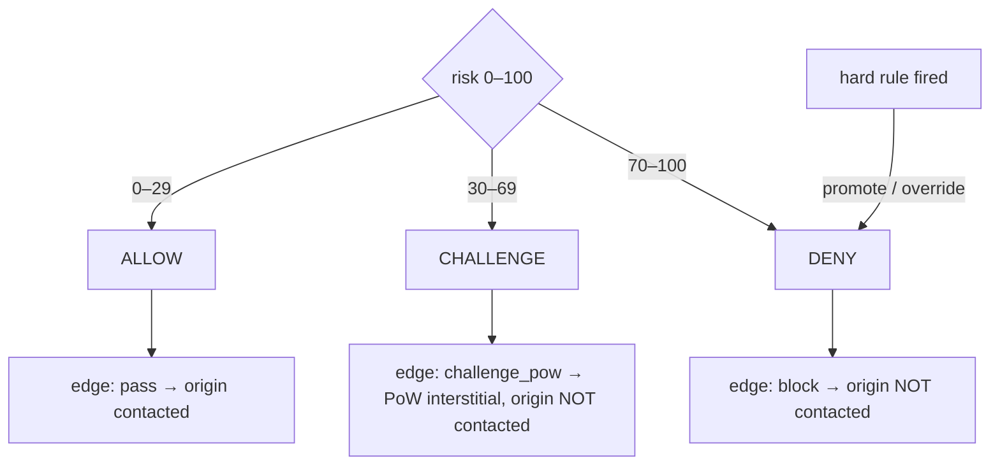

# Hard rules, verdicts and signal-ID reference

**Quadrant:** Reference (lookup tables). **Audience:** operators, integrators and evaluators reading a single verdict row and needing to know exactly what fired it and what happened next.

This page is a lookup reference for the values you see attached to a request in the Ledger and the audit log: the verdict, the edge action it produced, the hard rule (if any) that promoted it, and the drill-down signal IDs. It does not teach the model; for concepts, see [How Gate sees a request](../concepts/how-gate-sees-a-request.md). For where verdicts are enforced per route, see [CLI, Config & Per-Route Policy Reference](cli-config-policy.md).

humanymous Gate is a reference implementation, not a production-hardened build. Thresholds and rule set below reflect the reference build.

## Verdicts and edge actions

The engine emits one of three verdicts — ALLOW, CHALLENGE or DENY — derived from the 0–100 risk score and any hard rule that fired. The edge carries a fourth value, `none`, for a request with no evidence yet (Unknown). Each verdict maps to exactly one edge action.

| Verdict | Meaning | Risk band (score-based) | Edge action | Origin contacted? |
|---------|---------|-------------------------|-------------|-------------------|
| ALLOW | Not scored as automated; or a valid verdict trust token took the fast path | 0–29 | `pass` | Yes |
| CHALLENGE | Ambiguous; prove work before proceeding | 30–69 | `challenge_pow` (accessible proof-of-work interstitial served from the control plane) | No |
| DENY | Scored as automated, or a high-confidence hard rule fired | 70–100 | `block` | No |
| none | Unknown — no evidence captured yet | n/a | fail-open or fail-closed (see below) | Depends on the fail rule |

Thresholds (policy 1.0.0): risk `0–29` → ALLOW, `30–69` → CHALLENGE, `70–100` → DENY. ChallengeAt is 30, DenyAt is 70. The risk score is 0–100 with one decimal. Hard rules can promote or override the score-based verdict.

Formally, the verdict is the score band, unless a hard rule fires and forces DENY:

$$\text{verdict} = \begin{cases} \text{DENY} & \text{a hard rule fired, or } \text{risk} \ge 70 \\[2pt] \text{CHALLENGE} & 30 \le \text{risk} < 70 \\[2pt] \text{ALLOW} & \text{risk} < 30 \end{cases}$$




> **Note:** A fingerprint-bound verdict trust token, when present and valid, lets ALLOW take a fast path with no re-scoring — **except on an `attested` route.** There the attestation floor overrides the fast path: a valid verdict token does **not** fast-path; the request re-scores, and absent possession (a WebAuthn / Privacy Pass / Web Bot Auth trust-upgrade) or an `hmn_su` step-up proof, the ALLOW is priced to a CHALLENGE→Pass (never DENY). See the attestation-floor demotion rule below.

### The `none` (Unknown) fail rule

When the edge has to act on an Unknown verdict — no evidence has arrived yet — the direction depends on the route policy and the HTTP method:

- **Fail open (→ `pass`)** only for safe-method requests (GET / HEAD) on non-strict routes. This is a documented, accepted residual: a safe GET on a `balanced` route is allowed through while unknown, and is covered meanwhile by fingerprint/subnet rate metering.
- **Fail closed (→ `challenge`)** when the route is `strict` (failClosed or syncScore) **or** the HTTP method is unsafe (POST / PUT / PATCH / DELETE).

Every enforcement decision is written to the audit sink before it takes effect.

## The proof-of-work upgrade rule

A score-based CHALLENGE can be upgraded to ALLOW when the session has solved the proof-of-work challenge — the signal `l7.pow.solved` is present.

- The upgrade applies **only** to a CHALLENGE that came from the score (no hard rule fired).
- PoW **never** overrides a hard rule. Solving the work proves CPU effort, not humanity: if a hard rule promoted the verdict, `l7.pow.solved` does not clear it.

## The attestation-floor demotion rule (`attested` routes)

On a route the operator marked with the `attested` preset (`strict` plus the attestation floor, ceiling-guard #1), an ALLOW is not free — it is priced. Both ALLOW paths described above are affected:

- A **scoring-ALLOW** (risk < 30, no hard rule) and a **token-fast-path ALLOW** (a valid verdict trust token that would otherwise skip re-scoring) are **demoted to `challenge_pow`** unless the session presents possession — a WebAuthn / Privacy Pass / Web Bot Auth trust-upgrade (exempt, because the possession pre-gate forwards it first) — or a valid `hmn_su` step-up proof (minted on an LLM-resistant Pass solve, redeemed at `POST /__hmn/stepup`).
- The demotion is **CHALLENGE→Pass only, never DENY**: an unattested human solves the same Pass an anonymous visitor solves, so there is no categorical human block and no lockout. It does **not** detect or resolve a coherent spoof past the ceiling; it prices the ALLOW so unlimited free high-value passes become possession-or-a-per-session human solve.
- The floor applies only where it is armed. The preset is refused on a catch-all / public prefix, and without a wired credential verifier it degrades to a Pass-for-everyone friction wall.

## Hard rules

Hard rules can promote or override the score-based verdict. They fall in **two planes**, and knowing which is which prevents a common confusion:

- **Engine-plane hard rules (HR-1..HR-21)** are evaluated by the detection engine inside the score pipeline (`internal/scoring`). These are the rules the Detection Observatory shows in its hard-rule ladder, and the ones you see on a scored request.
- **Gate-plane hard rules (HR-22..HR-30)** are evaluated at the proxy edge (origin cloaking, request smuggling, token/beacon replay, upgrade tunnels, decision-probing). They never run in the detection engine and never appear in the Observatory's "HR-1 through HR-21" ladder — you only meet them on the running Gate proxy.

Each row lists what fires the rule, the action it drives, and its confidence class. The confidence class also tells you how to read a spike:

- **High-confidence (FP~0):** a spike means automated traffic matching that pattern is arriving. Reading a spike as "attack" is safe.
- **Heuristic (can catch some humans):** a spike may mean genuine humans are being mislabeled, not only automation. Investigate before treating it as attack volume.

### Engine-plane hard rules (HR-1..HR-21)

Evaluated by the detection engine; visualized in the Detection Observatory. Listed by number for lookup; the engine evaluates them in **first-match precedence order** (1, 2, 3, 4, 5, 6, 7, 8, 9, 13, 10, 16, 14, 18, 20, 19, 21, 15, 17, 12, 11), so — for example — HR-13 is checked before HR-10.

| Rule | What fires it | Action | Confidence | Reading a spike |
|------|---------------|--------|------------|-----------------|
| HR-1 | Hard automation artifact (Selenium / Puppeteer / Playwright) | DENY | High-confidence (FP~0) | Attack |
| HR-2 | UA claims a browser but TLS **and** HTTP/2 both resolve to a different engine | DENY | High-confidence | Attack |
| HR-3 | Synthetic (untrusted) events plus a webdriver/CDP tell | DENY | High-confidence | Attack |
| HR-4 | `webdriver` flag plus a patched native getter hiding it | DENY | High-confidence | Attack |
| HR-5 | RIT tamper / invalid HMAC together with a TLS engine mismatch | DENY | High-confidence | Attack |
| HR-6 | Runtime hooking / prototype pollution plus a webdriver/CDP tell | DENY | High-confidence | Attack |
| HR-7 | Headless browser plus a second automation indicator | DENY | High-confidence | Attack |
| HR-8 | Patched native getter in a chromeless / headless window (stealth tool) | DENY | High-confidence | Attack |
| HR-9 | A CDP leak together with any automation hint | DENY | High-confidence | Attack |
| HR-10 | No client-side (WASM/JS) signals at all | CHALLENGE | Heuristic — can catch some humans | May be mislabeling humans |
| HR-11 | A consistent browser from a datacenter ASN | CHALLENGE | Heuristic — can catch some humans | May be mislabeling humans |
| HR-12 | Zero interaction over the observation window | CHALLENGE | Heuristic — can catch some humans | May be mislabeling humans |
| HR-13 | A disabled Console API (Patchright) plus a chromeless / automation tell | DENY | High-confidence | Attack |
| HR-14 | The TLS fingerprint rotated within one session | DENY | High-confidence | Attack |
| HR-15 | Multi-axis rotation (UA changed together with TLS/IP rotation) | DENY | High-confidence | Attack |
| HR-16 | A RIT token that fails the body HMAC (request-body tamper) | DENY | High-confidence | Attack |
| HR-17 | A replayed or absent RIT token on an API call | CHALLENGE | Heuristic — can catch some humans | May be mislabeling humans |
| HR-18 | A browser UA that delivered zero client-side JS evidence (HTTP parrot) | DENY | High-confidence | Attack |
| HR-19 | One fingerprint across many subnets (residential-proxy rotation), or a proof-of-work solved implausibly fast | DENY | High-confidence | Attack |
| HR-20 | AI browser-agent signature (teleport click plus a second agent/CDP tell) | DENY | High-confidence | Attack |
| HR-21 | HTTP/2 DoS (Rapid Reset, CONTINUATION flood) | DENY | High-confidence | Attack |

> **Note:** These rows match the engine's own rule table (what the Observatory shows and what the engine did). For the exact predicate behind each rule (and how to author one), see [Inside the detection engine](../explanation/detection-engine-internals.md).

> **Where request-flood and credential-stuffing velocity are handled (not HR-21).** A request **flood** (`l5.abuse.flood`, a shared `ja4|subnet` bucket) is deliberately **not** a categorical HR-21 DENY — that would lock out a busy carrier-NAT (CGNAT) subnet on strangers' traffic. It instead contributes to a **score-based CHALLENGE** (a real flood is challenged and then rate-limited/banned by the escalating **ban ladder**). High **credential-stuffing / failed-auth velocity** is likewise a rate-limit / ban-ladder concern, not a scoring hard rule. HR-21 covers only the unambiguous HTTP/2 protocol DoS attacks.

### Gate-plane hard rules (HR-22..HR-30)

Evaluated at the proxy edge, **not** in the detection engine — these never appear in the Observatory.

| Rule | What fires it | Action | Confidence | Reading a spike |
|------|---------------|--------|------------|-----------------|
| HR-23 | HTTP request smuggling (CL+TE / duplicate CL / bad TE) | DENY | High-confidence | Attack |
| HR-24 | Direct origin hit bypassing Gate (origin cloaking) | 421 | High-confidence | Attack |
| HR-25 | Detection bundle injected but no beacon returned (script-strip) | CHALLENGE | Heuristic (a script-blocking user can trip it) | May be mislabeling humans |
| HR-26 | WebSocket / SSE upgrade with no prior fingerprint-bound verdict | DENY | High-confidence | Attack |
| HR-27b | Client forged a trust / internal forwarding header | DENY | High-confidence | Attack |
| HR-28 | Verdict token replayed from a different fingerprint, or forged | DENY | High-confidence | Attack |
| HR-29 | Replayed single-use proof (beacon / PoW nonce) | reject | High-confidence | Attack |
| HR-30 | Decision-probing sweep: many sessions from one fingerprint | DENY | High-confidence | Attack |

## Reading TopContributors drill-down signal IDs

When you open a session drill-down, the TopContributors panel lists the individual signals that pushed the risk score, each identified by a dotted signal ID. The namespace is:

```
l{n}.{group}.{item}
```

- `l{n}` — the detection layer that produced the signal (**layer tokens are uppercase L1–L7, but signal IDs are lowercase**, e.g. `l1.cdp.proxy_leak`). See the layer list in [How Gate sees a request](../concepts/how-gate-sees-a-request.md).
- `{group}` — the signal family within that layer; it drives de-duplication (two tells in one group are collapsed so they aren't double-counted).
- `{item}` — the specific signal.

Real examples from the reference build:

| Signal ID | Layer | Reads as |
|-----------|-------|----------|
| `l1.cdp.proxy_leak` | L1 Static Client | CDP proxy leak |
| `l1.navigator.webdriver` | L1 Static Client | `navigator.webdriver` flag |
| `l2.webgl.renderer` | L2 Fingerprint | WebGL renderer string |
| `l4.mouse.click_no_trajectory` | L4 Behavioral | Click with no mouse trajectory |
| `l4.agent.burst_silence` | L4 Behavioral | Agent burst/silence input cadence |
| `l5.h2dos.rapid_reset` | L5 Network/Protocol | HTTP/2 Rapid Reset pattern |
| `l5.correlation.proxy_rotation` | L5 Network/Protocol | Cross-session fingerprint correlation |
| `l5.rit.body_mismatch` | L5 Network/Protocol | Request-integrity-token body tamper |
| `l7.pow.solved` | L7 Scoring/Decision | Proof-of-work solved (drives the PoW upgrade above) |

> **Note:** The **L6 consistency layer** uses a separate `x.` namespace for its cross-checks — not an `l6.` prefix. The real cross-check IDs are `x.ua_vs_ja4` (UA vs TLS fingerprint), `x.ua_vs_h2` (UA vs HTTP/2 fingerprint), and `x.browser_no_js` (a browser UA that produced no client-side JS). HR-2 fires when **both** `x.ua_vs_ja4` and `x.ua_vs_h2` are inconsistent; HR-18 fires on `x.browser_no_js`.

## Related

- [CLI, Config & Per-Route Policy Reference](cli-config-policy.md) — how presets map verdicts to routes.
- [How Gate sees a request](../concepts/how-gate-sees-a-request.md) — the L1–L7 layers and glossary.
- [Incident Runbooks](../runbooks/incident-runbooks.md) — responding to a rule spike on call.
- [Will This Break My App?](../explanation/will-this-break-my-app.md) — fail-open behavior and rollout safety.
