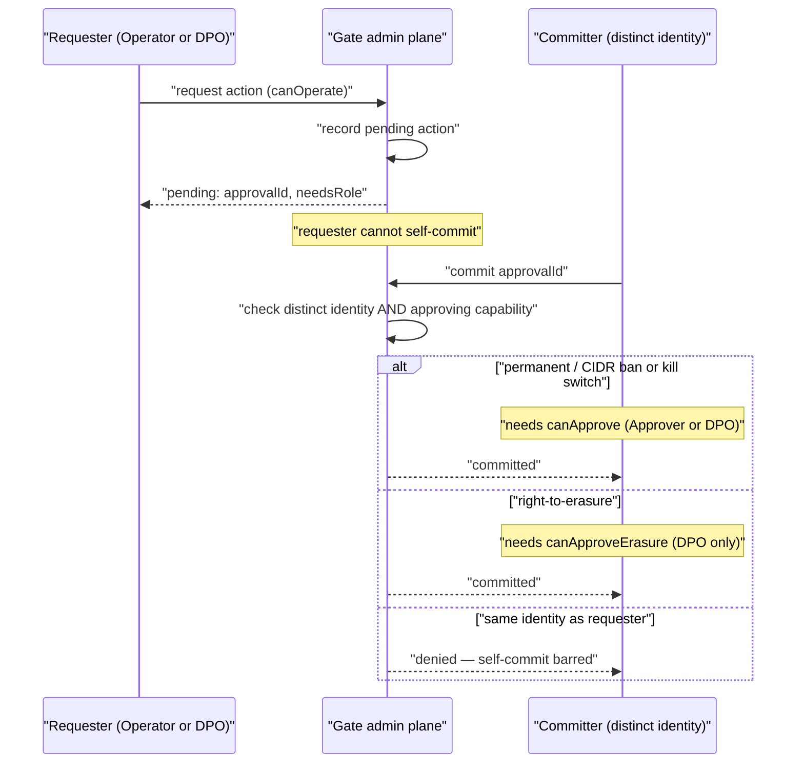

# RBAC, separation-of-duties and dual-control reference

**Diátaxis quadrant:** Reference. **Audience:** DPOs, security auditors, and IT-governance reviewers verifying who can do what on the admin plane of humanymous Gate.

This page is the authoritative lookup for the admin-plane access model in the reference build of humanymous Gate ("Gate" after first mention): the four roles, the capability each role carries, the exact capability-resolution rules, and which actions require a distinct second identity (dual-control). It is descriptive, not a walkthrough. For the admin API surface each capability maps onto, see the [CLI, config & per-route policy reference](./cli-config-policy.md). For the operational procedures these controls gate, see the [Kill-switch and bans runbook](../runbooks/kill-switch-and-bans.md) and the [Right-to-erasure (crypto-shred) runbook](../runbooks/erasure-crypto-shred.md).

> **Note:** This repository is a reference implementation, not a production-hardened build. The role model, capability rules, and dual-control constraints below are enforced by the reference binary; the transport authentication is dev bearer tokens (see [Authentication and trust boundary](#authentication-and-trust-boundary)), and mTLS/SSO admin authentication is a prod-delta not present in the reference.

Gate is the reverse-proxy enforcement layer. Its admin plane is served on a separate authenticated admin listener (`-admin-addr`, default `127.0.0.1:8445` (loopback)), cross-origin to the public edge. The public edge does not serve `/__hmn/admin/*` — it 404s that prefix.

---

## Roles and capabilities

The reference defines four roles (`internal/gate/adminauth.go`). Each role carries a fixed set of named capabilities. Capabilities are the primitives; roles are bundles of them.

| Role | `canRead` | `canOperate` | `canApprove` | `canApproveErasure` |
|----------|:---------:|:------------:|:------------:|:-------------------:|
| Auditor | yes | — | — | — |
| Operator | yes | yes | — | — |
| Approver | yes | — | yes | — |
| DPO | yes | yes | yes | yes |

- **Auditor** — read-only. Can read every admin view; cannot request, approve, or commit any action.
- **Operator** — read plus operate. Can request bans and erasure, lift bans, and cancel an erasure during its hold window.
- **Approver** — read plus approve. Can commit (approve) a pending ban or kill-switch action initiated by someone else.
- **DPO** — read, operate, approve, and approve-erasure. The only role that can commit a right-to-erasure.

### What each capability grants

| Capability | Grants |
|------------|--------|
| `canRead` | Read access to all admin GET views (bans, integrity, audit, incidents, policy, approvals, erasures, whoami). |
| `canOperate` | Request a ban or erasure, lift a ban, cancel an erasure during its hold window. |
| `canApprove` | Commit a pending dual-control action — a permanent/CIDR ban or the kill switch. |
| `canApproveErasure` | Commit a right-to-erasure. Held by the DPO role only. |

---

## Capability-resolution rules

The reference resolves each capability from the caller's role exactly as follows. These are the precise rules — do not infer capability from role name alone.

| Capability | Held by |
|------------|---------|
| `canRead` | Auditor **or** Operator **or** Approver **or** DPO (every role) |
| `canOperate` | Operator **or** DPO |
| `canApprove` | Approver **or** DPO |
| `canApproveErasure` | DPO **only** |

Consequences worth stating explicitly:

- A **DPO** is the only single role that holds `canOperate`, `canApprove`, and `canApproveErasure` at once. Even so, a DPO cannot self-commit a dual-control action — see [Dual-control](#dual-control-distinct-committer).
- An **Approver** holds `canApprove` but **not** `canApproveErasure`. A generic Approver therefore cannot commit an erasure.
- An **Operator** holds `canOperate` but neither `canApprove` nor `canApproveErasure`. An Operator can request but cannot commit any dual-control action.

---

## Dual-control (distinct committer)

Some actions require two distinct identities: one to request and a different one to commit. Dual-control means the committing identity must not be the requesting identity, and must hold the correct approving capability for that action class.

The two-principal flow — request, pending, distinct commit — resolves like this:

| Action | Requesting capability | Committing role (distinct identity) | Single- or dual-control |
|--------|-----------------------|-------------------------------------|-------------------------|
| Temporary ban (add) | `canOperate` (Operator or DPO) | — | Single-control |
| Ban lift | `canOperate` (Operator or DPO) | — | Single-control |
| Permanent / CIDR ban | `canOperate` (Operator or DPO) | distinct **Approver** (`canApprove`) | Dual-control |
| Kill switch (fleet-wide) | `canOperate` (Operator or DPO) | distinct **Approver** (`canApprove`) | Dual-control |
| Right-to-erasure (crypto-shred) | `canOperate` (Operator or DPO) | distinct **DPO** (`canApproveErasure`) | Dual-control |

Key constraints:

- **A generic Approver cannot commit an erasure.** Erasure commit requires `canApproveErasure`, which only the DPO role holds. An Approver approving a ban or the kill switch is not sufficient for an erasure.
- **The requester cannot approve their own action.** The committer must be a distinct identity, even when a single DPO would technically hold both the requesting and committing capabilities.
- **Temporary bans and ban lifts are single Operator actions** — no second identity is required. Bulk ban is temporary-only; permanent and CIDR bans are rejected from the bulk path and must go through the dual-control single-ban path.

> **Warning:** The kill switch is fleet-wide. When committed, it demotes hard-rule enforcement to monitor across every node at once — detection stops and traffic flows (manual bans still enforce). It is a dual-control action committed by a distinct Approver. See the [Kill-switch and bans runbook](../runbooks/kill-switch-and-bans.md).

> **Warning:** Cryptographic erasure (crypto-shred — destroying the per-subject linkage key) is irreversible once committed. It is DPO-gated and dual-control: the committer must be a distinct DPO. See the [Right-to-erasure (crypto-shred) runbook](../runbooks/erasure-crypto-shred.md).

---

## Authentication and trust boundary

The controls below back the role model. Each maps to a separation-of-duties (SoD) principle in the [next section](#how-each-control-maps-to-an-sod-principle).

- **Server-derived actor identity.** The acting identity is derived by the server from the presented token. Request-body actor fields are ignored — a caller cannot name themselves someone else in a request body.
- **Constant-time bearer compare.** Authentication is bearer (`Authorization: Bearer <token>`). Tokens are compared in constant time, so a comparison does not leak token bytes through timing.
- **Deny-by-default (404).** A missing or invalid token returns 404, not 401/403 — the admin surface is non-discoverable to an unauthenticated caller. `/__hmn/admin/*` is not served on the public edge at all.
- **Meta-audited access.** Every authenticated admin access is recorded to the audit log as `admin.access` **before** the request is served. Reads and actions alike are logged, so the audit trail shows who looked at what, not only who changed what.

> **Note:** The reference authenticates admin callers with dev bearer tokens (`HMN_ADMIN_TOKENS`, or random per-boot tokens printed at startup). Mutual-TLS or SSO admin authentication is a prod-delta and is not present in the reference build.

---

## How each control maps to an SoD principle

| Control | Separation-of-duties principle it satisfies |
|---------|---------------------------------------------|
| Four capability-scoped roles (Auditor / Operator / Approver / DPO) | **Least privilege** — a role carries only the capabilities its function needs; read-only Auditors cannot act. |
| `canApproveErasure` held by DPO only | **Segregation of a sensitive function** — the most consequential, irreversible action (crypto-shred) is confined to one accountable role. |
| Requester ≠ committer on permanent/CIDR bans, kill switch, erasure | **Two-person control** — no single identity can both initiate and commit a high-impact action. |
| Server-derived actor identity (body actor fields ignored) | **Non-repudiation / accountability** — the recorded actor cannot be spoofed by the caller. |
| Constant-time bearer compare | **Credential-handling hygiene** — authentication does not leak secret material through timing side channels. |
| Deny-by-default 404 on missing/invalid token | **Deny-by-default / non-discoverability** — the admin surface is closed unless a valid credential opens it. |
| `admin.access` meta-audit before serving | **Complete, tamper-evident audit trail** — every access, read or write, is attributable and logged before it takes effect. |

---

## Worked authorization outcomes

The table reads a few concrete request/role combinations against the rules above.

| Caller role | Action | Outcome | Why |
|-------------|--------|---------|-----|
| Auditor | Read `/__hmn/admin/audit` | Allowed | `canRead` held by every role. |
| Auditor | Request a temporary ban | Denied | Auditor lacks `canOperate`. |
| Operator | Request a permanent ban | Accepted as a request; not committed | Requires a distinct Approver to commit. |
| Operator | Commit their own permanent-ban request | Denied | Operator lacks `canApprove`, and self-commit is barred. |
| Approver | Commit an Operator's permanent-ban request | Committed | Distinct identity with `canApprove`. |
| Approver | Commit an erasure | Denied | Erasure commit requires `canApproveErasure` (DPO only). |
| DPO | Commit another identity's erasure request | Committed | Distinct DPO holds `canApproveErasure`. |
| DPO | Commit their own erasure request | Denied | Committer must be a distinct identity. |

---

## Related

- [CLI, config & per-route policy reference](./cli-config-policy.md) — the admin API endpoints, initiating roles, and dual-control columns each capability maps onto.
- [Kill-switch and bans runbook](../runbooks/kill-switch-and-bans.md) — the procedures for bans and the fleet-wide kill switch.
- [Right-to-erasure (crypto-shred) runbook](../runbooks/erasure-crypto-shred.md) — the DPO-gated, dual-control erasure procedure.
- [Hard rules, verdicts and signal-ID reference](./hard-rules-verdicts.md) — what the enforcement actions these roles govern actually do.