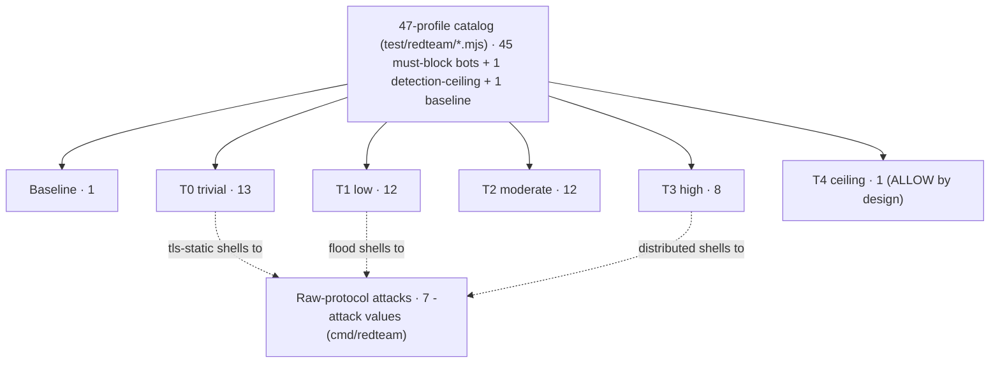

# Red-team catalog reference: profiles, raw-protocol attacks and verdict classification

**Quadrant:** Reference (lookup tables). **Audience:** Red-team developers needing the authoritative catalog map and the profile contract.

This page is the authoritative map of the Red catalog: the profile contract every `.mjs` file honours, the label rule that decides whether a sample counts as automated or as human baseline, the verdict-classification table the e2e runner applies, the 47-profile catalog (45 must-block bots + 1 detection-ceiling + 1 baseline), and the seven raw-protocol attacks the Go `cmd/redteam` client constructs. It is a lookup reference, not a build guide — to author a new profile, see [Write a Red profile](../how-to/write-a-red-profile.md); for how these pieces fit together, see [Red catalog architecture](../explanation/red-catalog-architecture.md).

> **Important:** This catalog is purely defensive, local-only and self-target-only. Everything here exercises **your own** detector's test catalog against your own loopback server; it teaches understanding and extending that catalog, never third-party evasion. Read the [Red-team rules of engagement](red-team-rules-of-engagement.md) before running anything — that page carries the guardrail these profiles operate under (loopback target hard-coded, no external hosts). Blocked traffic here is "automated" / "not verified as human". Every verdict named below is reference-measured on your machine, not a guarantee: T4-class adversaries (anti-detect plus real-human click-farms) remain a design boundary mitigated by rate and reputation, and the heuristic rules HR-11 / HR-12 / HR-17 can challenge some real humans.

## The profile contract

Every profile is an ES module under `test/redteam/` that exports three things. The shape is fixed because `test/e2e/runner.mjs` imports the module and reads exactly these fields.

| Export | Type | Meaning |
|--------|------|---------|
| `run(baseURL)` | `async function` returning `{verdict, riskScore, hardRuleFired, topContributors}` | Drives one attack against `baseURL` and returns **exactly what `POST /api/collect` returns** — the runner reads `verdict`, `riskScore`, `hardRuleFired`, and `topContributors[].id`. |
| `label` | `const string` | Classification label. Must start with `bot:` for an automated sample (see below). |
| `needsBrowser` | `const boolean` | `true` if the profile launches a real browser via `_driver.mjs`; `false` if it POSTs a spoofed report or shells a raw attack. |

The returned object is the `/api/collect` response verbatim: `verdict` is one of `ALLOW | CHALLENGE | DENY`, `riskScore` is 0–100, `hardRuleFired` is the winning hard-rule id or empty, and `topContributors` is the ranked `{id, score}` list. The runner records `topContributors.map(c => c.id)` into `results.json`.

Helper modules `_bin.mjs` (wraps the Go `cmd/redteam` binary) and `_driver.mjs` (launches the browser) export **no** `run()` and are **not** profiles.

### The `bot:` label rule

`classify()` decides whether a sample is automated or human baseline **solely from the label prefix**:

- A label starting with `bot:` is scored as automation.
- The **only** non-bot label is `human` (in `human.mjs`), the human baseline.

> **Warning:** Getting the label wrong silently flips a profile into the human baseline. A profile that forgets the `bot:` prefix is treated as a human sample: its DENY becomes a **false positive** and its ALLOW becomes a true negative, quietly corrupting the reported rates. There is no error — the mislabel just changes which column the sample lands in.

## Verdict classification

`classify(label, verdict)` in `runner.mjs` maps each result to one of TP / FN / FP / TN, plus the two detection-ceiling classes CEILING / CEIL-CAUGHT. This mirrors the source exactly:

```
const denied = verdict === 'DENY' || verdict === 'CHALLENGE';
if (label.startsWith('ceiling:')) return denied ? 'CEIL-CAUGHT' : 'CEILING';
if (label.startsWith('bot:')) return denied ? 'TP' : 'FN';
return verdict === 'DENY' ? 'FP' : 'TN';
```

| Sample kind | Verdict | Outcome |
|-------------|---------|---------|
| bot (`label` starts `bot:`) | CHALLENGE **or** DENY | TP (caught) |
| bot | ALLOW | FN (missed) |
| ceiling (`label` starts `ceiling:`) | ALLOW | CEILING (the honest detection ceiling — the expected result, not a miss) |
| ceiling | CHALLENGE **or** DENY | CEIL-CAUGHT (a bonus catch over the stated ceiling) |
| human (`label` = `human`) | DENY | FP (wrongly denied) |
| human | ALLOW **or** CHALLENGE | TN |

> **Note:** A `ceiling:` label is not a must-block bot. The single T4 `native_coherent_ceiling` profile is the documented detection ceiling: ALLOW is the honest expected result, priced via the attested / ceiling-guard mechanism (rate limiting plus cross-session reputation), not a bypass. A CHALLENGE or DENY on it is a bonus, not the pass condition.

> **Note:** A human **CHALLENGE is scored TN, not FP.** So `humanFPR` is a **DENY-only** metric — it under-reports human friction, because a human sent to a proof-of-work interstitial does not count against it. Inspect the challenge-rate on the baseline separately; do not read a clean `humanFPR` as "zero human friction".

## The 47-profile catalog

The catalog is **47 profiles = 45 must-block bots + 1 detection-ceiling + 1 baseline**. Rows are in `runner.mjs` `PROFILES` order. `Expected HR` is the hard rule the profile is designed to trip; where the ground-truth mapping does not pin a specific rule, the profile is still expected to score TP (CHALLENGE or DENY) but the exact rule is marked score-driven / for verification.

The catalog is organised as the **T0–T4 attacker cost-escalation ladder** defined in `test/e2e/tiers.mjs` — from the cheapest trivial script (T0) up to a funded real-engine adversary (T3) and the honest detection ceiling (T4). `assertCoverage()` in `runner.mjs` fails loudly if this catalog and the tier ladder drift. The raw-protocol attacks are a parallel axis three profiles shell into.



Node counts sum to the catalog total: 1 + 13 + 12 + 12 + 8 + 1 = 47.

### Baseline

The single must-not-block sample. A DENY here is a false positive.

| File | `label` | `needsBrowser` | Tell reproduced | Expected verdict / HR |
|------|---------|:--:|-----------------|-----------------------|
| `human.mjs` | `human` | true | Real browser drive (installed Edge / Playwright Firefox), genuine interaction | ALLOW (no hard rule) |

### T0 · trivial ($0, a script, no browser)

Non-browser HTTP/uTLS clients, header/token tricks, and the cheapest behaviour tells. Blue's expectation: reliable.

| File | `label` | `needsBrowser` | Tell reproduced | Expected verdict / HR |
|------|---------|:--:|-----------------|-----------------------|
| `nonbrowser_ua.mjs` | `bot:nonbrowser-ua` | false | Bare HTTP-library UA (`x.non_browser_ua`) | DENY / HR-10 |
| `http_client.mjs` | `bot:http-client` | false | Browser UA but zero client-side (WASM/JS) evidence — HTTP parrot | DENY / HR-18 |
| `tls_parrot.mjs` | `bot:tls-parrot` | false | uTLS Chrome ClientHello parrot; browser UA, no JS residual | DENY / HR-18 |
| `tls_static.mjs` | `bot:tls-static` | false | Static parrot: byte-identical ClientHello every connection, no extension permutation (`l5.traffic.tls_no_permutation`) | DENY / HR-14 |
| `sec_chua_absent.mjs` | `bot:sec-chua-absent` | false | Chrome UA without Sec-CH-UA (`x.uach_present`) | CHALLENGE/DENY (score-driven) |
| `sec_fetch_absent.mjs` | `bot:sec-fetch-absent` | false | Chrome UA without Sec-Fetch-* (`sec_fetch_missing`) | CHALLENGE/DENY (score-driven) |
| `rit_absent.mjs` | `bot:rit-absent` | false | API call with no RIT token | CHALLENGE / HR-17 |
| `rit_replay.mjs` | `bot:rit-replay` | false | RIT token replay — stale counter (`l5.rit.stale_replay`) | CHALLENGE / HR-17 |
| `rit_tamper.mjs` | `bot:rit-tamper` | false | RIT body tamper — HMAC over observed body fails (`l5.rit.header_tampered`) | DENY / HR-16 |
| `ua_rotate.mjs` | `bot:ua-rotate` | false | Mid-session User-Agent rotation (`l5.traffic.ua_rotation`) | CHALLENGE/DENY (score-driven; not a pinned hard rule) |
| `xff_spoof.mjs` | `bot:xff-spoof` | false | Forged private X-Forwarded-For (`l5.header.forwarded_private`) | CHALLENGE/DENY (score-driven) |
| `behavior_no_interaction.mjs` | `bot:no-interaction` | false | Zero interaction over the window | CHALLENGE / HR-12 |
| `behavior_untrusted.mjs` | `bot:untrusted-events` | false | `isTrusted=false` injected events (`l4.event.untrusted`) | CHALLENGE/DENY (score-driven) |

### T1 · low ($, off-the-shelf tools on defaults)

Naive automation frameworks, single-axis TLS/engine churn, and cheap resource/DoS abuse. Blue's expectation: reliable.

| File | `label` | `needsBrowser` | Tell reproduced | Expected verdict / HR |
|------|---------|:--:|-----------------|-----------------------|
| `selenium.mjs` | `bot:selenium` | true | `cdc_` artifacts + `webdriver` planted via `addInitScript` | DENY / HR-1 |
| `puppeteer.mjs` | `bot:puppeteer` | true | Headless token + webdriver | DENY / HR-7 |
| `playwright_plain.mjs` | `bot:playwright` | true | Headless + webdriver | DENY / HR-7 |
| `undetected.mjs` | `bot:undetected-chromedriver` | true | Headless, webdriver stripped | DENY / HR-7 |
| `direct_cdp.mjs` | `bot:direct-cdp` | true | Raw CDP driver (CDP leak) | DENY / HR-9 |
| `tls_rotate.mjs` | `bot:tls-rotate` | false | Mid-session TLS engine rotation (`l5.traffic.engine_rotation`) | DENY / HR-14 |
| `ja4_churn.mjs` | `bot:ja4-churn` | false | 3+ distinct JA4 fingerprints in one session | DENY / HR-14 |
| `grease_absent_js.mjs` | `bot:grease-absent-js` | false | No-GREASE Go TLS + JS (`grease_absent` + `x.ua_vs_ja4`) | CHALLENGE/DENY (score-driven) |
| `video_scrape.mjs` | `bot:video-scrape` | false | Media Range-storm on a heavy resource | DENY / HR-14 |
| `watermark_strip.mjs` | `bot:watermark-strip` | false | Resource leak + metadata strip (forensic trace) | DENY / `wm-traced` (forensic trace) |
| `flood.mjs` | `bot:flood` | false | Application-layer request flood (`l5.abuse.flood`) | DENY / HR-21 |
| `rapid_reset.mjs` | `bot:h2-rapid-reset` | false | HTTP/2 Rapid Reset DoS, CVE-2023-44487 (`l5.h2dos.rapid_reset`) | DENY / HR-21 |

### T2 · moderate ($$, stealth / rotation / fingerprint-spoof / humanizers)

Stealth-patched automation, multi-axis rotation, fingerprint-spoof contradictions, and mouse/keystroke humanizers. Blue's expectation: reliable.

| File | `label` | `needsBrowser` | Tell reproduced | Expected verdict / HR |
|------|---------|:--:|-----------------|-----------------------|
| `puppeteer_stealth.mjs` | `bot:puppeteer-stealth` | true | Patched native `toString` (L3 integrity) | DENY / HR-8 |
| `playwright_stealth.mjs` | `bot:playwright-stealth` | true | Patched natives (L3) | DENY / HR-8 |
| `patchright.mjs` | `bot:patchright` | true | Console API disabled (`l3.guard.console_disabled`) | DENY / HR-9 |
| `multi_axis_rotate.mjs` | `bot:multi-axis-rotate` | false | UA + TLS rotate together | DENY / HR-14 or HR-15 |
| `adv_webgpu_mismatch.mjs` | `bot:webgpu-mismatch` | false | WebGL vs WebGPU vendor contradiction (`l2.adv.webgpu_mismatch`) | CHALLENGE/DENY (score-driven) |
| `headless_ua_token.mjs` | `bot:headless-ua-token` | false | HeadlessChrome UA token + a second tell | CHALLENGE/DENY (score-driven) |
| `signal_forgery.mjs` | `bot:signal-forgery` | false | Forged `l7.pass.solved` / `l7.pow.solved` — stripped, no ALLOW (round-3 provenance) | CHALLENGE |
| `behavior_machine_keystroke.mjs` | `bot:machine-keystroke` | false | Sub-25ms machine typing (`l4.key.machine_speed`) | CHALLENGE/DENY (score-driven) |
| `behavior_teleport_click.mjs` | `bot:teleport-click` | false | Clicks with no approach trajectory (`l4.mouse.click_no_trajectory`) | CHALLENGE/DENY (score-driven) |
| `behavior_bezier_mouse.mjs` | `bot:bezier-mouse` | false | Pathologically smooth ghost-cursor path (`l4.mouse.*`) | CHALLENGE/DENY (score-driven) |
| `behavior_fixed_typing.mjs` | `bot:fixed-typing` | false | Fixed-interval typing, near-zero variance (`l4.key.*`) | CHALLENGE/DENY (score-driven) |
| `ai_burst_silence.mjs` | `bot:ai-burst-silence` | false | LLM inference-loop cadence (`l4.agent.burst_silence`) | CHALLENGE/DENY (score-driven) |

### T3 · high ($$$, real engine + AI + proxy infrastructure)

Real-engine anti-detect (nodriver / camoufox / xvfb / anti-detect), full AI-agent cadence, and residential-proxy-rotation correlation. Blue's expectation: degrades gracefully — scores and challenges or denies at lower confidence.

| File | `label` | `needsBrowser` | Tell reproduced | Expected verdict / HR |
|------|---------|:--:|-----------------|-----------------------|
| `nodriver.mjs` | `bot:nodriver` | true | Headful frontier — behaviour only, no display tells | CHALLENGE / HR-12 |
| `xvfb_headful.mjs` | `bot:xvfb-headful` | true | Headful, no display tells — behaviour | CHALLENGE / HR-12 |
| `antidetect.mjs` | `bot:anti-detect-browser` | true | Coherent spoof + behaviour | CHALLENGE / HR-12 |
| `camoufox.mjs` | `bot:camoufox` | true | Firefox fork (Playwright Firefox stand-in) | CHALLENGE / HR-12 |
| `ai_agent.mjs` | `bot:ai-agent` | true | LLM browser-agent cadence — teleport click, no trajectory | DENY / HR-20 |
| `ai_full_cadence.mjs` | `bot:ai-full-cadence` | false | Teleport + burst-silence + machine keystroke fused | DENY / HR-20 |
| `distributed.mjs` | `bot:distributed-proxy` | false | Rotating residential-proxy pool — one fingerprint across many subnets (`l5.correlation.proxy_rotation`) | DENY / HR-19 |
| `privacy_evasion.mjs` | `bot:privacy-evasion` | false | Proxy-rotation + forged adBlock/GPC — still HR-19 (round-5) | DENY / HR-19 |

### T4 · very high — the detection ceiling

A fully coherent BotBrowser-class engine spoof (or genuine human behaviour on a real engine): **not separable by detection alone**. Blue's honest expectation: NOT solved. The coherent case scores ALLOW; it is priced only by rate limiting and cross-session reputation (the attested / ceiling-guard mechanism), not caught by a signal. This single profile carries the `ceiling:` label, so its ALLOW is the expected honest result, not a false negative.

| File | `label` | `needsBrowser` | Tell reproduced | Expected verdict / HR |
|------|---------|:--:|-----------------|-----------------------|
| `native_coherent_ceiling.mjs` | `ceiling:native-coherent` | false | Fully-coherent Chrome-TLS engine spoof | **ALLOW by design** — the documented detection ceiling, priced via the attested / ceiling-guard mechanism, not a bypass |

> **Note:** The expected verdict and hard rule in these tables are reference-measured from the bundled catalog run against the local engine; run [self-validation](../how-to/self-validation-red-team.md) to reproduce them for your build. A hard rule fires on a specific tell (for example HR-7 on a headless browser that also exposes `webdriver`), so it is stable across environments; the exact risk score is not, and a profile whose tell is score-driven rather than rule-driven can land on a different hard rule if signal availability changes.

## Raw-protocol attacks (`cmd/redteam`)

The Go `cmd/redteam` client drives evasions a browser cannot: it controls the TLS ClientHello (via uTLS) and RIT tokens precisely, and it spoofs the client-hint / `sec-fetch` headers a real Chrome sends so the L6 header cross-checks stay quiet — isolating the one bypass under test. It exposes **seven** real `-attack` values.

> **Note:** These seven are the values the `-attack` switch in `cmd/redteam/main.go` implements. (HTTP/2 Rapid Reset is exercised by the `rapid_reset` node profile, not this binary.)

| `-attack` | What it constructs | Signal targeted | Hard rule |
|-----------|--------------------|-----------------|-----------|
| `flood` | 90 rapid `POST /api/collect` requests from one TLS fingerprint, each carrying JS-execution evidence (so the flood signal, not `browser_no_js`, is the clean catch) | `l5.abuse.flood` | HR-21 |
| `distributed` | One fixed device fingerprint across four different exit IPs (`X-Forwarded-For`); each session looks legit in isolation | `l5.correlation.proxy_rotation` | HR-19 |
| `tls-static` | Four cookied requests in one session, all with a byte-identical `HelloChrome_100` ClientHello (a pre-110 fingerprint that does not permute extension order) | `l5.traffic.tls_no_permutation` | HR-14 |
| `tls-rotate` | Two cookied requests in one session with different TLS stacks (Chrome then Firefox) | `l5.traffic.engine_rotation` | HR-14 |
| `ua-rotate` | Two cookied requests with different User-Agents, same TLS | `l5.traffic.ua_rotation` | — (score-based; not a pinned hard rule) |
| `rit-replay` | One valid signed request advances the counter, then replays the **same** token/counter (stale) | `l5.rit.stale_replay` | HR-17 |
| `rit-tamper` | Signs one body, then sends a **different** body with that token — the HMAC over the observed body fails | `l5.rit.header_tampered` | HR-16 |

The `-host` flag defaults to `127.0.0.1:8443`. That default is **advisory, not enforced** — the CLI connects to whatever `host:port` is passed, so keeping it loopback is the operator's responsibility. (Contrast the Detection Observatory launcher, which is structurally locked to loopback.)

### Two entry points for the same attack

Three attacks exist **both** as a `-attack` value **and** as a `.mjs` profile that shells to the Go binary via `_bin.mjs`: `flood`, `distributed`, and `tls-static`. Running the profile and running the raw `-attack` exercise the same underlying attack; the profile wrapper is what lets the e2e runner and the Observatory catalog reach it.

## Where verdict detail comes from

The full per-layer trace is not in every output. Sources, from least to most detail:

- **`node test/redteam/run-one.mjs <profile> https://127.0.0.1:8443` stdout** — intentionally minimal: `{label, verdict, riskScore, hardRuleFired}`. It **drops** `topContributors`.
- **`POST /api/collect` JSON** — the full `{verdict, riskScore, hardRuleFired, topContributors}` returned to every profile's `run()`.
- **`test/e2e/results.json`** — the runner's record per run, including the `top` contributor id list.
- **`GET /playground/explain/{id}`** (Detection Observatory) — the complete `ScoreTrace` for a stored session: per-signal contributions, dedup keep/drop, per-layer cap, and the ordered hard-rule evaluation. See [Run the Detection Observatory](../how-to/detection-observatory.md).

## Related pages

- [Hard rules, verdicts and signal-ID reference](hard-rules-verdicts.md) — the HR-1..HR-21 table and verdict bands.
- [Red catalog architecture](../explanation/red-catalog-architecture.md) — how profiles, helpers, the runner and the Go client fit together.
- [Write a Red profile](../how-to/write-a-red-profile.md) — authoring guide, including the three registration points.
- [Self-validation Red-team run](../how-to/self-validation-red-team.md) — running the suite and reading the rates.
- [Run the Detection Observatory](../how-to/detection-observatory.md) — the live feed and the score trace.
- [Red-team rules of engagement](red-team-rules-of-engagement.md) — the guardrail these attacks operate under.