# Right-to-erasure (crypto-shred) operations runbook

**Diátaxis quadrant:** Runbook (operational procedure).
**Audience:** DPO and compliance operator executing a GDPR Art. 17 / PIPA erasure request against a humanymous Gate deployment.

This runbook is written against the reference implementation. Endpoints, defaults, and role gates match the reference build; a production deployment may add controls (prod-delta) but must not remove the ones described here.

---

## What erasure means here

humanymous Gate does not store raw identifiers. Every subject identifier that appears in the audit log — IP, JA4, HTTP/2 fingerprint, UA, SNI, device fingerprint — is written only as a per-subject-key-derived pseudonym (64-hex, scrypt KDF-stretched). The data is therefore pseudonymous, not anonymous (GDPR Recital 26). See [How Gate sees a request](../concepts/how-gate-sees-a-request.md) for the pseudonymization model.

**Cryptographic erasure (crypto-shred)** is the erasure mechanism: rather than deleting audit records, Gate destroys the per-subject linkage key that binds a subject's pseudonyms to the identifiers they were derived from. Once the key is gone, the pseudonyms in the chain can no longer be resolved back to the subject, while the records themselves remain in place and cryptographically verifiable.

> **Warning:** Crypto-shred is irreversible. Destroying the per-subject linkage key cannot be undone, and there is no recovery path once the shred commits. Confirm subject identity and the mapped pseudonym before you request erasure, and use the hold window (step 3) as your last checkpoint.

This procedure is DPO-gated and dual-control. A single actor cannot shred a subject's key alone.

The five steps as a state machine — note the cancellable hold window that stands between commit and the irreversible shred:

```mermaid
stateDiagram-v2
  [*] --> Intake: map subject to console pseudonym
  Intake --> Pending: Operator or DPO requests erasure
  Pending --> Scheduled: distinct DPO commits
  Scheduled --> Cancelled: Operator or DPO cancels within hold window
  Scheduled --> Shredded: hold window (default 5 min) elapses
  Cancelled --> [*]
  Shredded --> Certificate: signed erasure certificate sealed
  Certificate --> [*]
  note right of Shredded: linkage key destroyed (irreversible); audit chain stays intact and verifiable
```




---

## Preconditions

- You can reach the Ledger on the admin listener at `https://localhost:8445/__hmn/admin/console` (Compliance/Erasure view), or you can call the admin API base `/__hmn/admin/` directly.
- You hold a bearer token whose server-derived role can act. **Requesting** erasure needs the **Operator** or **DPO** role; **committing** it requires the **DPO** role specifically. Actor identity is derived from the token; request-body actor fields are ignored.
- The requester and the committing DPO are **distinct** identities. Dual-control rejects a self-approval.

> **Important:** Only the **DPO** role can commit (approve) an erasure — a generic Approver cannot. Because the committer must be a distinct DPO, an erasure needs either two DPO identities, or an Operator requester plus a distinct DPO committer.
- Admin API calls carry `Authorization: Bearer <token>`. A missing or invalid token returns `404` (deny-by-default). Every authenticated access is meta-audited before it is served.

---

## Step 1 — Intake the request and map the subject

1. Record the incoming Art. 17 / PIPA request: data subject, legal basis, date received, and the identifier the subject supplied (for example an IP, a session, or an incident handle they were given).
2. In the Compliance/Erasure console view, resolve that identifier to the subject's **console-visible pseudonym** — the 64-hex per-subject value that keys the linkage. This pseudonym, not any raw identifier, is what the erasure request targets.
3. Confirm the mapping before proceeding. The shred acts on the linkage key behind this pseudonym; an incorrect mapping erases the wrong subject and cannot be reversed.

You supply the **console-visible session pseudonym** as the `Subject`. Gate resolves that pseudonym to the internal subject id through its audited reverse index automatically — the shred itself does not require a separate re-identification-vault step. (Resolving a pseudonym back to a *raw* identifier, by contrast, is what needs the vault + dual-control; erasure does not, because it operates on the linkage key, not the raw value.)

---

## Step 2 — Request erasure (Operator or DPO)

An Operator or a DPO submits the erasure request. This creates a **pending** action; nothing is destroyed at this point.

Console: in the Compliance/Erasure view, submit the erasure request against the mapped pseudonym.

API:

```
curl -X POST https://localhost:8445/__hmn/admin/erasure \
  -H "Authorization: Bearer <operator-or-dpo-token>" \
  -H "Content-Type: application/json" \
  --data '<erasure-request-body>'
```

The response identifies the pending erasure by an `<id>` used in steps 3 and 2b (commit).

The request body is `{"Subject":"<console pseudonym>","LegalBasis":"GDPR Art.17"}` — both fields are required (the call returns `400` otherwise). The response is `{"pending":true,"approvalId":"<id>","needsRole":"dpo"}`; the `approvalId` is the `<id>` used to commit (step 2b) or cancel (step 3).

### Step 2b — Commit via a distinct DPO

Erasure is dual-control, and its committer must hold the **DPO** role. A **distinct** DPO (an identity that is not the requester) commits the pending action:

```
curl -X POST https://localhost:8445/__hmn/admin/approvals/<id> \
  -H "Authorization: Bearer <distinct-dpo-token>"
```

The commit does not shred immediately. It starts the hold window described in step 3.

---

## Step 3 — The cancellable hold window

A cancellable hold window (default **5 minutes**) precedes the actual shred. During this window the committed erasure is scheduled but not yet executed.

- To abort, cancel the scheduled erasure:

```
curl -X POST https://localhost:8445/__hmn/admin/erasures/<id>/cancel \
  -H "Authorization: Bearer <token>"
```

Cancelling is an operate-level action: an **Operator** or a **DPO** token may cancel a scheduled erasure during its hold window.

- If the window is not cancelled, the shred auto-executes. A 10-second ticker runs due shreds; the key is destroyed on the first tick after the hold window elapses.

Use this window as the final checkpoint before an irreversible action. After it elapses and the shred executes, there is no cancel.

---

## Step 4 — Execution: destruction of the linkage key

Execution destroys the **per-subject linkage key**. From that point, the subject's pseudonyms in the audit log can no longer be resolved to the identifiers they were derived from.

> **Warning:** This is irreversible. The linkage key is destroyed and cannot be regenerated or recovered. What remains is unresolvable pseudonymous data, by design.

**The audit log stays intact and verifiable.** Records are **not** deleted. The append-only hash chain and the Merkle anchors (Signed Tree Heads) remain complete and continue to verify. This is deliberate: keeping the records — with only the linkage key destroyed — is what lets the audit log remain independently verifiable after an erasure, so an offline verifier can still confirm the chain has not been rewritten around the erased subject.

---

## Step 5 — The signed erasure certificate

On commit, Gate seals a **signed erasure certificate** recording that the shred occurred.

1. Retrieve the certificate for the completed erasure and archive it as defensible proof that the Art. 17 / PIPA obligation was discharged.
2. Send the data subject a confirmation that their erasure request has been fulfilled, accompanied by the certificate (or a certificate reference), and stating what was erased in plain terms: the key that links their pseudonymized records to their identifiers has been destroyed; the tamper-evident audit records remain, but can no longer be resolved to them.
3. Retain the certificate under your compliance retention schedule as evidence of completion.

> **Note:** In the reference build there is no admin endpoint that returns the sealed erasure certificate. `GET /__hmn/admin/erasures` lists scheduled shreds within their hold window (`id`, `legalBasis`, `requester`, `approver`, `executesInSec`); the certificate is sealed internally on commit. Exposing the certificate for retrieval/export is a production responsibility (prod-delta).

---

## What this proves, and the residual

- **Proves:** The per-subject linkage key was destroyed under DPO gating and dual-control, timestamped and sealed in a signed certificate, without altering or deleting the underlying audit records. The chain and Merkle anchors remain verifiable.
- **Residual — pseudonymous, not anonymous:** Erasure removes the resolution key, not the records. Low-entropy identifiers behind a pseudonym could in principle be re-derived **only if a key leaks** — that is, re-identification requires the vault key material, which crypto-shred is precisely what destroys for the erased subject. Describe the outcome to auditors as pseudonymized data rendered unresolvable, not as anonymized or deleted data.
- **Independent verification:** The audit chain still verifies after erasure. See the [Verify the audit log](../how-to/verify-audit-log.md) guide.

For independent verification, see the [Verify the audit log](../how-to/verify-audit-log.md) guide.

---

## Related

- [How Gate sees a request](../concepts/how-gate-sees-a-request.md) — audit log, hash chain / Merkle anchors, and pseudonymization model.
- [Incident runbooks](incident-runbooks.md) — on-call procedures.
- [Start here: Compliance / DPO](../start-here/compliance-dpo.md) — role and access setup.
- [Verify the audit log](../how-to/verify-audit-log.md) — independent verification of the tamper-evident chain.
