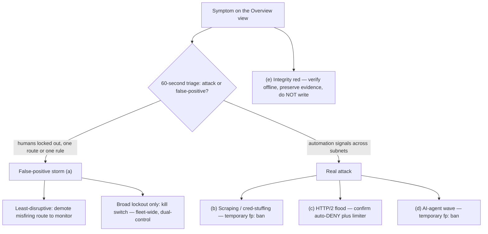
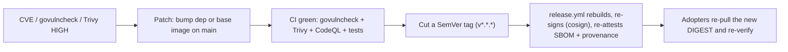

> **Runbook** — operational procedures for SOC on-call responders.
> **Audience:** on-call SOC / incident responders operating a running humanymous Gate deployment. Not an intro; if you have never seen the Ledger, read [How Gate sees a request](../concepts/how-gate-sees-a-request.md) first.

# Incident runbooks: humanymous Gate on-call

This page is symptom-indexed. Find the symptom you are seeing, run the 60-second triage, follow the decision tree, take the exact action, and know your rollback before you commit it.

The triage fork every section shares — is this a false positive to relieve, or an attack to hold?




humanymous Gate is a reverse-proxy enforcement layer that scores every request across layers L1–L7, applies hard rules, and enforces a verdict (ALLOW / CHALLENGE / DENY) at the edge. This is a reference implementation, not a production-hardened build; your deployment's paging rotation and thresholds may differ.

## Before you start: the tools you will use

You drive every action below from the **Ledger** or its admin API.

- Console: `https://localhost:8445/__hmn/admin/console` (served on the separate admin listener, not the public edge).
- API base: `/__hmn/admin/` on the admin listener. Bearer auth on every call. A missing or invalid token returns `404`, not `401` — that is deny-by-default, not a bug.
- In dev the console carries the **Operator** token, so it can read and request actions. Any two-person action must be committed by a **distinct Approver** token — the requester cannot approve their own action.

Read-only triage endpoints you will lean on:

```
curl -sk "https://localhost:8445/__hmn/admin/audit?verdict=deny" -H "Authorization: Bearer <operator-token>"
```

The `/audit` endpoint accepts `?verdict=&host=&route=&rule=&minRisk=&before=` and returns a `nextBefore` cursor for paging. Other reads: `/bans`, `/integrity`, `/incidents/<handle>`, `/policy`, `/approvals`, `/whoami`.

> **Note:** Actor identity is derived server-side from your token. You cannot act as someone else by editing a request body; those fields are ignored. Every authenticated admin access is itself meta-audited before it is served.

### The dual-control actions (memorize these)

Three action classes require a **distinct Approver** (second person, different token from the requester):

1. **Kill switch** (fleet-wide).
2. **Permanent or CIDR bans**.
3. **Ban lift / unblock** of a dual-control ban, and **erasure**.

The flow is always the same:

1. **Request** the action as Operator — it lands as `PENDING`.
2. **Locate** the pending id: `GET /__hmn/admin/approvals`.
3. **Commit** it as a distinct Approver: `POST /__hmn/admin/approvals/<id>`.

> **Note:** Request/response shapes — `POST /bans` takes `{"Key","Reason","Incident","DurationSec"}`; `/bans/bulk` takes `{"Keys":[…],"Reason","DurationSec"}` (temporary only); `/bans/lift` takes a **`?key=<ban-key>` query parameter, not a body**; `/killswitch` takes `{"On":true}`. Full shapes: [CLI, config & policy reference](../reference/cli-config-policy.md#request--response-shapes).

---

## (a) DENY rate jumped and real users are locked out

Suspected **false-positive storm**: a spike in DENY verdicts that is hitting verified humans, not automation.

### Trigger signal

- The Overview view ("live edge decisions") shows DENY climbing sharply.
- Support/appeal volume rises; users report a block page with an incident handle.

### 60-second triage — attack or false-positive?

1. **Filter** the audit log to the deny spike.

```
curl -sk "https://localhost:8445/__hmn/admin/audit?verdict=deny&minRisk=70" -H "Authorization: Bearer <operator-token>"
```

2. **Read** the TopContributors on the drilled-down sessions. Real automation clusters on high-confidence signals (`l1.navigator.webdriver`, `l1.cdp.proxy_leak`, `x.ua_vs_ja4`). A false-positive storm clusters on a single route or a single heuristic rule (for example HR-12, no-interaction → CHALLENGE) firing on ordinary traffic.
3. **Check** whether the denies concentrate on one route (`?route=`) or one rule (`?rule=`). One route + one rule + diverse, plausible fingerprints = misfire. Many rules + automation signals across subnets = real attack.

### Decision tree

- **Denies are correct automation** → this is not your incident; go to (b), (c), or (d).
- **One route is misfiring** on otherwise-human traffic → demote that route to monitor (below). Least-disruptive.
- **Misfire is broad / cross-route and users are locked out fleet-wide** → consider the **kill switch**. Fleet-wide and dual-control; read the warning first.

### Action — demote the misfiring route to monitor

Demoting a route to `monitor` keeps scoring and logging but enforces nothing on that route, so blocked humans flow through while you investigate.

> **Note:** the reference admin API has no per-route policy-write endpoint. `GET /__hmn/admin/policy` is read-only, and the only enforcement mutators are `POST /__hmn/admin/killswitch` (fleet-wide, dual-control — demotes all hard-rule enforcement to monitor) and manual bans. There is no hot per-route demotion: to move a single route to `monitor`/`off` you edit the `-routes` route-table file for that prefix and restart the node. `-monitor` is global-only and likewise requires a restart. If a single route cannot contain the storm, use the global kill switch below.

- **Consequence:** the demoted route stops enforcing — automation on that route is scored and logged but passes to origin.
- **Rollback:** restore the route's prior preset (`balanced` or `strict`) once the misfiring rule is tuned.

### Action — kill switch (broad lockout only)

> **Warning:** The kill switch is **fleet-wide** and **dual-control**. It demotes hard-rule enforcement to monitor across every node — detection continues to score and log, but hard-rule DENY/CHALLENGE stops taking effect and traffic flows to origin. Manual bans still enforce under the kill switch. Use it only when a false-positive storm is locking out real users faster than you can tune, and you accept that automation flows freely while it is on.

1. **Request** the flip as Operator: `POST /__hmn/admin/killswitch`.
2. **Have a distinct Approver commit it**: `GET /__hmn/admin/approvals` → `POST /__hmn/admin/approvals/<id>`.

- **Consequence:** hard-rule enforcement is off fleet-wide. The origin is exposed to automation that hard rules would otherwise DENY.
- **Rollback:** flip the kill switch back off — this is **also dual-control** and needs a **distinct Approver**. Do it the moment the misfiring rule is tuned or the route is demoted.

### Who to page

- **Page the Operator on-call** to tune/demote the route.
- **Page a distinct Approver** immediately if a kill switch or a dual-control unblock is on the table — you cannot proceed without one.

---

## (b) Scraping / credential-stuffing surge

High-volume automated access, often behind rotating residential proxies.

### Trigger signal

- Sustained DENY/CHALLENGE on login/checkout routes.
- Auto-ban ladder is climbing; `HR-19` (one stable fingerprint across many subnets) or `HR-30` (many sessions from one fingerprint) appears in the audit filter.

### 60-second triage — attack or false-positive?

1. **Filter** for the rotation signature.

```
curl -sk "https://localhost:8445/__hmn/admin/audit?rule=HR-19" -H "Authorization: Bearer <operator-token>"
```

2. **Look** at the ban keys in `GET /__hmn/admin/bans`. If one `fp:<fingerprint>` recurs across many distinct IPs/subnets, this is residential-proxy rotation — the fingerprint is stable, the IP is not.
3. **Confirm** it is not a shared-egress false positive (a corporate NAT or mobile carrier can put many real humans behind few IPs). Rotation shows one fingerprint across many subnets; shared egress shows many fingerprints behind one IP.

### Decision tree

- **One fingerprint, many subnets (`HR-19`)** → ban on the **`fp:` key, not `ip:`**. An IP ban chases a moving target; the fingerprint is the stable handle.
- **Many fingerprints behind one hostile IP/range** → an `ip:` ban is appropriate; a CIDR ban is dual-control.
- **Many real humans behind one IP** → do **not** IP-ban. Prefer fingerprint-scoped action or let rate metering absorb it.

### Action — fingerprint ban with the escalating ladder

Auto-bans escalate on repeat strikes: **1h → 6h → 24h → permanent**, with strike decay for good behavior. Let the ladder do the work; you place manual bans only to get ahead of it.

- **Temporary `fp:` ban** (1h/6h/24h): `POST /__hmn/admin/bans`. Single-person Operator action; reversible when it expires.
- **Bulk temporary bans**: `POST /__hmn/admin/bans/bulk`. Temporary-only by design — permanent and CIDR keys are **rejected** from bulk.

> **Warning:** A **permanent** or **CIDR** ban is **dual-control**. Request it as Operator, then have a **distinct Approver** commit via `POST /__hmn/admin/approvals/<id>`.
> - **Consequence:** the key is denied indefinitely (permanent) or an entire range is denied (CIDR) — high blast radius, real risk of catching humans behind shared egress.
> - **Rollback:** `POST /__hmn/admin/bans/lift`. Lifting a dual-control ban is **also dual-control** — needs a **distinct Approver**.

### Who to page

- **Page the Operator on-call** to place fingerprint bans and watch the ladder.
- **Page a distinct Approver** for any permanent/CIDR ban or any lift.

---

## (c) HTTP/2 flood / destructive abuse (HR-21)

Protocol-level flooding or a destructive request pattern.

### Trigger signal

- `HR-21` (destructive flood / HTTP/2 DoS / rate-limit ban → DENY) fires.
- Signals `l5.h2dos.rapid_reset` and related appear in TopContributors.
- Control-plane flood limiter is returning `429` before scoring (default window 10s, soft 60, hard 120 per IP).

### 60-second triage — attack or false-positive?

1. **Filter** for the rule.

```
curl -sk "https://localhost:8445/__hmn/admin/audit?rule=HR-21" -H "Authorization: Bearer <operator-token>"
```

2. **Confirm** it is protocol abuse, not a load spike: `HR-21` keys on frame-level patterns (rapid reset) and rate-limit ceilings, not on content. A legitimate traffic surge raises request counts but does not produce reset-flood frame signatures.

### Decision tree

- **`HR-21` firing + rate limiter shedding at `429`** → enforcement is already active; DENY is automatic and the origin is never contacted. Your job is containment and escalation, not first-line blocking.
- **Repeat offender by fingerprint or IP** → place a ban (fingerprint for a rotating source, IP/CIDR for a fixed source) to move it up the ladder faster.
- **Rate ceilings are too low and catching real bursts** → the flood limiter thresholds (`RateWindow` / `RateSoft` / `RateHard`) are configuration, not a hot admin toggle; retuning them is a config/restart change — escalate, do not guess.

### Action

- **Ban the source** with the ladder as in (b): temporary `fp:`/`ip:` ban via `POST /__hmn/admin/bans`; permanent/CIDR is **dual-control** with a **distinct Approver**, rollback via `POST /__hmn/admin/bans/lift` (also dual-control).
- **Do not** reach for the kill switch here — it demotes hard-rule enforcement fleet-wide and would remove exactly the `HR-21` DENY that is protecting the origin.

### Who to page

- **Page the Operator on-call** for bans.
- **Page the infrastructure/network on-call** if the flood is saturating the edge below the application layer — Gate sheds at the control plane, but upstream capacity is outside its control.

> **TODO(verify):** the concrete escalation contact / rotation for HTTP/2 DoS saturation (deployment-specific; not in the brief).

---

## (d) AI-agent wave (HR-20)

A surge of AI browser-agents driving real browser engines.

### Trigger signal

- `HR-20` (AI browser-agent signature: teleport click + LLM cadence → DENY) fires across many sessions.
- Signals `l4.agent.burst_silence` and `l4.mouse.click_no_trajectory` dominate TopContributors.

### 60-second triage — attack or false-positive?

1. **Filter** for the rule.

```
curl -sk "https://localhost:8445/__hmn/admin/audit?rule=HR-20" -H "Authorization: Bearer <operator-token>"
```

2. **Inspect** the behavioral evidence. `HR-20` keys on teleport clicks (no cursor trajectory) plus LLM-paced cadence. These are behavioral tells on real engines (attacker tier T3), so confidence is lower than for hardware artifacts — read a few drill-downs before acting broadly.
3. **Watch the false-positive edge:** assistive tech, scripted accessibility tools, and some automation-for-testing can resemble teleport-click cadence. If drill-downs look like genuine assisted humans, treat it like a false-positive storm — go to (a).

### Decision tree

- **Clear agent signature, high volume** → `HR-20` is already DENYing. Add fingerprint bans for the persistent sources to escalate the ladder.
- **Mixed / uncertain evidence** → keep enforcing but hold manual permanent bans; prefer temporary `fp:` bans that expire.
- **Evidence looks like assisted humans** → demote the affected route to monitor (see (a)) and page for policy review rather than banning.

### Action

- **Temporary `fp:` ban** via `POST /__hmn/admin/bans` for repeat agent fingerprints; the ladder escalates on repeats.
- **Permanent/CIDR** only with a **distinct Approver** (dual-control); rollback via `POST /__hmn/admin/bans/lift` (also dual-control).

> **Note:** T4 (anti-detect tooling plus real-human click-farms) is an explicit design boundary Gate does not solve; it is mitigated only by rate and reputation. If bans are not denting the volume, escalate rather than banning ever-wider.

### Who to page

- **Page the Operator on-call** for bans and route review.
- **Page a distinct Approver** for any permanent/CIDR ban.

---

## (e) Integrity Dashboard went red

The audit chain reported a mismatch. **This is not a routine bot page.** Treat it as possible tampering until proven otherwise.

### Trigger signal

The Integrity Dashboard flags one of these mismatch classes:

- **hash-break** — a record's content hash does not match.
- **hmac-invalid** — a per-record HMAC does not verify.
- **seq-gap** — a sequence number is missing.
- **linkage-break** — the append-only chain linkage is broken.
- **checkpoint-mismatch** — a Signed Tree Head checkpoint does not reconcile.
- **node-missing** — records for a node are absent (a suppression alert).

### 60-second triage — attack or false-positive?

1. **Read** the integrity state.

```
curl -sk "https://localhost:8445/__hmn/admin/integrity" -H "Authorization: Bearer <auditor-token>"
```

2. **Identify** the mismatch class and the affected node/segment.
3. **Recall** the honest scope: records written after the last signed checkpoint are re-writable by the writer until the next checkpoint (`CheckpointEvery=32`) — the unanchored in-window residual. A mismatch confined to that live tail is the known residual; a mismatch **before** the last checkpoint, or a failed witness co-sign, is a tamper indicator.

### Decision tree

- **hash-break / hmac-invalid / linkage-break / checkpoint-mismatch before the last checkpoint** → treat as tampering. Preserve evidence. Escalate.
- **node-missing (suppression)** → treat as tampering or outage of the audit writer. Escalate — silence is itself the alarm.
- **seq-gap only in the live unanchored tail** → likely the in-window residual or a writer restart; still verify with the offline verifier before standing down.

### Action — verify independently, do not mutate

> **Warning:** Do **not** place bans, lift bans, flip the kill switch, or issue erasures while integrity is red and unexplained. Those actions write new audit records and can obscure the evidence. Contain by escalation, not by admin writes.

1. **Run** the offline verifier against the audit log. It checks the hash chain, per-record HMACs, and Ed25519 Signed Tree Heads with the independent witness co-signature, **without trusting the operator or the running node**.

> **Note:** verification is a mode of the `gate` binary, not a separate tool. Run `bin/gate.exe -audit-wal <wal-dir> -keystore <keystore-path> -audit-verify` with `HMN_UNSEAL` set. **`-audit-wal` is required** and the WAL must contain at least one record — an empty chain exits non-zero (`class=empty-chain`) so a missing path cannot look like a clean audit. On a real chain it re-checks the hash chain, per-record HMACs, Ed25519 Signed Tree Heads, and independent-witness co-signatures, then prints `audit-verify: OK (<n> records)` and exits 0 on success, or `audit-verify: FAILED class=<class> seq=<n>` and exits non-zero on a break. Point the keystore + `HMN_UNSEAL` at the node under investigation; there is no separate offline-verifier executable.

2. **Capture** the verifier output and the Integrity Dashboard state as evidence (screenshots + saved output).
3. **Preserve** the audit files; do not rotate, truncate, or restart the node until security has the evidence.

- **Consequence of a confirmed break:** the audit record is only tamper-evident, not tamper-proof — a confirmed pre-checkpoint break means you cannot trust unanchored records from that window. Scope the blast radius with security.
- **Rollback:** none — you do not "undo" an integrity mismatch. You confirm it, preserve it, and hand it off.

### Who to page

- **Page the security lead** immediately. An integrity mismatch is a security incident, not a traffic incident.
- **Page the DPO** as well if the affected segment touches subject data or an in-flight erasure — see the [Right-to-erasure (crypto-shred) runbook](./erasure-crypto-shred.md).

---

## (f) Dependency / supply-chain CVE response

A known-vulnerable dependency or a vulnerable OS package in a shipped image. **Not a live-traffic symptom** — this fires from CI or a scanner, not the Overview view — but it is an incident, and the response path is operational.

### Trigger signal

- CI goes red on the **`govulncheck`** step (a CVE reachable from code we actually call) or on a **Trivy** image scan (`HIGH`/`CRITICAL`, *fixable* — CI ignores unfixed).
- A **Dependabot** PR / alert lands for a Go module or a GitHub Action.
- A CodeQL alert, or an out-of-band advisory (upstream GHSA/CVE) for a dependency you ship.

### Who triages

- **The maintainer / security-lead on-call** owns triage — the same rotation that receives [`SECURITY.md`](../../SECURITY.md) reports. This is not the SOC on-call's job: the SOC holds the live edge; supply-chain CVEs are a build-and-release concern.
- Confirm the finding is **real and reachable**: `govulncheck` is reachability-aware (it only flags CVEs in call paths we exercise), and Trivy is gated to **fixable** HIGH/CRITICAL. A Trivy hit with no upstream fix is tracked, not shipped-blocked. Assess severity against actual exposure (is the vulnerable path in the released binary / image, or only in a test/tool dependency?).

### The patch → tag → re-release → re-pull path



1. **Patch on `main`.** Bump the vulnerable Go module (or the image base layer for a Trivy OS-package CVE); merge the Dependabot PR or raise the equivalent. Land it as a Conventional Commit (`fix:` / `harden:`) so the changelog records it.
2. **Let CI prove it.** The fix must pass `govulncheck`, the Trivy image scans, CodeQL, and the full test + Docker attack gate — the same gates that caught it. Detection is **frozen**; a dependency bump must not change detection behaviour (the attack/conformance gates guard that).
3. **Cut a release.** Tag `v*.*.*` — `release.yml` rebuilds both images, **keyless-signs them with cosign**, and re-attaches the **SPDX SBOM + SLSA provenance**. See [Cut a release](../how-to/cut-a-release.md).
4. **Publish the advisory** where the issue warrants it (GHSA, request a CVE) per the CVD process in `SECURITY.md`.
5. **Adopters re-pull and re-verify.** Notify adopters to pull the new tag, **resolve it to the new digest**, and re-run the signature / SBOM / provenance checks before deploying — see [Verify a released image](../how-to/verify-the-image.md). The old digest stays vulnerable; pinning to it is the point of pinning, so the re-pull is the fix reaching production.

### Who to page

- **Page the maintainer / security-lead on-call** to triage and drive the patch→tag path.
- **Page the release owner** to cut the tag once CI is green.
- No SOC page unless the CVE is being **actively exploited against your edge** — then it is also a live incident and you contain at the edge (bans / kill switch) in parallel with patching.

---

## (g) Personal-data-breach tie-in

**A note, not a full runbook — the legal notification wording belongs to the data controller.** Some incidents on this page are not only availability/integrity events; they are candidate **personal-data breaches** that start a regulatory clock. Recognise them fast and hand off.

### What makes an incident a candidate breach

The audit chain and its pseudonyms are only *pseudonymous* — re-identification requires the **vault plus dual-control**. So the events that raise a session/pseudonym incident to a **personal-data breach assessment** are the ones that compromise that separation or the chain itself:

- **Keystore or `HMN_UNSEAL` compromise** — the sealed keystore holds the signing seed and HMAC key; its passphrase unseals it. Compromise of the keystore **or** the `HMN_UNSEAL` passphrase, or of the **vault** (the per-subject linkage keys), enables **mass re-identification of every un-shredded subject** — a confidentiality breach of pseudonymous personal data at scale.
- **`audit.integrity.violation.detected`** — this audit record indicates **chain tampering** (it is the machine tell behind a red Integrity Dashboard in [(e)](#e-integrity-dashboard-went-red)). A confirmed pre-checkpoint break is an **integrity** breach of the audit record of personal-data processing.

### Immediate actions (parallel to the technical runbook)

1. **Keep running the technical response** — for a keystore/vault compromise, rotate keys and revoke the exposed material per [Key management](../how-to/key-management.md); for an integrity red, follow [(e)](#e-integrity-dashboard-went-red) (verify offline, **preserve evidence, do not write**).
2. **Page the DPO / privacy owner immediately** — in parallel with the security lead, not after. The breach assessment (scope, affected subjects, likelihood of harm) is theirs to run.
3. **Start the clock and record it.** Log the **time of awareness** — under GDPR the controller's assessment feeds a **72-hour notification window to the supervisory authority** (Art. 33), with data-subject notification (Art. 34) when the risk warrants. This runbook does not decide whether the threshold is met and does not draft the notice — **the controller / DPO owns the legal determination and wording**. Your job is to surface the facts (what was exposed, when, how many subjects, mass-re-identification feasible yes/no) so they can decide against the clock.
4. **Scope the blast radius with the DPO:** how many un-shredded subjects were resolvable, whether the vault/keystore was actually used to re-identify, and whether the exposure is contained.

> **Note:** A lawful crypto-shred erasure never produces an integrity mismatch (see [(e)](#e-integrity-dashboard-went-red) and the [erasure runbook](./erasure-crypto-shred.md)); a `seq-gap`/`linkage-break`/`hash-break` is a tampering signal, not an erasure footprint. Do not mistake one for the other when scoping a candidate breach.

### Who to page

- **Page the security lead** (technical containment) **and the DPO / privacy owner** (breach assessment + the notification clock) **together**.
- Do not wait for the technical root-cause to be fully understood before paging the DPO — the 72-hour clock runs from awareness, not from resolution.

---

## Quick reference

| Symptom | Primary rule / signal | First non-destructive move | Escalation |
| --- | --- | --- | --- |
| (a) DENY spike, humans locked out | HR-12 misfire / route-scoped | Demote route to monitor | Distinct Approver for kill switch |
| (b) Scraping / cred-stuffing | HR-19, HR-30 | Temporary `fp:` ban | Distinct Approver for permanent/CIDR |
| (c) HTTP/2 flood | HR-21, `l5.h2dos.rapid_reset` | Confirm auto-DENY + limiter | Infra/network on-call |
| (d) AI-agent wave | HR-20, `l4.agent.burst_silence` | Temporary `fp:` ban | Distinct Approver; Operator for route review |
| (e) Integrity red | mismatch classes | Run offline verifier, preserve | Security lead (+ DPO if data-touching) |
| (f) Dependency / supply-chain CVE | govulncheck / Trivy HIGH / Dependabot | Confirm reachable + fixable, patch on `main` | Maintainer/security-lead → release owner (tag) |
| (g) Personal-data-breach tie-in | keystore/`HMN_UNSEAL`/vault compromise; `audit.integrity.violation.detected` | Preserve evidence, log time of awareness | Security lead **and** DPO together (72h clock) |

### Rules of engagement

- **Kill switch and permanent/CIDR bans and their lifts are dual-control** — always name and involve a **distinct Approver**; the requester never self-approves.
- **The kill switch is fleet-wide** — it stops hard-rule enforcement everywhere and exposes the origin; manual bans still enforce; roll it back (dual-control) the moment the cause is fixed.
- **Fingerprint (`fp:`) beats IP (`ip:`)** against rotation; IP/CIDR beats fingerprint against a fixed hostile source; neither beats shared-egress false positives.
- **Integrity red is a security incident** — verify offline, preserve evidence, do not paper over it with admin writes.

### Related pages

- [Hard rules, verdicts & signal-ID reference](../reference/hard-rules-verdicts.md)
- [CLI, config & per-route policy reference](../reference/cli-config-policy.md)
- [Right-to-erasure (crypto-shred) runbook](./erasure-crypto-shred.md)
- [Cut a release](../how-to/cut-a-release.md) — the tag→rebuild→re-sign path for a supply-chain patch (f)
- [Verify a released image](../how-to/verify-the-image.md) — cosign / SBOM / provenance checks adopters re-run after a re-pull (f)
- [Will this break my app? (safety, fail-open, rollout)](../explanation/will-this-break-my-app.md)
- [Why am I seeing this? (blocked-user help + appeal)](../help/why-am-i-seeing-this.md)
