> **Runbook** — operational procedure for the two-person actions you reach for under pressure.
> **Audience:** on-call Operator and the Approver they page. You are mid-incident; this page tells you what each control does, what it costs, how to roll it back, and who the distinct second role is that has to commit it.

# Kill switch & bans: blast radius, apply / escalate / lift, dual-control

This runbook is written against the reference implementation, not a production-hardened build. Endpoints, defaults, and role gates match the reference; a production deployment may add controls but must not remove the dual-control gates described here.

Every action below is driven from the **Ledger** or its admin API on the separate admin listener:

- Console: `https://localhost:8445/__hmn/admin/console` (not on the public edge).
- API base: `/__hmn/admin/` on the admin listener. Bearer auth on every call. A missing or invalid token returns `404`, not `401` — that is deny-by-default, not a bug.
- In dev the console carries the **Operator** token, so it can read and request. Any two-person action must be committed by a **distinct Approver** token (a different identity from the requester). Actor identity is derived server-side from the token; request-body actor fields are ignored, and every authenticated access is meta-audited before it is served.

The dual-control commit flow is always the same three steps:

1. **Request** the action (Operator) — it lands as `PENDING`.
2. **Locate** the pending id: `GET /__hmn/admin/approvals`.
3. **Commit** it as a **distinct Approver**: `POST /__hmn/admin/approvals/<id>`.

> **Note:** Request/response shapes — `POST /bans` takes `{"Key","Reason","Incident","DurationSec"}`; `/bans/bulk` takes `{"Keys":[…],"Reason","DurationSec"}` (temporary only); `/bans/lift` takes a **`?key=<ban-key>` query parameter, not a body**; `/killswitch` takes `{"On":true}`. Full shapes are in the [CLI, config & policy reference](../reference/cli-config-policy.md#request--response-shapes).

---

## Part 1 — The kill switch

### What it does, exactly

The kill switch demotes **hard-rule enforcement to monitor, fleet-wide**. Detection does not stop: every request is still scored across L1–L7 and every decision is still written to the audit log. What changes is that a hard-rule DENY or CHALLENGE no longer takes effect at the edge — traffic that hard rules would have blocked now flows to origin.

One thing keeps enforcing: **manual bans still enforce under the kill switch.** A ban you placed on an `ip:`, `fp:`, or `cidr:` key continues to block while the switch is on. The kill switch demotes the scoring-and-hard-rule path, not your explicit denylist.

> **Warning:** The kill switch is **fleet-wide**. It demotes hard-rule enforcement across every node at once — there is no per-node or per-route scope on this control. While it is on, the origin is exposed to exactly the automation that hard rules would otherwise DENY. Treat turning it on and leaving it on as two separate decisions, and roll it back the moment the cause is fixed.

### Why it is dual-control

A fleet-wide enforcement stand-down is too consequential for one person, so it is gated on two distinct roles:

1. **Operator requests** the flip: `POST /__hmn/admin/killswitch` — it lands as `PENDING`.
2. **A distinct Approver commits** it: `GET /__hmn/admin/approvals` → `POST /__hmn/admin/approvals/<id>`.

The requester cannot approve their own flip. If you are the Operator, you cannot proceed without paging an Approver; page them before you request, not after.

Both directions — engaging the switch and disengaging it — cross the same two-person gate:

```mermaid
stateDiagram-v2
  [*] --> Enforcing
  Enforcing --> PendingOn: Operator requests kill switch ON
  PendingOn --> KillSwitchOn: distinct Approver commits
  PendingOn --> Enforcing: not committed
  KillSwitchOn --> PendingOff: Operator requests kill switch OFF
  PendingOff --> Enforcing: distinct Approver commits
  note right of KillSwitchOn: hard-rule enforcement demoted to monitor fleet-wide; manual bans still enforce
```

### The decision criterion — when to pull it, when not to

Pull the kill switch for **a false-positive storm that is locking out real customers faster than you can tune it.** That is the one situation where letting automation through briefly is the lesser harm: real humans are being denied, and the switch stops the bleeding fleet-wide while you fix the misfiring rule or route.

Do **not** pull the kill switch to "calm" an actual attack. Under a real scraping, flood, or AI-agent wave, the hard rules are the thing protecting the origin — demoting them fleet-wide hands the attacker exactly the access they wanted. For attacks, use bans (Part 2); keep enforcement on.

If you are unsure whether a DENY spike is a misfire or an attack, run the attack-or-false-positive triage in the [Incident runbooks](./incident-runbooks.md) before you touch the switch.

### The narrower alternative, and why it is not always available

The least-disruptive fix for a misfiring route is to demote **that one route** to monitor, leaving enforcement intact everywhere else. But per-route demotion is **not a runtime option**: route presets (`off` / `monitor` / `balanced` / `strict` / `attested`) are startup configuration in the route table, not something an admin endpoint rewrites live. `GET /__hmn/admin/policy` reads the posture; there is no runtime policy-write endpoint.

So under a false-positive storm your two runtime choices are:

- **Edit the route table and restart** — demotes the single misfiring route to `monitor`, narrow blast radius, but costs a restart.
- **The global kill switch** — no restart, immediate, but fleet-wide.

Pick the narrow route-table edit when you can afford the restart and the misfire is confined to one route. Pick the kill switch when the misfire is broad or a restart is too slow while customers are locked out.

### Consequence and rollback in one breath

- **Consequence:** hard-rule enforcement is off across the whole fleet; the origin is exposed to automation that hard rules would DENY. Detection still scores and logs; manual bans still enforce.
- **Rollback:** flip the kill switch back off. This is **also dual-control** and needs a **distinct Approver** — request as Operator, commit as Approver. Do it the moment the misfiring rule is tuned or the route is demoted and restarted.

---

## Part 2 — Bans

Bans are your enforcement lever for an actual attack, and they escalate on their own. Auto-bans climb an escalating ladder on repeat strikes:

**1h → 6h → 24h → permanent**, with strike decay so a source that stops misbehaving falls back down over time. Let the ladder do the work; you place manual bans only to get ahead of it.

`Source=auto` marks a ban the ladder placed; `Source=manual` marks one you placed. The active set is visible in `GET /__hmn/admin/bans`, and the "Rate Limits & Bans" console view shows the count as a badge.

### `ip:` vs `fp:` — pick the stable handle

A ban keys on either an IP or a fingerprint, and choosing wrong either misses the target or catches humans:

- **`fp:<fingerprint>` — use this for residential-proxy rotation (HR-19).** When one stable fingerprint appears across many subnets, the IP is a moving target and the fingerprint is the stable handle. An `ip:` ban here chases the rotation and, worse, an over-broad IP or CIDR ban risks blocking real humans behind CGNAT or a corporate egress that shares those addresses. Ban the fingerprint.
- **`ip:<addr>` or `cidr:<range>` — use this for a fixed hostile source.** When many fingerprints come from one hostile IP or range, the IP is the stable handle and a fingerprint ban would chase each new fingerprint.
- **Neither beats shared-egress false positives.** Many real humans behind one NAT or carrier IP means: do not IP-ban. Prefer fingerprint-scoped action or let rate metering absorb it.

### Applying bans

- **Single temporary ban** (`1h` / `6h` / `24h`, `ip:` or `fp:`): `POST /__hmn/admin/bans`. **Single Operator action** — reversible when it expires.
- **Bulk temporary bans:** `POST /__hmn/admin/bans/bulk`. **Temporary-only by design** — permanent and CIDR keys are **rejected** from bulk. Use bulk to place a batch of expiring `fp:`/`ip:` bans quickly; it cannot be used to place indefinite or range bans.

> **Warning:** A **permanent** ban or a **CIDR** ban is **dual-control**. Request it as Operator, then have a **distinct Approver** commit via `POST /__hmn/admin/approvals/<id>`.
> - **Consequence:** the key is denied indefinitely (permanent) or an entire range is denied (CIDR) — high blast radius, real risk of catching humans behind shared egress.
> - **Rollback:** `POST /__hmn/admin/bans/lift`.

### Lifting bans — the rollback path

- **Lifting a temporary ban is a single Operator action:** `POST /__hmn/admin/bans/lift`.
- **Lifting a permanent or CIDR ban is dual-control** — it needs a **distinct Approver**, the same two-person flow as placing one. A dual-control ban and its removal both require the second role; the requester never self-approves either direction.

### What bans are *not* for

Do not reach for the kill switch to deal with an attack that bans can hold. The kill switch demotes hard-rule enforcement fleet-wide and would remove exactly the DENY that is protecting the origin — while your manual bans keep enforcing regardless. Escalate the ladder with fingerprint bans; keep enforcement on.

> **Note:** Anti-detect tooling combined with real-human click-farms is an explicit design boundary Gate does not solve; it is mitigated only by rate and reputation. If bans are not denting the volume, escalate rather than banning ever-wider.

---

## Quick reference

| Control | Who requests | Who commits | Blast radius | Rollback |
| --- | --- | --- | --- | --- |
| Kill switch (on or off) | Operator | **Distinct Approver** | Fleet-wide; hard-rule enforcement → monitor everywhere; manual bans still enforce | Flip off — also dual-control |
| Temporary `ip:`/`fp:` ban | Operator (single) | — | One key, expires (1h/6h/24h) | Lift — single Operator |
| Bulk temporary bans | Operator (single) | — | Batch of expiring keys (perm/CIDR rejected) | Lift each — single Operator |
| Permanent or CIDR ban | Operator | **Distinct Approver** | Indefinite key, or whole range | Lift — also dual-control |

### Rules of engagement

- **Kill switch, permanent/CIDR bans, and their lifts are dual-control** — always name and page a **distinct Approver**; the requester never self-approves, in either direction.
- **The kill switch is fleet-wide** — it stops hard-rule enforcement everywhere and exposes the origin. Manual bans still enforce. Pull it for a customer-hurting false-positive storm, never to calm a real attack; roll it back (dual-control) the moment the cause is fixed.
- **Per-route demotion is startup config, not a runtime toggle** — under a false-positive storm your runtime choices are the global kill switch or a route-table edit plus restart.
- **`fp:` beats `ip:` against rotation (HR-19)** — and avoids CGNAT / corporate-egress false positives; `ip:`/`cidr:` beats fingerprint against a fixed source; neither beats shared-egress false positives.

### Related pages

- [Incident runbooks](./incident-runbooks.md) — symptom-indexed on-call procedures and the attack-or-false-positive triage.
- [Right-to-erasure (crypto-shred) runbook](./erasure-crypto-shred.md) — the other dual-control control plane.
- [RBAC & separation of duties reference](../reference/rbac-separation-of-duties.md) — Auditor / Operator / Approver / DPO capabilities and who can commit what.
- [Hard rules, verdicts & signal-ID reference](../reference/hard-rules-verdicts.md) — HR-19 and the hard-rule glossary.
- [CLI, config & per-route policy reference](../reference/cli-config-policy.md) — route presets and the `-monitor` flag.
