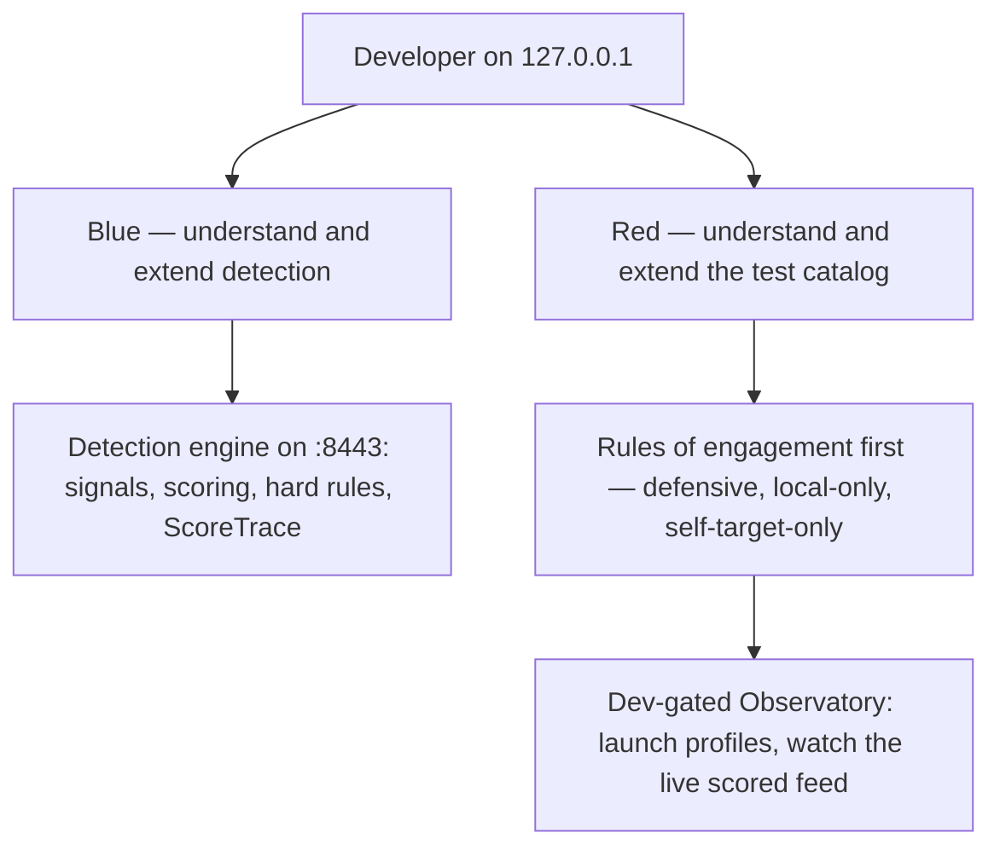

> **How-to / navigation hub.** For Red-team and Blue detection **developers** who want the depth tier — building on the detection engine and the local Red test catalog.
> This page is a router: it points you at your next reads and nothing else.

# Start here: Developer (Red/Blue)

A developer works two surfaces here, both on your own loopback. On the **Blue** side you understand and extend the detection engine — how it scores a request across layers L1–L7, how signals combine, how the hard rules HR-1..HR-21 promote a verdict — and you add your own signals and tests. On the **Red** side you understand and extend the local Red test catalog — the profiles that exercise the engine so you can verify what your detector catches and measure the effect of a change. Everything is defensive, local-only, and self-target-only: the Red material teaches you to understand and extend **your own** detector's test catalog against your own `127.0.0.1` engine, never third-party evasion.

Before you pick a path, read [Which piece am I using?](../explanation/which-piece-am-i-using.md) so you do not confuse the three surfaces: the standalone detection engine (`:8443`), the Detection Observatory (dev-gated page on that engine), and the Gate reverse proxy (edge `:8444` + admin `:8445`).

The two surfaces you work, both self-target-only on your own `127.0.0.1`:

## Blue path — understand & extend detection

1. [Which piece am I using?](../explanation/which-piece-am-i-using.md) — tell the three surfaces apart before you touch code.
2. [Run the detection engine](../how-to/run-detection-engine.md) — build the WASM detector and the server, run it on `127.0.0.1:8443`, and score a request.
3. [Detection engine internals](../explanation/detection-engine-internals.md) — signals, the scoring math (dedup → per-layer cap → noisy-OR), the hard-rule table, and the ScoreTrace you can observe.
4. [Extend detection](../how-to/extend-detection.md) — add a signal or a hard rule and confirm it in the trace.

> **Important:** There is a cross-plane contract on the Pass solve path. When `HMN_TOKEN_KEY` is set, `handlePassSolve` in `cmd/server/pass_handler.go` mints a session-bound step-up receipt into the solve response JSON (`stepUpReceipt`), which the Gate redeems at `POST /__hmn/stepup` to issue the `hmn_su` proof the `attested` preset's attestation floor requires. If you change the Pass solve flow — the response shape, the session binding, or when the receipt is minted — you can break attested-route redemption downstream even though the engine and its tests stay green. See [Configure attested routes](../how-to/configure-attested-routes.md) for the redemption path.

## Red path — understand & extend the test catalog

Read the rules of engagement **first** — before running or writing anything.

1. [Red-team rules of engagement](../reference/red-team-rules-of-engagement.md) — the defensive, local-only, self-target-only boundaries. Read this first.
2. [Self-validation with the Red catalog](../how-to/self-validation-red-team.md) — run the catalog against your own engine and read the results.
3. [Detection Observatory](../how-to/detection-observatory.md) + [Observatory tour](../how-to/observatory-tour.md) — launch profiles from the dev-gated Observatory and watch the live scored feed and per-session trace.
4. [Red-team catalog](../reference/red-team-catalog.md) — the profiles, their labels, and the hard rule each is expected to exercise.
5. [Red catalog architecture](../explanation/red-catalog-architecture.md) — the profile contract, the runner, and how a profile reaches the engine.
6. [Write a Red profile](../how-to/write-a-red-profile.md) — add a profile and register it at the three points a new profile needs.

> **Note:** Everything here is defensive, local-only, and self-target-only, on your own `127.0.0.1` engine — for understanding and extending your own detector and its test catalog, never third-party evasion. This is a reference implementation, and every measured number is reference-measured on your machine, not a guarantee.