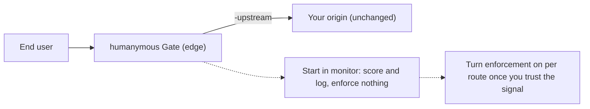

**Diátaxis quadrant:** How-to.
**Audience:** backend and platform developers placing Gate in front of an existing application.

This page orients you and points to your next three reads.

# Start here: Integrator

humanymous Gate is a reverse proxy you put in front of your app. It scores the evidence its current collector supplies, enforces ALLOW, CHALLENGE, or DENY at the edge, records decisions, and forwards allowed traffic to your origin. Core's complete seven-stage evidence path is not present at Gate, so validate the proxy you will actually deploy. Start in monitor mode and treat this repository as a reference implementation, not a production-hardened shield.

The drop-in shape and the monitor-first rollout it enables:



## What you need

- A way to run Gate — either **Docker** (pull the published image; nothing to build) or a **Go toolchain** to build `bin/gate.exe` from `./cmd/gate` (module `github.com/modootoday/humanymous`). You only need one.
- A throwaway origin app to front — the default upstream is `http://127.0.0.1:9000`, so run something on `:9000` you don't mind experimenting against.
- The `-upstream` flag to point Gate at that origin (default `http://127.0.0.1:9000`). Gate listens on `:8444` (public edge) by default.

> **Note:** Building from source needs **Go 1.25.3 or newer** (the version pinned in `go.mod`); the build is pure Go (no CGO). The Docker path below needs neither Go nor the source tree.

## Fastest path — run the published image (no build)

The quickest way to get Gate in front of an origin is to pull the published container image rather than build. It is multi-arch (`linux/amd64` + `linux/arm64`) and cosign-signed. Monitor-first: start with `-monitor` so Gate scores and logs without enforcing, then drop the flag once you trust the signal.

```
docker run -d -p 8444:8444 -p 127.0.0.1:8445:8445 \
  ghcr.io/modootoday/humanymous-gate:latest \
  -addr :8444 -admin-addr :8445 -upstream http://YOUR-ORIGIN:PORT -monitor
```

`:latest` tracks the newest release. The admin listener is mapped to host loopback only (`127.0.0.1:8445`) — keep it that way. For a full production deployment (ACME TLS, sealed keystore, durable audit log, hardened read-only container) use the pull-only Compose file `deployments/compose.release.yaml`, which references the published image directly — see [Deployment & policy operations](../how-to/deployment-policy-operations.md). Prefer to build from source instead? Keep reading — the quickstart below covers the `go build` path.

> **Decide your topology first.** Where you place Gate determines which detection layers are
> even active. The network plane (JA3/JA4/H2) needs raw-TLS termination and does **not** fire
> at the gate or behind a TLS-terminating CDN/application-layer load balancer. Read [Supported topologies](../reference/supported-topologies.md)
> before you wire anything, so you deploy the shape that matches the detection you expect.

## Your next 3 reads (in order)

1. [Quickstart (monitor mode)](../tutorials/quickstart-monitor-mode.md) — build the binary, front your throwaway origin, and watch verdicts get scored and logged without enforcing anything. Do this first.
2. [Will This Break My App?](../explanation/will-this-break-my-app.md) — how fail-open on safe GETs, monitor-first rollout, and per-route enforcement keep real users flowing before you turn enforcement on.
3. [CLI, Config & Per-Route Policy Reference](../reference/cli-config-policy.md) — every flag (`-addr`, `-admin-addr`, `-upstream`, `-monitor`, and more), the five policy presets (off / monitor / balanced / strict / attested), and how the route table maps paths to enforcement.

Then, for high-value routes: once you trust the signal and want a ceiling-guard on your mutating endpoints (checkout, transfer, password, key issuance), read [Configure attested routes](../how-to/configure-attested-routes.md). The `attested` preset is strict plus an attestation floor — a scoring-ALLOW on a marked route is priced to CHALLENGE → Pass unless the session presents possession or a step-up proof — so the install → first-use → ceiling-guard path is walkable end to end.

## Then

For the vocabulary behind the verdicts — the seven-stage pipeline, enforcement rules, risk score, fingerprint — read [Concepts & Glossary](../concepts/how-gate-sees-a-request.md).

> **Tip:** When something misbehaves during rollout, the on-call [Incident Runbooks](../runbooks/incident-runbooks.md) cover the common failure modes and how to confirm them.
