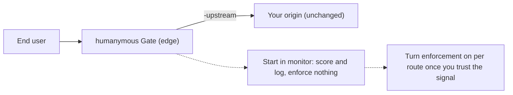

> **How-to / navigation hub.** Start here if you are a backend or platform developer dropping Gate in front of an existing app.
> This page orients you and points to your next three reads.

# Start here: Integrator

humanymous Gate is a reverse proxy you put in front of your app. It terminates TLS, streams a detection bundle into your HTML, scores every request across layers L1–L7 inline, enforces a verdict (ALLOW / CHALLENGE / DENY) at the edge, and writes each decision to a tamper-evident audit log — then forwards allowed traffic to your origin, which it fronts and does not modify. The drop-in promise: near-zero upstream changes (point Gate at your origin with `-upstream`; your app code stays as-is), reversible (start in monitor mode — score and log, enforce nothing — and turn enforcement on per route only when you trust the signal), and safe by default. This repository is a reference implementation, not a production-hardened build.

The drop-in shape and the monitor-first rollout it enables:

## What you need

- A Go toolchain to build the binary to `bin/gate.exe` from `./cmd/gate` (module `github.com/modootoday/humanymous`).
- A throwaway origin app to front — the default upstream is `http://127.0.0.1:9000`, so run something on `:9000` you don't mind experimenting against.
- The `-upstream` flag to point Gate at that origin (default `http://127.0.0.1:9000`). Gate listens on `:8444` (public edge) by default.

> **Note:** Building needs **Go 1.25.3 or newer** (the version pinned in `go.mod`). The build is pure Go (no CGO).

## Your next 3 reads (in order)

1. [Quickstart (monitor mode)](../tutorials/quickstart-monitor-mode.md) — build the binary, front your throwaway origin, and watch verdicts get scored and logged without enforcing anything. Do this first.
2. [Will This Break My App?](../explanation/will-this-break-my-app.md) — how fail-open on safe GETs, monitor-first rollout, and per-route enforcement keep real users flowing before you turn enforcement on.
3. [CLI, Config & Per-Route Policy Reference](../reference/cli-config-policy.md) — every flag (`-addr`, `-admin-addr`, `-upstream`, `-monitor`, and more), the four policy presets (off / monitor / balanced / strict), and how the route table maps paths to enforcement.

## Then

For the vocabulary behind the verdicts — layers L1–L7, hard rules, risk score, fingerprint — read [Concepts & Glossary](../concepts/how-gate-sees-a-request.md).

> **Tip:** When something misbehaves during rollout, the on-call [Incident Runbooks](../runbooks/incident-runbooks.md) cover the common failure modes and how to confirm them.
