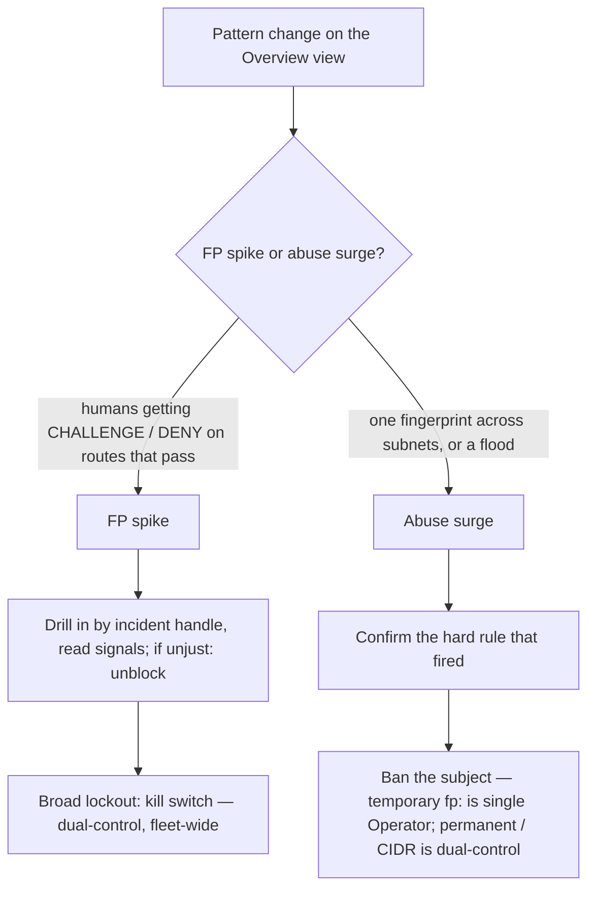

# Start here: Operator

> **How-to / navigation hub.** For the security operator or SOC on-call who runs the humanymous Gate Ledger during a shift.

You are the person watching humanymous Gate while it fronts the origin. Your working surface is the Ledger: you watch the Overview view ("live edge decisions") as ALLOW / CHALLENGE / DENY decisions land, and you decide whether a change in the pattern is a false-positive spike (real humans getting CHALLENGE or DENY) or an abuse surge (automated traffic Gate is correctly holding back). When you need to act, you have three levers — unblock a subject, ban a subject, or pull the kill switch — and you drill into a flagged session by its incident handle to read the hard rules and signal contributions behind the verdict. Gate is a reference implementation, not a production-hardened build; treat the numbers and thresholds you see as reference behavior, and confirm before you widen the blast radius of any action.

Your read-decide-act loop, from a pattern change on the Overview view to the lever you reach for:

## Triage, in short

- **FP spike** — humans reporting blocks, a jump in CHALLENGE/DENY on routes that normally pass. Drill into a sample session, read the contributing signals, and if the verdict is unjust, unblock and consider whether a route preset is too tight.
- **Abuse surge** — one fingerprint across many subnets, a destructive flood, a fingerprint sweeping many sessions. Confirm the hard rule that fired, then ban the subject.

## The three levers

| Lever | What it does | Second Approver? |
| --- | --- | --- |
| **Unblock** (lift a ban) | `POST /__hmn/admin/bans/lift` — releases an IP or fingerprint ban so the subject is scored fresh again. | No — a single Operator action. |
| **Ban** | `POST /__hmn/admin/bans` — an IP (`ip:<addr>`) or fingerprint (`fp:<fingerprint>`) ban on the escalating ladder (1h → 6h → 24h → permanent). | A **temporary** ban is a single Operator action. A **permanent or CIDR** ban is dual-control — a distinct **Approver** (not you) commits it via `POST /__hmn/admin/approvals/{id}`. |
| **Kill switch** | `POST /__hmn/admin/killswitch` — demotes hard-rule enforcement to monitor across the whole fleet. Detection keeps scoring and logging; traffic flows. Manual bans still enforce. | Yes — dual-control. A distinct **Approver** commits the flip. |

> **Warning:** The kill switch is fleet-wide. It stops hard-rule enforcement everywhere Gate runs, not on one route or one node. Traffic that would have been challenged or denied will pass. Pull it only as a deliberate, two-person decision, and plan to restore enforcement.

> **Note:** Your identity is derived by the server from your bearer token — the Console reads and requests with the Operator token. Dual-control actions need a genuinely distinct Approver token; you cannot approve your own request.

> **Note:** On a route running the `attested` preset, a scoring-ALLOW is deliberately priced to CHALLENGE → Pass by the attestation floor. This is **not** a false positive, **not** a bug, and **not** a lockout — it is the configured behavior for that route. A real human self-resolves it: they solve the Pass, the solve returns a session-bound receipt, the client redeems it at `POST /__hmn/stepup`, and the resulting `hmn_su` proof fast-paths later requests on the route. Neither lever fits here — **Unblock** lifts bans, and there is no ban to lift; the kill switch demotes hard-rule enforcement but does not clear the attestation floor. If unattested humans are looping instead of self-resolving, the cause is a topology one (a diverged `hsid` cookie jar or a missing shared `HMN_TOKEN_KEY`), covered in [Supported topologies](../reference/supported-topologies.md), not an action for the levers.

## Your next 3 reads

1. **[Incident Runbooks](../runbooks/incident-runbooks.md)** — the on-call playbooks for FP spikes, abuse surges, and the exact steps behind each lever.
2. **[Hard Rules, Verdicts & Signal-ID Reference](../reference/hard-rules-verdicts.md)** — what each HR-ID means and what the dotted signal IDs in a drill-down are telling you.
3. **[The Ledger](https://localhost:8445/__hmn/admin/console)** — the live surface itself, six views: Overview (live edge decisions), Integrity, Sessions (incident drill-down), Rate Limits & Bans, Policy, and Compliance.

> **Tip:** The Ledger is served on the separate admin listener (default `127.0.0.1:8445` (loopback)), not on the public edge. In dev it uses a self-signed certificate, so expect a browser certificate warning.
